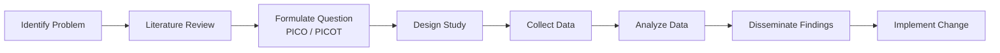
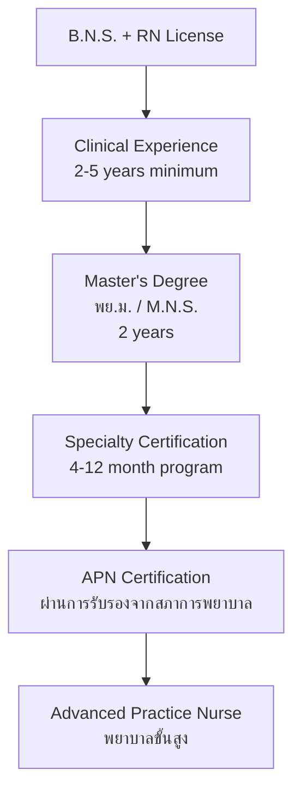

---
tags:
  - nursing
  - clinical-practice
  - research
  - evidence-based-practice
  - APN
source: "Thai Nursing Council B.N.S. Curriculum Standards"
created: 2026-07-27
domain: "Clinical Practice & Research"
prerequisites: ["[[02_Nursing_Fundamentals]]", "[[03_Medical_Surgical_Nursing]]", "[[04_Maternal_Child_and_Mental_Health_Nursing]]"]
---

# 07 — Clinical Practice & Research

> *"In the clinical setting, knowledge becomes skill. In research, curiosity becomes evidence."*

Clinical practice is where everything comes together — the **practicum (ฝึกปฏิบัติ)** where students apply theory to real patients. Research and evidence-based practice (EBP) ensure that what nurses do is grounded in science, not tradition. This domain spans **Year 1–4** (practicum) and **Year 3–4** (research).

---

## Part A: Clinical Practicum (การฝึกปฏิบัติทางคลินิก)

### 1 | Practicum Structure Across 4 Years

| Year | Focus | Hours (Approx.) | Settings |
|---|---|---|---|
| **Year 1** | Basic nursing skills + Foundation sciences lab | ~200 hrs | Skills lab, simulation center |
| **Year 2** | Nursing fundamentals + Adult health assessment | ~400 hrs | General wards, outpatient |
| **Year 3** | Med-surg, OB/GYN, Pediatrics, Psych, Community | ~700 hrs | Specialty wards, L&D, community |
| **Year 4** | Advanced clinical + Management practicum + Research | ~700 hrs | ICU, ER, OR, leadership rotation |

**Total clinical hours:** ~2,000+ hours (meets Thai Nursing Council requirements)

### 2 | Clinical Settings

| Setting | What You'll Do |
|---|---|
| **Medical ward** | Care for 2–4 patients, meds, vital signs, documentation |
| **Surgical ward** | Pre/post-op care, wound management, drains, pain assessment |
| **ICU/CCU** | 1:1 patient monitoring, ventilator care, hemodynamics, critical drips |
| **Emergency Room** | Triage, rapid assessment, trauma care, emergency procedures |
| **Labor & Delivery** | Labor support, newborn care, assist delivery, postpartum assessment |
| **Pediatric ward** | Growth/development assessment, family-centered care, play therapy |
| **Psychiatric unit** | Therapeutic communication, group therapy, behavior management |
| **Community / รพ.สต.** | Home visits, health screening, immunization, health education |
| **OR** | Scrub and circulate, sterile technique, instrument handling |

### 3 | Skills You'll Master

```mermaid
flowchart TD
    subgraph "Year 1-2"
        A1[Vital Signs] --> A2[Bed Making]
        A2 --> A3[Personal Hygiene Care]
        A3 --> A4[Basic Wound Care]
        A4 --> A5[Specimen Collection]
    end
    subgraph "Year 3"
        B1[IV Insertion and Fluids] --> B2[Blood Transfusion]
        B2 --> B3[NG Tube / Catheter]
        B3 --> B4[Complex Wounds]
        B4 --> B5[ECG / Monitoring]
    end
    subgraph "Year 4"
        C1[Critical Care Skills] --> C2[Ventilator Management]
        C2 --> C3[Emergency Response]
        C3 --> C4[Leadership and Delegation]
        C4 --> C5[Independent Practice]
    end
```

### 4 | Clinical Evaluation

| Method | What's Assessed |
|---|---|
| **Direct observation** | Skill performance, communication, safety |
| **Clinical portfolio** | Case studies, care plans, reflective journals |
| **Preceptor evaluation** | Professional behavior, clinical reasoning |
| **OSCE (Objective Structured Clinical Exam)** | Standardized stations testing specific skills |
| **Clinical logs** | Hours, procedures, patient encounters |

---

## Part B: Nursing Research (การวิจัยทางการพยาบาล)

### 5 | Why Research Matters in Nursing

> Evidence-Based Practice (EBP) = Best Research Evidence + Clinical Expertise + Patient Values & Preferences

| Without EBP | With EBP |
|---|---|
| "We've always done it this way" | "What does the evidence say?" |
| Ritual-based practice | Science-based practice |
| Variable outcomes | Standardized, predictable care |
| Defensive practice | Confident, informed practice |

### 6 | Research Process

### 7 | PICO(T) Framework

| Element | Meaning | Example |
|---|---|---|
| **P** — Population | Who are the patients? | Elderly patients with dementia |
| **I** — Intervention | What treatment/intervention? | Music therapy |
| **C** — Comparison | Compared to what? | Standard care without music |
| **O** — Outcome | What result do you want? | Reduced agitation |
| **T** — Time (optional) | Over what time period? | During evening shift (4 weeks) |

**Example PICO Question:** "In elderly patients with dementia (P), does music therapy (I) compared to standard care (C) reduce agitation (O) during the evening shift over 4 weeks (T)?"

### 8 | Research Designs

| Type | Description | When to Use |
|---|---|---|
| **RCT (Randomized Controlled Trial)** | Gold standard — randomly assign to intervention/control | Testing treatment effectiveness |
| **Quasi-experimental** | Similar but without randomization | When randomization isn't feasible |
| **Cohort** | Follow a group over time | Looking at risk factors, prognosis |
| **Case-Control** | Compare those with and without condition | Rare diseases |
| **Cross-sectional** | Snapshot at one point in time | Prevalence, surveys |
| **Qualitative** | Interviews, focus groups, observation | Understanding experiences, meanings |
| **Mixed Methods** | Quantitative + Qualitative | Comprehensive understanding |

### 9 | Evidence Hierarchy

| Level | Evidence Type |
|---|---|
| **Level I** | Systematic review / Meta-analysis of RCTs |
| **Level II** | Single well-designed RCT |
| **Level III** | Quasi-experimental (no randomization) |
| **Level IV** | Non-experimental (cohort, case-control) |
| **Level V** | Systematic review of qualitative studies |
| **Level VI** | Single qualitative study |
| **Level VII** | Expert opinion, committee reports |

---

## Part C: Advanced Practice Nursing (APN — พยาบาลขั้นสูง)

### 10 | APN Pathway in Thailand

### 11 | Recognized APN Specialties in Thailand

| Specialty | Role |
|---|---|
| **Nurse Practitioner (เวชปฏิบัติ)** | Primary care, limited prescribing, manage common illnesses |
| **Nurse Midwife** | Independent midwifery practice |
| **Clinical Nurse Specialist** | Expert in a specialty (cardiac, oncology, etc.) |
| **Nurse Anesthetist (วิสัญญีพยาบาล)** | Anesthesia administration (1-year certificate) |
| **Critical Care APN** | Advanced ICU management, hemodynamics |
| **Community Health APN** | Population health, program management |

### 12 | Continuing Education & Lifelong Learning

| Pathway | Duration | Outcome |
|---|---|---|
| **Specialty certificate (หลักสูตรเฉพาะทาง)** | 4–12 months | Specialized skill certification |
| **Master's degree (พย.ม.)** | 2 years | APN eligibility, teaching/research roles |
| **Doctoral degree (Ph.D. / DNP)** | 3–5 years | Academic leadership, advanced research |
| **CNE workshops & conferences** | Ongoing | License renewal, skill updates |
| **International certifications** | Variable | Global career opportunities |

---

## 13 | Key Terminology

| Thai | English | Notes |
|---|---|---|
| การฝึกปฏิบัติทางคลินิก | Clinical Practicum | Supervised hands-on practice |
| การปฏิบัติการพยาบาลโดยใช้หลักฐานเชิงประจักษ์ | Evidence-Based Practice (EBP) | Science-informed clinical decisions |
| การวิจัยทางการพยาบาล | Nursing Research | Generating new nursing knowledge |
| PICO / PICOT | PICO Framework | Research question formulation |
| การทบทวนวรรณกรรมอย่างเป็นระบบ | Systematic Review | Highest level of evidence |
| การทดลองแบบสุ่มและมีกลุ่มควบคุม | Randomized Controlled Trial (RCT) | Gold standard research design |
| พยาบาลขั้นสูง (APN) | Advanced Practice Nurse | Master's-prepared specialist |
| เวชปฏิบัติ | Nurse Practitioner | Limited prescriptive authority |
| วิสัญญีพยาบาล | Nurse Anesthetist | Anesthesia specialist |
| การศึกษาต่อเนื่อง | Continuing Nursing Education (CNE) | Lifelong learning for license renewal |

---

## Related Notes

- [[06_Nursing_Administration_Ethics_and_Law]] — Quality improvement and audit
- [[08_University_Guide_and_Career_Paths]] — Career progression to APN and beyond
- [[Nursing - Overview]] — Return to nursing overview
