---
tags:
  - overview
  - nursing
  - career
  - health-science
  - thai-education
source: "Thailand Nursing and Midwifery Council (สภาการพยาบาล), B.E. 2540 (1997), amended B.E. 2550 (2007)"
created: 2026-07-27
profession: "พยาบาลวิชาชีพ (Registered Nurse)"
degree: "พยาบาลศาสตรบัณฑิต (พย.บ.) — Bachelor of Nursing Science (B.N.S.)"
duration: "4 ปี (4 years)"
---

# Nursing — วิชาชีพพยาบาล

> **"Nursing is the protection, promotion, and optimization of health and abilities, prevention of illness and injury, alleviation of suffering through the diagnosis and treatment of human response, and advocacy in the care of individuals, families, communities, and populations."** — American Nurses Association

> **"การพยาบาลเป็นการกระทำในการช่วยเหลือ ดูแลผู้ป่วยหรือผู้ที่อยู่ในภาวะเสี่ยงต่อการเจ็บป่วย เพื่อบรรเทาอาการของโรคและการดำเนินของโรค เพื่อให้ผู้ป่วยหายจากโรคคืนสู่ภาวะปกติ"** — พระราชบัญญัติวิชาชีพการพยาบาลและการผดุงครรภ์ พ.ศ. 2540

## What Is This?

This is a **career guidance knowledge base** for Thai students considering nursing as a profession. It covers what nursing is, what you'll learn, where you can study, how to get licensed, and what career paths exist after graduation.

Nursing is a **regulated health profession** in Thailand. All practicing nurses must:
1. Graduate from a **Thai Nursing Council-accredited** B.N.S. program (4 years)
2. Pass the **national nursing licensure examination** (การสอบขึ้นทะเบียนและรับใบอนุญาตประกอบวิชาชีพการพยาบาลและการผดุงครรภ์)
3. Maintain a license through **continuing nursing education (CNE)** credits

## The 8 Knowledge Domains

### 🧬 Foundation Sciences
- [[01_Foundation_Sciences|01 Foundation Sciences]] — Anatomy, physiology, biochemistry, microbiology, pharmacology, pathophysiology, nutrition

### 🩺 Core Nursing Practice
- [[02_Nursing_Fundamentals|02 Nursing Fundamentals]] — Nursing process, vital signs, infection control, basic care, communication, documentation
- [[03_Medical_Surgical_Nursing|03 Medical-Surgical Nursing]] — Adult health, disease management, pre/post-operative care, emergency nursing
- [[04_Maternal_Child_and_Mental_Health_Nursing|04 Maternal, Child & Mental Health Nursing]] — Obstetrics, gynecology, pediatrics, psychiatric nursing

### 🏘️ Community & Population Health
- [[05_Community_and_Public_Health_Nursing|05 Community & Public Health Nursing]] — Primary care, home visits, epidemiology, health promotion, school health

### ⚖️ Professional Practice
- [[06_Nursing_Administration_Ethics_and_Law|06 Nursing Administration, Ethics & Law]] — Leadership, management, nursing ethics, Thai nursing law, patient rights

### 🔬 Advanced Practice
- [[07_Clinical_Practice_and_Research|07 Clinical Practice & Research]] — Clinical practicum, evidence-based practice, nursing research, quality improvement

### 🎓 Career Pathways
- [[08_University_Guide_and_Career_Paths|08 University Guide & Career Paths]] — Top nursing schools, TCAS requirements, tuition, salaries, specializations, advanced practice

## The Nursing Profession in Thailand

### Regulatory Body
| Organization | Thai Name | Role |
|---|---|---|
| **Thailand Nursing and Midwifery Council** | สภาการพยาบาล | License exams, professional standards, curriculum accreditation, ethics enforcement |
| **Ministry of Public Health** | กระทรวงสาธารณสุข | Public health nursing employment, rural health policy |
| **Thai Nurses Association** | สมาคมพยาบาลแห่งประเทศไทยฯ | Professional development, advocacy |

### Legal Framework

The profession is governed by the **Nursing and Midwifery Profession Act B.E. 2540 (1997), amended B.E. 2550 (2007)** — พระราชบัญญัติวิชาชีพการพยาบาลและการผดุงครรภ์.

Key provisions:
- **Section 3:** Defines "nursing" (การพยาบาล) and "midwifery" (การผดุงครรภ์)
- **Section 25-29:** Establishes the Nursing Council (สภาการพยาบาล)
- **Section 30-38:** License requirements, examination, registration
- **Section 39-43:** Professional conduct, ethics, disciplinary actions
- **Section 44-49:** Penalties for unlicensed practice

## Education Pathway

```mermaid
flowchart TD
    A[ม.6 Graduate<br/>สายวิทย์-คณิต] --> B[Apply via TCAS<br/>คณะพยาบาลศาสตร์]
    B --> C[4-Year B.N.S. Program<br/>พยาบาลศาสตรบัณฑิต]
    C --> D["National Licensure Exam<br/>การสอบขึ้นทะเบียนฯ<br/>&#40;8 subjects&#41;"]
    D --> E{Pass?}
    E -->|Yes| F["Registered Nurse<br/>พยาบาลวิชาชีพ<br/>&#40;License&#41;"]
    E -->|No| G[Retake Exam<br/>สอบซ่อม]
    G --> E
    F --> H[Work in Hospital / Clinic / Community]
    H --> I["CNE Credits<br/>ต่ออายุใบอนุญาต<br/>ทุก 5 ปี"]
    I --> H
    F --> J["APN / Specialty<br/>หลักสูตรเฉพาะทาง<br/>&#40;4-12 months&#41;"]
    F --> K["Graduate Degree<br/>พย.ม. / Ph.D."]
    K --> L[Advanced Practice Nurse<br/>พยาบาลขั้นสูง / APN]
```

## Key Terminology

| Thai | English | Notes |
|---|---|---|
| พยาบาลวิชาชีพ | Registered Nurse (RN) | Licensed professional nurse |
| พยาบาลศาสตรบัณฑิต (พย.บ.) | Bachelor of Nursing Science (B.N.S.) | 4-year degree |
| สภาการพยาบาล | Thailand Nursing and Midwifery Council | Regulatory body |
| การสอบขึ้นทะเบียนฯ | National Licensure Examination | 8-subject exam |
| ใบอนุญาตประกอบวิชาชีพ | Professional license | Renewed every 5 years |
| หน่วยคะแนนการศึกษาต่อเนื่อง (CNE) | Continuing Nursing Education credits | Required for license renewal |
| APN (พยาบาลขั้นสูง) | Advanced Practice Nurse | Master's + specialty certification |
| หลักสูตรเฉพาะทาง | Specialty training program | 4-12 month certificate |
| การผดุงครรภ์ | Midwifery | Included in Thai B.N.S. |
| เวชปฏิบัติ | Nurse practitioner practice | Limited prescriptive authority |

## Reading Paths

- **High school student exploring careers:** Start here → [[08_University_Guide_and_Career_Paths|University Guide]] → [[01_Foundation_Sciences|What you'll study]]
- **Current nursing student:** [[02_Nursing_Fundamentals|Nursing Fundamentals]] → [[03_Medical_Surgical_Nursing|Med-Surg]] → [[04_Maternal_Child_and_Mental_Health_Nursing|Specialties]]
- **Practicing nurse advancing career:** [[07_Clinical_Practice_and_Research|Research & APN]] → [[06_Nursing_Administration_Ethics_and_Law|Leadership]]
- **Parent/guidance counselor:** [[08_University_Guide_and_Career_Paths|University Guide]] → Return here for subject details

---

> **Related Careers:** [[../lawyer/Law - Overview|Law]], [[../doctor/Medicine - Overview|Medicine]], [[../pharmacist/Pharmacy - Overview|Pharmacy]], [[../teacher/Teaching - Overview|Teaching]]
> **Related Vaults:** [[body-of-knowledge/Science/04_Human_Body_Systems|Human Body Systems]], [[body-of-knowledge/Health and PE/Health and PE - Overview|Health & PE]]
