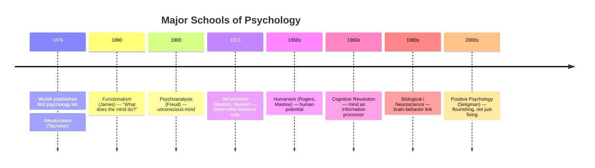

---
tags:
  - psychology
  - foundations
  - biological-psychology
  - cognitive-psychology
  - developmental-psychology
  - social-psychology
  - personality
source: "Thai Psychology Council Curriculum Standards"
created: 2026-07-27
domain: "Foundations of Psychology"
prerequisites: []
---

# 01 — Foundations of Psychology

> *"Psychology cannot claim to have all the answers, but it asks the right questions — and investigates them with scientific rigor."*

The foundations of psychology are the core theories and research that explain how humans think, feel, develop, and interact. These subjects are concentrated in **Year 1–2** of the bachelor's degree.

---

## 1 | The Five Pillars of Psychology

### 1.1 Biological Psychology (จิตวิทยาชีวภาพ)

| Topic | Key Concepts |
|---|---|
| **Neuron structure & function** | Dendrites, axon, synapse, action potential, neurotransmitters (dopamine, serotonin, GABA, norepinephrine) |
| **Brain anatomy** | Lobes (frontal, parietal, temporal, occipital), limbic system (amygdala, hippocampus, hypothalamus), brainstem |
| **Nervous system** | CNS (brain + spinal cord), PNS (somatic + autonomic), sympathetic vs. parasympathetic |
| **Endocrine system** | HPA axis, cortisol (stress hormone), oxytocin (bonding), melatonin (sleep) |
| **Genetics & behavior** | Heritability, twin studies, epigenetics — nature vs. nurture |
| **Sensation & perception** | How stimuli become experience: vision, hearing, touch, taste, smell, proprioception |

**Why it matters:** Understanding the biological basis of behavior is essential for clinical work — e.g., depression involves serotonin dysregulation, anxiety involves amygdala hyperactivity.

### 1.2 Cognitive Psychology (จิตวิทยาการรู้คิด)

| Topic | Key Concepts |
|---|---|
| **Attention** | Selective, divided, sustained; cocktail party effect; ADHD as attention disorder |
| **Memory** | Sensory → Short-term/Working → Long-term (explicit/implicit); Ebbinghaus forgetting curve |
| **Language** | Broca's area (production), Wernicke's area (comprehension); language acquisition |
| **Thinking & problem-solving** | Heuristics, biases (confirmation bias, availability heuristic), algorithms |
| **Decision-making** | Kahneman's System 1 (fast) vs. System 2 (slow); prospect theory |
| **Intelligence** | Spearman's *g*, Gardner's multiple intelligences, Sternberg's triarchic theory; IQ testing |

**Why it matters:** CBT (Cognitive Behavioral Therapy) directly targets cognitive distortions — faulty thinking patterns that maintain depression and anxiety. Understanding cognition = understanding the core mechanism of the most evidence-based therapy.

### 1.3 Developmental Psychology (จิตวิทยาพัฒนาการ)

| Stage | Key Theorist | Core Concepts |
|---|---|---|
| **Infancy (0–2 yr)** | Piaget (Sensorimotor), Bowlby (Attachment) | Object permanence, stranger anxiety, secure/avoidant/ambivalent/disorganized attachment |
| **Early childhood (2–6 yr)** | Piaget (Preoperational), Erikson (Initiative vs. Guilt) | Egocentrism, theory of mind, pretend play |
| **Middle childhood (6–12 yr)** | Piaget (Concrete Operational), Erikson (Industry vs. Inferiority) | Conservation, logical thinking, social comparison |
| **Adolescence (12–18 yr)** | Piaget (Formal Operational), Erikson (Identity vs. Role Confusion) | Abstract reasoning, identity formation — "Who am I?" |
| **Early adulthood** | Erikson (Intimacy vs. Isolation) | Relationships, career |
| **Middle adulthood** | Erikson (Generativity vs. Stagnation) | Contributing to next generation |
| **Late adulthood** | Erikson (Integrity vs. Despair) | Life review, meaning |

**Thai-specific notes:**
- **Filial piety (กตัญญู)** — Caring for aging parents is a cultural expectation affecting family dynamics
- **Intergenerational households** — Common in Thailand; grandparents often primary caregivers
- **Buddhist life-stage concepts** — Influence how Thais think about aging and life transitions

### 1.4 Social Psychology (จิตวิทยาสังคม)

| Topic | Key Concepts |
|---|---|
| **Social cognition** | Attribution theory (internal vs. external), fundamental attribution error, self-serving bias |
| **Attitudes & persuasion** | Elaboration Likelihood Model (central vs. peripheral route), cognitive dissonance (Festinger) |
| **Conformity & obedience** | Asch conformity experiments, Milgram obedience study — powerful demonstrations of social influence |
| **Group processes** | Social facilitation, social loafing, groupthink, deindividuation |
| **Prejudice & discrimination** | Stereotypes, implicit bias, contact hypothesis |
| **Altruism & aggression** | Bystander effect, frustration-aggression hypothesis |
| **Relationships** | Attachment styles in adults, Sternberg's Triangular Theory of Love (Intimacy, Passion, Commitment) |

**Why it matters:** Understanding social influence helps explain why people do things they wouldn't do alone — crucial for understanding bullying, workplace dynamics, cult behavior, and compliance with health recommendations.

### 1.5 Personality Psychology (จิตวิทยาบุคลิกภาพ)

| Theory | Key Figure(s) | Core Idea |
|---|---|---|
| **Psychoanalytic** | Freud | Id, Ego, Superego; unconscious drives; defense mechanisms |
| **Neo-Freudian** | Jung, Adler, Horney | Collective unconscious, inferiority complex, basic anxiety |
| **Humanistic** | Rogers, Maslow | Self-actualization, unconditional positive regard, hierarchy of needs |
| **Trait Theory — Big Five (OCEAN)** | Costa & McCrae | **O**penness, **C**onscientiousness, **E**xtraversion, **A**greeableness, **N**euroticism |
| **Social-Cognitive** | Bandura | Reciprocal determinism, self-efficacy, observational learning |
| **Biological** | Eysenck | PEN model (Psychoticism, Extraversion, Neuroticism); genetic basis |

**The Big Five (OCEAN) — Most empirically supported model:**

| Trait | High | Low |
|---|---|---|
| **Openness** | Curious, creative, adventurous | Practical, conventional, routine-preferring |
| **Conscientiousness** | Organized, disciplined, reliable | Spontaneous, flexible, careless |
| **Extraversion** | Outgoing, energetic, social | Reserved, solitary, reflective |
| **Agreeableness** | Cooperative, compassionate, trusting | Competitive, skeptical, challenging |
| **Neuroticism** | Anxious, moody, emotionally reactive | Calm, stable, resilient |

---

## 2 | History of Psychology — Major Schools

---

## 3 | Key Terminology

| Thai | English | Notes |
|---|---|---|
| จิตวิทยาชีวภาพ | Biological Psychology | Brain-behavior connection |
| จิตวิทยาการรู้คิด | Cognitive Psychology | Thinking, memory, language |
| จิตวิทยาพัฒนาการ | Developmental Psychology | Lifespan changes |
| จิตวิทยาสังคม | Social Psychology | How others influence us |
| จิตวิทยาบุคลิกภาพ | Personality Psychology | Individual differences |
| สารสื่อประสาท | Neurotransmitter | Chemical messengers (dopamine, serotonin) |
| การรู้คิด | Cognition | Mental processes |
| ความผูกพัน | Attachment | Emotional bond (Bowlby) |
| บุคลิกภาพห้าองค์ประกอบ | Big Five / OCEAN | Most validated personality model |
| จิตวิทยาเชิงบวก | Positive Psychology | Study of well-being |

---

## Study Tips for Psychology Foundations

| Subject | Strategy |
|---|---|
| **Biological** | Draw brain diagrams; link each region to a function AND a disorder |
| **Cognitive** | Connect to everyday experience — when did you forget something? Why? |
| **Developmental** | Observe children at different ages; note what Piaget/Erikson predicted |
| **Social** | Watch for cognitive biases in your own thinking — they're universal |
| **Personality** | Take the Big Five yourself (IPIP-NEO online) — then critique the results |

---

## Related Notes

- [[02_Psychological_Assessment_and_Diagnosis]] — Applying theories to measurement
- [[Psychologist - Overview]] — Return to psychology overview
