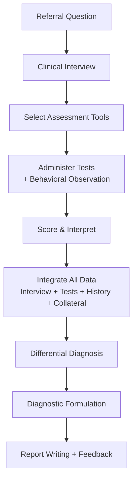

---
tags:
  - psychology
  - assessment
  - psychometrics
  - diagnosis
  - DSM-5
source: "Thai Psychology Council Curriculum Standards; APA; DSM-5-TR"
created: 2026-07-27
domain: "Psychological Assessment & Diagnosis"
prerequisites: ["[[01_Foundations_of_Psychology]]"]
---

# 02 — Psychological Assessment & Diagnosis

> *"If you can't measure it, you can't manage it. Psychological assessment is how we measure the mind — with science, not guesswork."*

Psychological assessment is what distinguishes psychologists from other mental health professionals. It involves systematically measuring intelligence, personality, psychopathology, and neuropsychological functioning using validated instruments. This is taught in **Year 3–4** (bachelor's) and deepened in **master's programs**.

---

## 1 | Psychometrics — The Science of Measurement

### 1.1 Reliability (ความเที่ยง)

| Type | Definition | How to Assess |
|---|---|---|
| **Test-Retest** | Same test, different time → same results? | Administer twice, correlate scores (r ≥ 0.80 = good) |
| **Internal Consistency** | Do items within the test agree with each other? | Cronbach's alpha (α ≥ 0.70 acceptable, ≥ 0.90 excellent) |
| **Inter-rater** | Do different raters/scorers agree? | Cohen's kappa (κ ≥ 0.60 acceptable) |
| **Parallel Forms** | Different versions of same test → same results? | Administer both forms, correlate scores |

### 1.2 Validity (ความตรง)

| Type | Question It Answers |
|---|---|
| **Content Validity** | Does the test cover all aspects of the construct? |
| **Criterion Validity** | Does it predict real-world outcomes? (Concurrent: now; Predictive: future) |
| **Construct Validity** | Does it actually measure what it claims to measure? (Convergent: correlates with similar measures; Discriminant: does NOT correlate with unrelated measures) |
| **Face Validity** | Does it LOOK like it measures what it should? (Weakest form — but important for participant buy-in) |

### 1.3 Standardization & Norms

| Concept | Definition |
|---|---|
| **Standardization** | Test administered the same way every time — same instructions, time limits, scoring |
| **Norms** | Scores compared to a reference group (age, gender, education, culture) |
| **Percentile rank** | % of norm group scoring below a given score |
| **Standard score** | z-score, T-score (M=50, SD=10), IQ (M=100, SD=15) |

> **⚠️ Cultural caveat:** Most major psychological tests were developed in Western (WEIRD — Western, Educated, Industrialized, Rich, Democratic) populations. Thai psychologists must use **Thai-normed versions** whenever available.

---

## 2 | Major Categories of Psychological Tests

### 2.1 Intelligence Tests (แบบทดสอบเชาวน์ปัญญา)

| Test | Ages | What It Measures | Thai Version? |
|---|---|---|---|
| **WAIS-IV / WAIS-V** (Wechsler Adult Intelligence Scale) | 16–90 | Full Scale IQ, 4 indices: Verbal Comprehension, Perceptual Reasoning, Working Memory, Processing Speed | ✅ Thai WAIS-IV available |
| **WISC-V** (Wechsler Intelligence Scale for Children) | 6–16 | Similar indices adapted for children | ✅ Thai WISC-V available |
| **WPPSI-IV** (Preschool) | 2.5–7 | Early cognitive assessment | Thai version available |
| **Raven's Progressive Matrices** | 5+ | Non-verbal reasoning — less culture-bound | ✅ Widely used in Thailand |
| **Stanford-Binet** | 2–85+ | Broad intellectual assessment | Limited Thai availability |

### 2.2 Personality Tests (แบบทดสอบบุคลิกภาพ)

| Test | Type | What It Measures |
|---|---|---|
| **MMPI-2 / MMPI-3** (Minnesota Multiphasic Personality Inventory) | Objective — 567 True/False items | Psychopathology, personality structure; 10 clinical scales + validity scales |
| **NEO-PI-R / IPIP-NEO** | Objective | Big Five (OCEAN) personality traits |
| **Rorschach Inkblot Test** | Projective | Unconscious processes, personality structure (controversial; Exner's Comprehensive System is the most accepted scoring) |
| **TAT** (Thematic Apperception Test) | Projective | Motivations, needs, interpersonal themes |
| **House-Tree-Person (HTP)** | Projective (drawing) | Often used with children; subjective interpretation |
| **Sentence Completion Test** | Semi-projective | Attitudes, beliefs, conflicts |

**Validity Scales in the MMPI — Critical for Detecting Faking:**

| Scale | What It Detects |
|---|---|
| **L (Lie)** | "I always tell the truth" — unrealistic virtue |
| **F (Infrequency)** | Rarely endorsed items — malingering or severe psychopathology |
| **K (Correction)** | Defensiveness — trying to look good |
| **VRIN / TRIN** | Inconsistent responding — random answers |

### 2.3 Neuropsychological Tests (แบบทดสอบทางประสาทจิตวิทยา)

| Test | What It Measures |
|---|---|
| **Mini-Mental State Exam (MMSE)** | Cognitive impairment screening — orientation, memory, attention, language |
| **Montreal Cognitive Assessment (MoCA)** | More sensitive than MMSE for mild cognitive impairment |
| **Trail Making Test (TMT) A & B** | Processing speed (A), executive function / set-shifting (B) |
| **Wisconsin Card Sorting Test (WCST)** | Executive function, cognitive flexibility |
| **Stroop Test** | Selective attention, inhibition |
| **Boston Naming Test** | Language — confrontation naming |

### 2.4 Symptom & Diagnostic Scales

| Scale | Target | Items | Use |
|---|---|---|---|
| **Beck Depression Inventory (BDI-II)** | Depression severity | 21 items | Screening + treatment monitoring |
| **PHQ-9** | Depression | 9 items | Quick screening in medical settings |
| **Beck Anxiety Inventory (BAI)** | Anxiety | 21 items | Differentiates anxiety from depression |
| **GAD-7** | Generalized anxiety | 7 items | Quick screening |
| **Y-BOCS** | OCD severity | 10 items | Treatment planning & monitoring |
| **PCL-5** | PTSD | 20 items | DSM-5 PTSD symptom checklist |
| **WHODAS 2.0** | Functional impairment | 12/36 items | Cross-cultural disability assessment |

---

## 3 | Diagnostic Systems

### 3.1 DSM-5-TR (Diagnostic and Statistical Manual of Mental Disorders, Fifth Edition, Text Revision)

- **Publisher:** American Psychiatric Association (APA)
- **Structure:** 20+ diagnostic categories organized developmentally
- **Format per disorder:** Diagnostic criteria + prevalence + risk factors + differential diagnosis + comorbidity
- **Cultural Formulation Interview (CFI):** Helps clinicians assess cultural context

### 3.2 ICD-11 (International Classification of Diseases, 11th Revision)

- **Publisher:** World Health Organization (WHO)
- **Used in:** Thai government health system, for insurance coding
- **Key difference from DSM-5-TR:** More internationally oriented, includes both mental and physical disorders in one system

### 3.3 The Diagnostic Process

---

## 4 | Clinical Interview (การสัมภาษณ์ทางคลินิก)

| Component | Key Elements |
|---|---|
| **Chief complaint** | "What brings you here?" — in patient's own words |
| **History of present illness** | Onset, course, severity, triggers, previous treatment |
| **Psychiatric history** | Previous diagnoses, hospitalizations, medications, therapy |
| **Medical history** | Rule out medical causes (e.g., thyroid dysfunction → depression) |
| **Substance use** | Alcohol, drugs, medications — be non-judgmental |
| **Family history** | Mental illness, suicide, substance use in family |
| **Social history** | Education, occupation, relationships, living situation, legal issues |
| **Mental Status Exam (MSE)** | See below |

### Mental Status Exam (MSE — การตรวจสภาพจิต)

| Domain | What to Assess |
|---|---|
| **Appearance** | Grooming, hygiene, attire, eye contact |
| **Behavior** | Psychomotor agitation/retardation, tics, gait |
| **Speech** | Rate, rhythm, volume, articulation |
| **Mood** (subjective) | "How do you feel?" — patient's self-report |
| **Affect** (objective) | Range (full/restricted/flat), intensity, congruence with mood |
| **Thought process** | Logical/illogical, tangential, circumstantial, flight of ideas, loosening of associations |
| **Thought content** | Delusions, obsessions, phobias, suicidal/homicidal ideation |
| **Perception** | Hallucinations (auditory, visual, tactile, olfactory), illusions, depersonalization |
| **Cognition** | Orientation (time, place, person), attention, memory, abstraction |
| **Insight** | Awareness of illness — full/partial/none |
| **Judgment** | Ability to make sound decisions |

---

## 5 | Key Terminology

| Thai | English | Notes |
|---|---|---|
| การประเมินทางจิตวิทยา | Psychological Assessment | Multimethod evaluation |
| จิตมิติ | Psychometrics | Science of psychological measurement |
| ความเที่ยง | Reliability | Consistency of measurement |
| ความตรง | Validity | Accuracy — measuring what you intend to |
| แบบทดสอบทางจิตวิทยา | Psychological Test | Standardized measurement instrument |
| แบบทดสอบเชาวน์ปัญญา | Intelligence Test | IQ, cognitive ability |
| แบบทดสอบบุคลิกภาพ | Personality Test | Objective (MMPI) or projective (Rorschach) |
| การตรวจสภาพจิต (MSE) | Mental Status Exam | Structured observation of current mental state |
| DSM-5-TR | Diagnostic and Statistical Manual | APA diagnostic bible |
| ICD-11 | International Classification of Diseases | WHO system |
| การวินิจฉัยแยกโรค | Differential Diagnosis | Ruling out alternative explanations |

---

## Related Notes

- [[01_Foundations_of_Psychology]] — Theories behind what's being measured
- [[03_Clinical_Psychology]] — Using assessment to guide treatment
- [[06_Research_Methods_and_Ethics]] — How tests are validated
- [[Psychologist - Overview]] — Return to psychology overview
