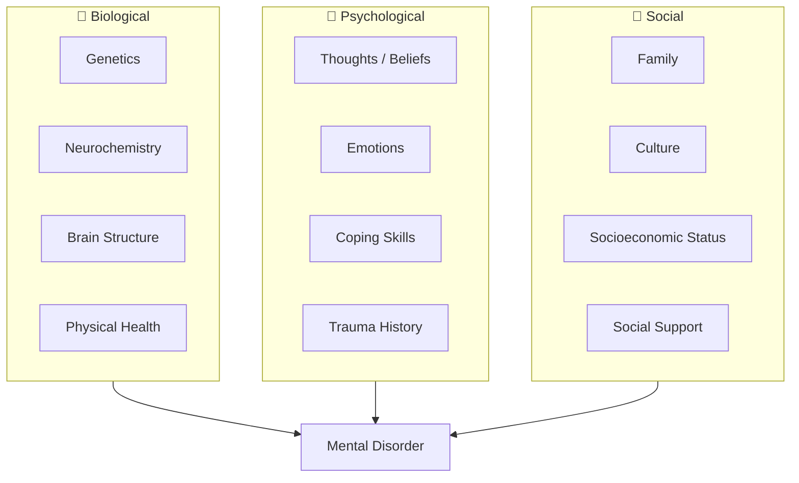
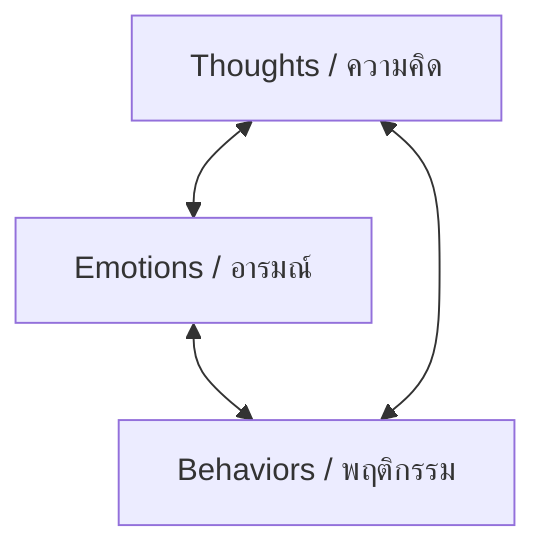

---
tags:
  - psychology
  - clinical-psychology
  - psychopathology
  - psychotherapy
  - CBT
source: "Thai Psychology Council Curriculum Standards; DSM-5-TR"
created: 2026-07-27
domain: "Clinical Psychology"
prerequisites: ["[[01_Foundations_of_Psychology]]", "[[02_Psychological_Assessment_and_Diagnosis]]"]
---

# 03 — Clinical Psychology

> *"Clinical psychology is where science meets suffering — using evidence-based methods to understand, prevent, and relieve psychological distress."*

Clinical Psychology (จิตวิทยาคลินิก) is the largest specialty in psychology. Clinical psychologists assess, diagnose, and treat mental disorders across the lifespan — from childhood anxiety to geriatric dementia. This is the main track for those who want to work directly with patients in hospitals, clinics, or private practice.

---

## 1 | Psychopathology — Understanding Mental Disorders

### 1.1 The Biopsychosocial Model

No mental disorder has a single cause. Every case involves an interaction of biological vulnerability, psychological factors, and social context.

### 1.2 Major Disorder Categories (DSM-5-TR)

| Category | Key Disorders | Core Features |
|---|---|---|
| **Depressive Disorders** | MDD, Persistent Depressive Disorder (Dysthymia), PMDD | Low mood, anhedonia, sleep/appetite changes, worthlessness |
| **Anxiety Disorders** | GAD, Panic Disorder, Social Anxiety, Specific Phobia, Agoraphobia | Excessive fear/anxiety, avoidance, physiological arousal |
| **OCD & Related** | OCD, Body Dysmorphic Disorder, Hoarding | Obsessions (intrusive thoughts) + compulsions (rituals) |
| **Trauma & Stressor-Related** | PTSD, Acute Stress Disorder, Adjustment Disorder | Exposure to trauma → re-experiencing, avoidance, hyperarousal |
| **Schizophrenia Spectrum** | Schizophrenia, Schizoaffective, Delusional Disorder | Psychosis: hallucinations, delusions, disorganized speech/behavior |
| **Bipolar & Related** | Bipolar I, Bipolar II, Cyclothymic Disorder | Mania/hypomania alternating with depression |
| **Personality Disorders** | Borderline, Antisocial, Narcissistic, Avoidant, OCPD (Cluster A/B/C) | Enduring, inflexible patterns of inner experience and behavior |
| **Neurodevelopmental** | ADHD, ASD (Autism), Intellectual Disability, Specific Learning Disorder | Onset in developmental period |
| **Neurocognitive** | Delirium, Alzheimer's, Vascular Dementia, TBI | Decline in cognitive functioning |
| **Substance-Related** | Alcohol, Opioid, Stimulant, Cannabis Use Disorders | Impaired control, social impairment, risky use, tolerance/withdrawal |
| **Eating Disorders** | Anorexia Nervosa, Bulimia Nervosa, Binge-Eating Disorder | Disturbed eating behavior + body image |
| **Somatic Symptom** | Somatic Symptom Disorder, Illness Anxiety, Conversion Disorder | Physical symptoms with psychological cause |

### 1.3 High-Yield Clinical Distinctions

| Look-Alike Pair | Key Differentiator |
|---|---|
| **Depression vs. Bipolar II** | Any history of hypomania? → Bipolar II (antidepressants alone can trigger mania!) |
| **Panic Disorder vs. Medical condition** | Rule out cardiac (MI, arrhythmia), thyroid, pheochromocytoma |
| **GAD vs. adjustment disorder** | Duration > 6 months? + Multiple worries vs. single stressor |
| **PTSD vs. Acute Stress Disorder** | Duration > 1 month = PTSD; 3 days–1 month = ASD |
| **Schizophrenia vs. Schizoaffective** | Mood episodes present for majority of illness? → Schizoaffective |
| **ADHD vs. Bipolar in children** | ADHD: chronic, non-episodic; Bipolar: distinct mood episodes |
| **Borderline PD vs. Bipolar II** | BPD: rapid mood shifts (hours), triggered by interpersonal events; BP II: sustained episodes (days-weeks) |

---

## 2 | Psychotherapy — The Four Major Orientations

### 2.1 Cognitive Behavioral Therapy (CBT — การบำบัดความคิดและพฤติกรรม)

> **Most evidence-based therapy for depression, anxiety, PTSD, OCD, eating disorders, insomnia, chronic pain...**

**Core Model: The Cognitive Triangle**

| Component | Technique |
|---|---|
| **Cognitive restructuring** | Identify automatic negative thoughts → Examine evidence → Generate balanced alternative |
| **Cognitive distortions** | All-or-nothing thinking, catastrophizing, mind-reading, overgeneralization, personalization... |
| **Behavioral activation** | Schedule pleasant activities to break the depression-inertia cycle |
| **Exposure therapy** | Gradual, systematic confrontation of feared stimuli (for anxiety/OCD/PTSD) |
| **Socratic questioning** | Guided discovery — "What's the evidence for/against that thought?" |
| **Homework** | Between-session tasks are ESSENTIAL — therapy doesn't end at the door |

**Third-Wave CBT Approaches:**

| Approach | Key Feature |
|---|---|
| **ACT (Acceptance & Commitment Therapy)** | Accept thoughts/feelings rather than fighting them; commit to values-based action |
| **DBT (Dialectical Behavior Therapy)** | Gold standard for Borderline PD — mindfulness, distress tolerance, emotion regulation, interpersonal effectiveness |
| **MBCT (Mindfulness-Based Cognitive Therapy)** | Combines CBT + mindfulness meditation; prevents depression relapse |
| **CFT (Compassion-Focused Therapy)** | Develop self-compassion — especially for shame/self-criticism |

### 2.2 Psychodynamic Therapy (จิตบำบัดแบบจิตพลวัต)

- **Origin:** Freud → evolved through object relations, attachment theory, self-psychology
- **Core idea:** Unconscious conflicts from early relationships shape current problems
- **Key concepts:** Transference (patient projects onto therapist), countertransference (therapist's emotional reaction), defense mechanisms, working through
- **Modern form:** Brief psychodynamic therapy (12–20 sessions) — evidence supports it for depression, some personality disorders

### 2.3 Humanistic-Existential Therapy (จิตบำบัดแบบมนุษยนิยม)

- **Rogers' Person-Centered Therapy:** Unconditional positive regard, empathy, congruence — the therapeutic relationship IS the therapy
- **Existential therapy (Yalom):** Confronting the "givens" of existence — death, freedom, isolation, meaninglessness
- **Gestalt therapy (Perls):** Here-and-now awareness, empty chair technique, taking responsibility

### 2.4 Systemic / Family Therapy (จิตบำบัดครอบครัว)

- **Core idea:** The "identified patient" is a symptom of the family system
- **Key concepts:** Homeostasis, circular causality, boundaries, triangulation
- **Techniques:** Genograms, circular questioning, reframing, paradoxical intervention
- **Evidence:** Strong for adolescent conduct problems, eating disorders, family conflict

---

## 3 | Common Therapeutic Factors

> **Lambert's Pie (1992):** What makes therapy work?
> - 40% — Client factors & extra-therapeutic change
> - 30% — Therapeutic relationship (alliance)
> - 15% — Expectancy / placebo
> - 15% — Specific techniques

**The therapeutic alliance (Bordin, 1979):**
1. **Bond** — Trust, rapport, mutual respect
2. **Goals** — Agreement on what therapy aims to achieve
3. **Tasks** — Agreement on HOW to get there

> *"It's the relationship that heals."* — Irvin Yalom

---

## 4 | Crisis Intervention & Risk Assessment

### 4.1 Suicide Risk Assessment

| Risk Factor | Protective Factor |
|---|---|
| Previous attempts (strongest predictor) | Reasons for living |
| Suicidal ideation with plan + means | Social support |
| Psychiatric diagnosis (esp. depression, BPD, substance use) | Access to mental healthcare |
| Hopelessness | Problem-solving skills |
| Recent loss / humiliation | Religious/spiritual beliefs |
| Access to lethal means (firearms, pesticides) | Responsibility to children/family |

**Questions to ask directly:**
- "Are you thinking about suicide?" (Must ask — asking does NOT plant the idea)
- "Do you have a plan?" → "Do you have access to means?"
- "What has kept you alive so far?" (protective factors)

### 4.2 Self-Harm (Non-Suicidal Self-Injury — NSSI)

- **Functions:** Emotion regulation (most common), self-punishment, communication of distress
- **Common in:** Adolescents, Borderline PD, trauma survivors
- **Intervention:** DBT skills (distress tolerance), harm minimization, treat underlying cause

---

## 5 | Key Terminology

| Thai | English | Notes |
|---|---|---|
| จิตวิทยาคลินิก | Clinical Psychology | Assessment and treatment of mental disorders |
| จิตพยาธิวิทยา | Psychopathology | Study of mental disorders |
| จิตบำบัด | Psychotherapy | Talk therapy — the primary clinical tool |
| CBT | Cognitive Behavioral Therapy | Most evidence-based approach |
| ความคิดอัตโนมัติด้านลบ | Automatic Negative Thoughts (ANTs) | Core CBT target |
| การเผชิญกับสิ่งที่กลัว | Exposure Therapy | Gradual confrontation of feared stimuli |
| สัมพันธภาพเพื่อการบำบัด | Therapeutic Alliance | The healing relationship |
| การประเมินความเสี่ยงฆ่าตัวตาย | Suicide Risk Assessment | Critical clinical skill |
| การบำบัดแบบวิภาษวิธี (DBT) | Dialectical Behavior Therapy | Gold standard for Borderline PD |
| ACT | Acceptance and Commitment Therapy | Third-wave CBT |

---

## Related Notes

- [[02_Psychological_Assessment_and_Diagnosis]] — Diagnosis before treatment
- [[04_Counseling_Psychology]] — Lighter-touch, adjustment-focused work
- [[06_Research_Methods_and_Ethics]] — Evidence base for interventions
- [[Psychologist - Overview]] — Return to psychology overview
