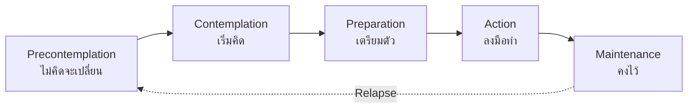

---
tags:
  - psychology
  - counseling-psychology
  - career-counseling
  - crisis-intervention
  - family-therapy
source: "Thai Psychology Council Curriculum Standards"
created: 2026-07-27
domain: "Counseling Psychology"
prerequisites: ["[[01_Foundations_of_Psychology]]"]
---

# 04 — Counseling Psychology

> *"Clinical psychology treats disorders. Counseling psychology helps people navigate life."*

Counseling Psychology (จิตวิทยาการปรึกษา) focuses on helping individuals cope with **normal life challenges** — career decisions, relationship issues, grief, stress, life transitions. While clinical psychology emphasizes pathology and treatment, counseling psychology emphasizes **strengths, prevention, and wellness**. In practice, the boundary between the two is increasingly blurred.

---

## 1 | Core Theories of Counseling

### 1.1 Person-Centered Therapy (Carl Rogers)

> *"The curious paradox is that when I accept myself just as I am, then I can change."*

| Core Condition | Meaning |
|---|---|
| **Unconditional Positive Regard (UPR)** | Accepting the client without judgment — "You are worthy, regardless" |
| **Empathy** | Understanding the client's world FROM THEIR PERSPECTIVE — not just feeling sorry for them |
| **Congruence (Genuineness)** | The counselor is real, authentic — not hiding behind a "professional mask" |

**Rogers' belief:** People have an innate tendency toward growth (actualizing tendency). The counselor's job is to create the right conditions — the client will find their own answers.

### 1.2 Cognitive Behavioral Counseling

- Same principles as CBT (see [[03_Clinical_Psychology]]) but applied to subclinical concerns
- **REBT (Rational Emotive Behavior Therapy — Ellis):** ABC model — Activating event → Belief → Consequence. Dispute irrational beliefs.
- **Solution-Focused Brief Therapy (SFBT — de Shazer & Berg):** Focus on solutions, not problems. "Miracle question," scaling questions, exceptions.

### 1.3 Narrative Therapy (White & Epston)

> *"The person is not the problem; the problem is the problem."*

- Externalization: Separate the person from the problem ("How has Anxiety been affecting your life?")
- Re-authoring: Help client construct a preferred life story
- Unique outcomes: Find times when the problem DIDN'T control them

### 1.4 Motivational Interviewing (Miller & Rollnick)

> **Essential for:** Addiction, health behavior change, ambivalence

| Spirit of MI | OARS Skills |
|---|---|
| **Partnership** (not expert-recipient) | **O**pen-ended questions |
| **Acceptance** (autonomy support) | **A**ffirmations |
| **Compassion** (client's welfare first) | **R**eflective listening |
| **Evocation** (draw out, not install) | **S**ummarizing |

**Stages of Change (Transtheoretical Model):**

---

## 2 | Career Counseling (การปรึกษาด้านอาชีพ)

### 2.1 Major Career Theories

| Theory | Key Concept |
|---|---|
| **Holland's RIASEC** | 6 types: **R**ealistic, **I**nvestigative, **A**rtistic, **S**ocial, **E**nterprising, **C**onventional — match person to environment |
| **Super's Life-Span Theory** | Career development is lifelong — Growth → Exploration → Establishment → Maintenance → Disengagement |
| **Social Cognitive Career Theory (SCCT)** | Self-efficacy + Outcome expectations → Interests → Goals → Actions |
| **Krumboltz's Learning Theory** | Career decisions shaped by learning experiences; planned happenstance |

### 2.2 Career Counseling Process

1. **Self-assessment** — Interests (RIASEC), values, skills, personality
2. **Career exploration** — Research options, informational interviews, job shadowing
3. **Decision-making** — Weigh options, address barriers
4. **Action planning** — Education/training, job search, networking

**Common tools:** Strong Interest Inventory, Myers-Briggs (MBTI — use cautiously; limited scientific support), values card sorts

---

## 3 | Grief & Loss Counseling

### 3.1 Grief Models

| Model | Stages / Tasks |
|---|---|
| **Kübler-Ross (1969)** | Denial → Anger → Bargaining → Depression → Acceptance (NOT linear!) |
| **Worden's Tasks of Mourning** | 1. Accept reality; 2. Process pain; 3. Adjust to world without the deceased; 4. Find enduring connection while moving forward |
| **Dual Process Model (Stroebe & Schut)** | Oscillation between loss-oriented coping and restoration-oriented coping |

### 3.2 Complicated Grief vs. Normal Grief

| Normal Grief | Complicated Grief (Prolonged Grief Disorder) |
|---|---|
| Waves of sadness that gradually lessen | Persistent, intense yearning > 12 months (6 for children) |
| Able to function despite pain | Significant functional impairment |
| Ability to experience joy returns | Pervasive numbness, bitterness |
| Identity gradually reorganizes | Identity disruption, feeling life is meaningless |

---

## 4 | Crisis Counseling

### 4.1 Types of Crisis

| Type | Examples |
|---|---|
| **Developmental** | Leaving home, becoming a parent, retirement |
| **Situational** | Accident, job loss, divorce, death |
| **Traumatic** | Assault, natural disaster, witnessing violence |
| **Existential** | Loss of meaning, mid-life crisis |

### 4.2 Crisis Intervention Model (Gilliland & James)

1. **Define the problem** — From the client's perspective
2. **Ensure safety** — Physical + psychological
3. **Provide support** — Communicate caring, not just words
4. **Examine alternatives** — What has worked before? What resources exist?
5. **Make a plan** — Concrete, collaborative, realistic
6. **Obtain commitment** — Client commits to follow through

**Psychological First Aid (PFA):** Used in disasters — safety, calming, connectedness, self-efficacy, hope.

---

## 5 | Group Counseling (การปรึกษาแบบกลุ่ม)

| Type | Structure | Best For |
|---|---|---|
| **Psychoeducational groups** | Structured, curriculum-driven | Skill-building (anger management, parenting, social skills) |
| **Counseling groups** | Semi-structured, process-oriented | Interpersonal growth, shared experience |
| **Support groups** | Peer-led or facilitator-led | Shared condition/experience (grief, addiction, illness) |
| **Therapy groups** | Led by licensed professional | Deeper psychological work |

**Therapeutic factors in groups (Yalom):**
1. **Universality** — "I'm not the only one"
2. **Altruism** — Helping others helps me
3. **Instillation of hope** — Seeing others improve
4. **Interpersonal learning** — Feedback from peers
5. **Group cohesiveness** — Belonging

---

## 6 | Key Terminology

| Thai | English | Notes |
|---|---|---|
| จิตวิทยาการปรึกษา | Counseling Psychology | Life adjustment, wellness focus |
| การปรึกษาแบบยึดบุคคลเป็นศูนย์กลาง | Person-Centered Counseling | Rogers' core conditions |
| การสัมภาษณ์เพื่อเสริมสร้างแรงจูงใจ | Motivational Interviewing (MI) | Ambivalence resolution |
| การปรึกษาด้านอาชีพ | Career Counseling | RIASEC, Super's theory |
| การปรึกษาภาวะวิกฤต | Crisis Intervention | Acute problem-solving |
| การปรึกษาแบบกลุ่ม | Group Counseling | Yalom's therapeutic factors |
| การปรึกษาครอบครัว | Family Counseling | Systemic approach |
| ความสูญเสียและเศร้าโศก | Grief and Loss | Normal vs. complicated grief |
| การฟังอย่างตั้งใจ | Active Listening | Core counseling microskill |
| การปรึกษาแบบเน้นทางออก | Solution-Focused Brief Therapy | Future-focused, strength-based |

---

## Related Notes

- [[03_Clinical_Psychology]] — For more severe psychopathology
- [[02_Psychological_Assessment_and_Diagnosis]] — Career and interest assessments
- [[05_Applied_Psychology_Specialties]] — Other psychology career paths
- [[Psychologist - Overview]] — Return to psychology overview
