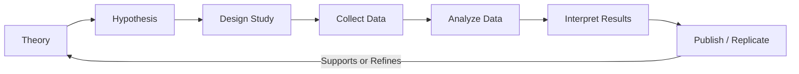
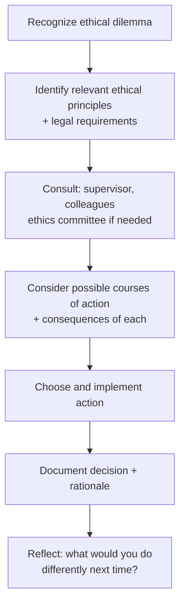

---
tags:
  - psychology
  - research-methods
  - statistics
  - ethics
  - professional-practice
source: "Thai Psychology Council Code of Ethics; APA Ethical Principles"
created: 2026-07-27
domain: "Research Methods & Ethics"
prerequisites: ["[[01_Foundations_of_Psychology]]"]
---

# 06 — Research Methods & Ethics

> *"Without research, psychology is just opinion. Without ethics, psychology is just manipulation."*

Research methods give psychology its scientific credibility. Ethics ensure that science serves people, not the other way around. Every psychology student — regardless of career path — must understand both.

---

## Part A: Research Methods (ระเบียบวิธีวิจัยทางจิตวิทยา)

### 1 | The Scientific Method in Psychology

### 2 | Research Designs

| Design | Description | Strengths | Limitations |
|---|---|---|---|
| **Experimental** | Manipulate IV, measure DV, random assignment | Can infer CAUSATION | Artificial settings, ethics (can't randomly assign trauma) |
| **Quasi-experimental** | Manipulate IV, NO random assignment | More feasible in real settings | Weaker causal claims |
| **Correlational** | Measure relationship between variables | Naturalistic, broad scope | Correlation ≠ Causation! |
| **Longitudinal** | Follow same people over time | Tracks development, change | Expensive, attrition |
| **Cross-sectional** | Compare different groups at one time | Quick, efficient | Cohort effects |
| **Case Study** | In-depth study of one person/case | Rich detail, rare phenomena | Poor generalizability |
| **Qualitative** | Interviews, focus groups, observation | Depth, meaning, lived experience | Subjective, time-intensive |
| **Mixed Methods** | Quantitative + Qualitative | Comprehensive understanding | Complex, requires dual expertise |
| **Meta-Analysis** | Statistically combine multiple studies | Most powerful evidence | "Garbage in, garbage out" |

### 3 | Variables & Measurement

| Concept | Definition |
|---|---|
| **Independent Variable (IV)** | What you manipulate — the "cause" |
| **Dependent Variable (DV)** | What you measure — the "effect" |
| **Confounding Variable** | An unmeasured variable that could explain results |
| **Operational Definition** | How you define and measure a variable concretely (e.g., "stress" = cortisol level OR self-report scale score) |
| **Internal Validity** | Are the results truly due to the IV, not confounds? |
| **External Validity** | Do results generalize to other people, settings, times? |

### 4 | Statistics for Psychology

#### 4.1 Descriptive Statistics

| Measure | Purpose | Example |
|---|---|---|
| **Mean (M)** | Average | Group average score |
| **Median** | Middle value | Better when data is skewed |
| **Mode** | Most frequent value | Nominal data |
| **Standard Deviation (SD)** | Spread of scores | M = 100, SD = 15 for IQ |
| **Range** | Max − Min | Quick check for outliers |
| **Correlation (r)** | Strength and direction of relationship | r = −1.00 to +1.00; r = 0 means no linear relationship |

#### 4.2 Inferential Statistics

| Test | When to Use |
|---|---|
| **t-test** | Compare means of 2 groups (independent or paired) |
| **ANOVA** | Compare means of 3+ groups (one-way, factorial, repeated measures) |
| **Chi-square (χ²)** | Compare frequencies / proportions (categorical data) |
| **Pearson's r** | Correlation between two continuous variables |
| **Regression** | Predict DV from one or more IVs |
| **Effect size (d, η², r²)** | How LARGE is the effect? (More important than p-value!) |

#### 4.3 Understanding p-values

| p-value | Meaning |
|---|---|
| **p < .05** | "Statistically significant" — result unlikely due to chance alone (< 5%) |
| **p > .05** | "Not statistically significant" — MAY still be meaningful, just not proven |

> **⚠️ The Replication Crisis:** Many classic psychology findings have failed to replicate. Modern solutions: pre-registration, larger samples, open data, replication studies. Psychology is fixing itself.

### 5 | Ethical Issues in Research

| Principle | Application |
|---|---|
| **Informed Consent** | Participants must understand and agree voluntarily |
| **Confidentiality** | Data is protected; identities anonymized |
| **Debriefing** | Explain the true purpose after deception studies |
| **Right to Withdraw** | Participants can quit anytime, no penalty |
| **Minimize Harm** | Physical and psychological harm must be minimized |
| **IRB / Ethics Committee Approval** | Required for all human subjects research |

---

## Part B: Professional Ethics (จริยธรรมวิชาชีพนักจิตวิทยา)

### 6 | General Ethical Principles

Based on the **APA Ethical Principles of Psychologists and Code of Conduct** and the **Thai Psychology Council Code of Ethics**:

| Principle | Meaning |
|---|---|
| **Beneficence & Non-maleficence** | Do good; do no harm — safeguard welfare of clients |
| **Fidelity & Responsibility** | Build trust; be aware of professional responsibility to society |
| **Integrity** | Be honest, accurate, truthful — no fraud, no misrepresentation |
| **Justice** | Fairness — equal quality of care regardless of demographics |
| **Respect for People's Rights & Dignity** | Privacy, confidentiality, self-determination, cultural sensitivity |

### 7 | Key Ethical Issues in Practice

| Issue | Ethical Requirement |
|---|---|
| **Confidentiality** | Must protect client information. Limits: (1) Danger to self, (2) Danger to others (Tarasoff duty to warn), (3) Child/elder abuse, (4) Court order |
| **Informed Consent** | Client must understand: nature of therapy, fees, limits of confidentiality, alternatives, right to withdraw |
| **Dual Relationships** | Avoid multiple roles with clients (friend, business partner, lover). Sexual relationships with current clients = NEVER. With former clients = at least 2 years (and even then, scrutinized) |
| **Competence** | Practice only within boundaries of training and experience |
| **Cultural Competence** | Understand and respect cultural differences; do not impose own values |
| **Record Keeping** | Maintain records securely; Thai law requires records kept for specified periods |
| **Termination** | Do not abandon clients; provide referrals when ending therapy |
| **Technology & Telehealth** | Secure platforms, informed consent for online therapy limitations |

### 8 | The Thai Psychology Council Code of Ethics (จรรยาบรรณนักจิตวิทยา)

The Psychology Council of Thailand prescribes ethical standards including:

| Section | Content |
|---|---|
| **จรรยาบรรณต่อผู้รับบริการ** | Ethics toward clients — confidentiality, competence, informed consent |
| **จรรยาบรรณต่อวิชาชีพ** | Ethics toward the profession — integrity, continuing education, no false claims |
| **จรรยาบรรณต่อเพื่อนร่วมวิชาชีพ** | Ethics toward colleagues — respect, cooperation, no unfair criticism |
| **จรรยาบรรณต่อสังคม** | Ethics toward society — promote public welfare, accurate public communication |

### 9 | Ethical Decision-Making Model

---

## 10 | Key Terminology

| Thai | English | Notes |
|---|---|---|
| ระเบียบวิธีวิจัย | Research Methodology | Systematic approach to knowledge generation |
| ตัวแปรต้น / ตัวแปรตาม | Independent / Dependent Variable | IV = manipulated; DV = measured |
| สมมติฐาน | Hypothesis | Testable prediction |
| นัยสำคัญทางสถิติ | Statistical Significance | p < .05 convention |
| ขนาดอิทธิพล | Effect Size | Magnitude of effect, not just significance |
| การพิทักษ์สิทธิผู้เข้าร่วมวิจัย | Human Subjects Protection | IRB, informed consent |
| จรรยาบรรณวิชาชีพ | Professional Code of Ethics | Enforceable by Psychology Council |
| การรักษาความลับ | Confidentiality | Limits: danger, abuse, court order |
| ความยินยอมที่ได้รับการบอกกล่าว | Informed Consent | Understanding + voluntariness |
| ความสัมพันธ์ซ้ำซ้อน | Dual Relationship | Multiple roles with same person — avoid |

---

## Related Notes

- [[02_Psychological_Assessment_and_Diagnosis]] — Research on test validity/reliability
- [[03_Clinical_Psychology]] — Evidence-based practice depends on research
- [[Psychologist - Overview]] — Return to psychology overview
