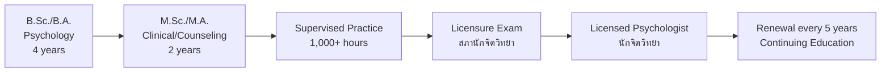
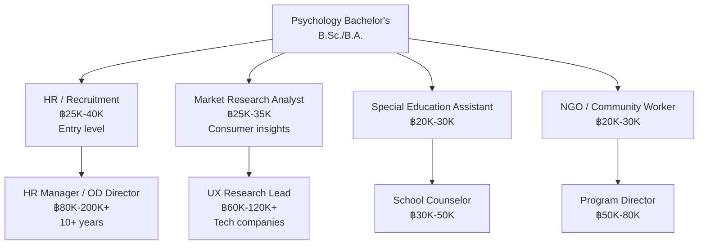

---
tags:
  - psychology
  - university-guide
  - career-paths
  - TCAS
  - salary
source: "Thai Psychology Council; TCAS; University websites; Department of Mental Health"
created: 2026-07-27
domain: "University Guide & Career Paths"
prerequisites: ["[[Psychologist - Overview]]"]
---

# 07 — University Guide & Career Paths

> *"Psychology is one of the most versatile degrees. But if you want to be a licensed clinical psychologist, the path is specific — and you need to know it from the start."*

This is the practical guide: where to study, how to get in, the licensing process, what you'll earn, and where psychology can take you.

---

## Part A: University Guide (แนวทางเข้าศึกษา)

### 1 | Admission Requirements

| Requirement | Details |
|---|---|
| **Education** | ม.6 (Matthayom 6) graduate. **Science-Math or Arts-Math track** accepted by most programs |
| **GPA** | Minimum GPAX typically 2.50–3.00 (varies by university) |
| **Required subjects** | Science track preferred but NOT always required — check each university |
| **Key aptitude** | Strong reading comprehension, analytical thinking, English skills |
| **Age** | Typically 17–25 at enrollment |

> **⚡ Key difference from nursing:** Psychology bachelor's programs accept BOTH science and arts tracks! This makes it more accessible for arts-language students.

### 2 | TCAS Admission Rounds

| Round | Period | Description | Suitable For |
|---|---|---|---|
| **TCAS 1 — Portfolio** | Oct–Dec | Portfolio + GPAX + activities | Students with strong extracurriculars |
| **TCAS 2 — Quota** | Jan–Mar | Regional/special quotas | Students from specific provinces/schools |
| **TCAS 3 — Admission 1** | Mar–May | Central admission via TGAT/TPAT + A-Level | Most students |
| **TCAS 4 — Admission 2** | May–Jun | Direct admission by university | Flexible requirements |
| **TCAS 5 — Direct** | Jun–Jul | Final round | Remaining seats |

### 3 | Exams Required for Psychology (TCAS 3)

| Exam | Subject | Typical Weight |
|---|---|---|
| **TGAT** | Thai General Aptitude Test — communication, thinking, English | 30–50% |
| **A-Level English** | ภาษาอังกฤษ | 15–25% |
| **A-Level Biology** | ชีววิทยา (for some programs) | 10–20% |
| **A-Level Thai / Social Studies** | ภาษาไทย / สังคมศึกษา | 10–15% |
| **TPAT 1** | Medical Aptitude (for clinical-heavy programs) | Occasionally required |

> **Note:** Psychology is generally less math-intensive than medicine/nursing. The emphasis is on reading, writing, analytical thinking, and English.

### 4 | Top Psychology Programs in Thailand

#### 🥇 Tier 1 — Premier Psychology Faculties

| University | Faculty/Program | Location | Notable Features |
|---|---|---|---|
| **Chulalongkorn University** | คณะจิตวิทยา (Faculty of Psychology) | Bangkok | Thailand's only standalone Faculty of Psychology; strongest research output; B.Sc., M.Sc., Ph.D. all available |
| **Thammasat University** | สาขาจิตวิทยา คณะศิลปศาสตร์ (Psychology, Faculty of Liberal Arts) | Pathum Thani (Rangsit) | Strong social psychology and counseling; clinical training at Thammasat Hospital; progressive culture |
| **Chiang Mai University** | สาขาจิตวิทยา คณะมนุษยศาสตร์ (Psychology, Faculty of Humanities) | Chiang Mai | Strong clinical and community psychology; Northern Thailand hub; Maharaj Nakorn CM Hospital affiliation |

#### 🥈 Tier 2 — Strong Programs with Clinical Training

| University | Faculty | Location | Notable Features |
|---|---|---|---|
| **Mahidol University** | สถาบันชีววิทยาศาสตร์โมเลกุล (Neuroscience focus) / วิทยาลัยวิทยาศาสตร์การแพทย์ | Bangkok (Salaya) | Neuroscience-heavy; research-focused; international collaborations |
| **Kasetsart University** | สาขาจิตวิทยา คณะสังคมศาสตร์ | Bangkok (Bang Khen) | Strong I-O and community psychology; counseling psychology |
| **Srinakharinwirot University** | สาขาจิตวิทยา คณะมนุษยศาสตร์ | Bangkok | Strong educational psychology; teacher training tradition |
| **Burapha University** | สาขาจิตวิทยา คณะมนุษยศาสตร์และสังคมศาสตร์ | Chonburi | Eastern seaboard; growing clinical program |
| **Prince of Songkla University** | สาขาจิตวิทยา คณะมนุษยศาสตร์และสังคมศาสตร์ | Pattani / Hat Yai | Southern Thailand hub; cross-cultural psychology (deep south context) |

#### 🥉 Tier 3 — Other Notable Programs

| University | Location |
|---|---|
| **Khon Kaen University** (คณะมนุษยศาสตร์ฯ) | Khon Kaen |
| **Naresuan University** (คณะสังคมศาสตร์) | Phitsanulok |
| **Silpakorn University** (คณะศึกษาศาสตร์) | Nakhon Pathom |
| **Ramkhamhaeng University** (คณะศึกษาศาสตร์) | Bangkok (open university — lower tuition) |
| **Sukhothai Thammathirat Open University** | Distance learning (เหมาะสำหรับผู้ที่ทำงานไปด้วย) |

#### 🏥 Clinical Training Institutions (Postgraduate)

For the **master's in clinical psychology**, these are the premier institutions:

| Institution | Program | Features |
|---|---|---|
| **Chulalongkorn University** | วท.ม. จิตวิทยาคลินิก | Most competitive; strong research component |
| **Mahidol University** | วท.ม. จิตวิทยาคลินิก | Neuroscience/medical orientation; Siriraj Hospital |
| **Chiang Mai University** | วท.ม. จิตวิทยาคลินิก | Strong community mental health |
| **Thammasat University** | วท.ม. จิตวิทยาการปรึกษา | Counseling psychology focus |
| **Ramathibodi Hospital (Mahidol)** | หลักสูตรเฉพาะทาง | Clinical training for hospital-based psychologists |
| **Srithanya Hospital (กรมสุขภาพจิต)** | หลักสูตรเฉพาะทาง | Psychiatric hospital — hands-on clinical training |
| **Somdet Chaopraya Institute of Psychiatry** | หลักสูตรเฉพาะทาง | Thailand's largest psychiatric hospital |

### 5 | Tuition & Costs (ค่าใช้จ่าย)

| Type | Tuition per Year (Approx.) | Notes |
|---|---|---|
| **Public University — Bachelor's** | ฿15,000–฿40,000 | Government subsidized |
| **Private University — Bachelor's** | ฿80,000–฿200,000 | e.g., ABAC, Rangsit, Bangkok University |
| **Public University — Master's** | ฿30,000–฿80,000 | Clinical master's often more expensive |
| **International Program** | ฿150,000–฿400,000 | English-medium, often joint degrees |

---

## Part B: The Licensing Process (การขอรับใบอนุญาต)

### 6 | Becoming a Licensed Psychologist in Thailand

### 7 | License Categories Under the Psychology Profession Act B.E. 2560

| Category | Education Required | Exam |
|---|---|---|
| **นักจิตวิทยาคลินิก (Clinical Psychologist)** | M.Sc./M.A. in Clinical Psychology | Clinical psychology licensure exam |
| **นักจิตวิทยาการปรึกษา (Counseling Psychologist)** | M.Sc./M.A. in Counseling Psychology | Counseling psychology licensure exam |
| **นักจิตวิทยาอุตสาหกรรมและองค์การ (I-O Psychologist)** | M.Sc./M.A. in I-O Psychology | I-O psychology exam |
| **นักจิตวิทยาพัฒนาการ (Developmental Psychologist)** | M.Sc./M.A. in Developmental Psychology | Developmental psychology exam |
| **นักจิตวิทยาชุมชน (Community Psychologist)** | M.Sc./M.A. in Community Psychology | Community psychology exam |

---

## Part C: Career Paths & Salaries

### 8 | Work Settings & Salary Ranges

| Setting | Role | Salary (Monthly) |
|---|---|---|
| **Government Psychiatric Hospital** | Clinical Psychologist (ข้าราชการ) | ฿25,000–฿45,000 + government benefits |
| **General Hospital** | Clinical Psychologist | ฿30,000–฿50,000 |
| **Private Hospital** | Clinical Psychologist | ฿40,000–฿80,000 |
| **Private Practice / Clinic** | Owner or contracted psychologist | ฿50,000–฿150,000+ (variable) |
| **Corporate — HR/OD** | I-O Psychologist, HR Manager | ฿35,000–฿80,000 (junior); ฿80,000–฿200,000+ (senior) |
| **School / University** | School Psychologist / Counselor | ฿25,000–฿50,000 |
| **University Lecturer** | อาจารย์ (requires Ph.D. for permanent) | ฿30,000–฿60,000 + research grants |
| **Research Institute** | Researcher | ฿25,000–฿55,000 |
| **NGO / Non-profit** | Community Psychologist, Program Manager | ฿25,000–฿60,000 |
| **Government Agency** | Policy, program evaluation | ฿25,000–฿50,000 |
| **Private — Market Research / UX** | Consumer Psychologist, UX Researcher | ฿40,000–฿90,000 |
| **Freelance / Consultant** | Trainer, coach, consultant | ฿1,500–฿5,000/hr |

### 9 | Career Progression — Clinical Track

```mermaid
flowchart TD
    A["Psychology Bachelor's<br/>B.Sc./B.A.<br/>฿0 &#40;student&#41;"] --> B["Master's in Clinical Psych<br/>2 years + internship"]
    B --> C["Licensed Clinical Psychologist<br/>฿25K-50K<br/>Hospital / Clinic"]
    C --> D["Senior Psychologist<br/>฿45K-70K<br/>5-10 years experience"]
    D --> E["Chief Psychologist / Director<br/>฿70K-120K+<br/>Department/Hospital head"]
    C --> F["Private Practice<br/>฿50K-150K+<br/>Build own client base"]
    C --> G["Ph.D. / Doctoral<br/>Academic career<br/>Research + teaching"]
```

### 10 | Career Progression — Non-Clinical Track

### 11 | In-Demand Specialties in Thailand

| Specialty | Why Growing |
|---|---|
| **Clinical Psychologist** | Mental health awareness rising; still severe shortage — ~1 clinical psychologist per 200,000 people |
| **Child & Adolescent Psychology** | Child mental health crisis post-COVID; school violence, bullying, social media impact |
| **Geriatric Psychology** | Thailand's aging society — dementia care, caregiver support, end-of-life |
| **Addiction Psychology** | Substance abuse (ya ba, alcohol, cannabis); behavioral addictions (gambling, gaming) |
| **Corporate Wellness / EAP** | Companies investing in employee mental health (Employee Assistance Programs) |
| **UX Research** | Tech companies hiring psychologists to understand users |
| **Trauma Psychology** | PTSD treatment, disaster mental health (tsunami, floods, political violence) |
| **Neuropsychology** | Brain injury, stroke, dementia assessment |

### 12 | International Career Pathways

| Destination | Requirements | Notes |
|---|---|---|
| **USA** | Ph.D./Psy.D. + EPPP exam + state licensure + supervised hours | Very competitive; Ph.D. usually funded |
| **UK** | HCPC registration + doctoral-level training | DClinPsy (3-year funded doctorate) |
| **Australia** | APAC-accredited degree + PsyBA registration | 6-year pathway (4+2 or 5+1) |
| **Singapore** | Recognized master's + SPS registration | High demand, competitive salaries |
| **Malaysia** | Master's + LCP registration | Growing mental health sector |

### 13 | Scholarships (ทุนการศึกษา)

| Scholarship | Sponsor | Details |
|---|---|---|
| **ทุนกรมสุขภาพจิต** | Department of Mental Health | For clinical psychology training + work commitment |
| **ทุน ก.พ.** | Civil Service Commission | For government psychologist positions |
| **ทุนมหาวิทยาลัย** | Individual universities | Teaching assistantships, research assistantships (especially at master's/Ph.D. level) |
| **ทุน Fulbright** | US Government | For Ph.D. study in USA (competitive) |
| **ทุนรัฐบาลไทย (ก.พ.)** | Royal Thai Government | Graduate study abroad + return service |
| **ทุน กยศ. (Student Loan Fund)** | Government | Low-interest loan |

### 14 | Professional Organizations

| Organization | Thai Name | Benefit |
|---|---|---|
| **Thailand Psychology Council** | สภานักจิตวิทยา | Mandatory — licensing and regulation |
| **Thai Psychological Association** | สมาคมจิตวิทยาแห่งประเทศไทย | Conferences, journals, networking |
| **Thai Clinical Psychology Association** | สมาคมนักจิตวิทยาคลินิกไทย | Clinical networking, continuing education |
| **Thai Mental Health Association** | สมาคมสุขภาพจิตแห่งประเทศไทย | Multidisciplinary mental health |
| **Asian Psychological Association** | — | Regional connections |
| **APA (American Psychological Association)** | — | International student membership available |

---

## 15 | Summary: Is Psychology Right for You?

| ✅ You'll thrive if you... | ⚠️ Consider carefully if you... |
|---|---|
| Are genuinely curious about why people think, feel, and act as they do | Just want to "help people" but don't like science |
| Enjoy reading and writing (a LOT of both) | Dislike reading research papers and statistics |
| Can separate your emotions from others' problems (professional boundaries) | Absorb others' pain and can't let go |
| Are comfortable with uncertainty (the mind is complex) | Need clear-cut, black-and-white answers |
| Like working one-on-one or with small groups | Prefer working alone or only with data |
| Are patient — change takes time, sometimes years | Expect quick fixes or dramatic breakthroughs |
| Can handle being with someone in deep pain without "fixing" them immediately | Feel compelled to solve everyone's problems |
| Want a versatile degree that opens many doors | Already know you want clinical only AND dislike 6+ years of study |

> **Final thought:** Psychology is not about reading minds. It's not about having all the answers. It's about being willing to sit with uncertainty, to listen deeply, to apply scientific rigor to the most complex subject in the universe — the human mind. If that excites you more than it intimidates you, welcome.

---

## Related Notes

- [[Psychologist - Overview]] — Start here for the big picture
- [[01_Foundations_of_Psychology]] — What you'll study in Year 1–2
- [[03_Clinical_Psychology]] — The clinical specialization track
- [[05_Applied_Psychology_Specialties]] — Non-clinical career options
