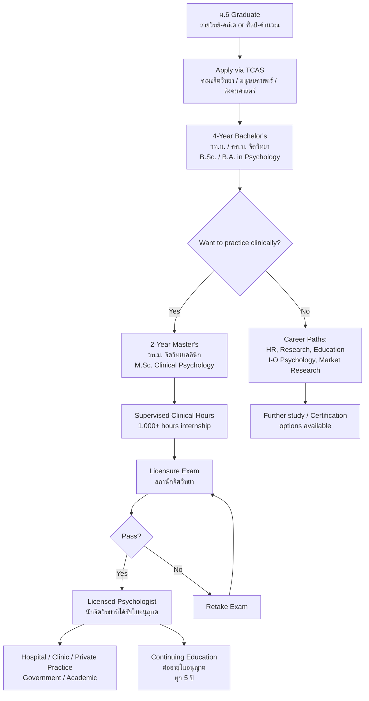

---
tags:
  - overview
  - psychology
  - career
  - mental-health
  - thai-education
source: "Psychology Profession Act B.E. 2560 (2017); Thai Psychology Council (สภานักจิตวิทยา)"
created: 2026-07-27
profession: "นักจิตวิทยา (Psychologist)"
degree: "วท.บ. / ศศ.บ. จิตวิทยา → วท.ม. / ศศ.ม. จิตวิทยาคลินิก"
duration: "4 ปี (ป.ตรี) + 2 ปี (ป.โท) รวม 6 ปี สำหรับ Clinical Track"
---

# Psychology — วิชาชีพนักจิตวิทยา

> *"Psychology is the scientific study of mind and behavior. Psychologists don't just guess what people are thinking — we measure, test, observe, and apply decades of science."*

> *"นักจิตวิทยา คือ ผู้ประกอบวิชาชีพที่กระทำต่อมนุษย์เกี่ยวกับการศึกษา วิเคราะห์ วิจัย การทดสอบ การประเมิน การวินิจฉัยทางจิตวิทยา การบำบัดความผิดปกติทางจิต การให้คำปรึกษา และการฟื้นฟูสุขภาพจิต"* — พ.ร.บ. วิชาชีพนักจิตวิทยา พ.ศ. 2560

## What Is This?

This is a **career guidance knowledge base** for Thai students considering psychology as a profession. It covers what psychology is, what you'll learn, where you can study, how to get licensed, and what career paths exist.

Psychology in Thailand became a **regulated profession** with the **Psychology Profession Act B.E. 2560 (2017)** — พระราชบัญญัติวิชาชีพนักจิตวิทยา. Before this law, anyone could call themselves a "psychologist." Now, only licensed professionals can legally use the title and practice.

> **⚠️ Important distinction:** 
> - **Psychologist (นักจิตวิทยา)** — studies mind and behavior; treats through psychotherapy and assessment. Not a medical doctor. Cannot prescribe medication.
> - **Psychiatrist (จิตแพทย์)** — medical doctor (M.D.) who specialized in psychiatry. Can prescribe medication, order lab tests, admit patients.
> - **Counselor (ผู้ให้คำปรึกษา)** — broader term; may or may not be licensed depending on context.

## Education Pathway

## The 7 Knowledge Domains

### 🧠 Foundation Sciences
- [[01_Foundations_of_Psychology|01 Foundations of Psychology]] — Biological, cognitive, developmental, social, personality psychology

### 📏 Assessment
- [[02_Psychological_Assessment_and_Diagnosis|02 Psychological Assessment & Diagnosis]] — Psychometrics, IQ tests, personality tests, DSM-5-TR / ICD-11 diagnosis

### 🏥 Clinical Practice
- [[03_Clinical_Psychology|03 Clinical Psychology]] — Psychopathology, psychotherapy (CBT, psychodynamic, humanistic), treatment modalities
- [[04_Counseling_Psychology|04 Counseling Psychology]] — Life adjustment, career counseling, crisis intervention, family therapy

### 🔬 Applied Specialties
- [[05_Applied_Psychology_Specialties|05 Applied Psychology Specialties]] — I-O psychology, educational, health, forensic, community, sports, neuropsychology

### 📊 Research & Ethics
- [[06_Research_Methods_and_Ethics|06 Research Methods & Ethics]] — Experimental design, statistics, psychometrics, Thai Psychology Council Code of Ethics

### 🎓 Career Pathways
- [[00_University_Guide_and_Career_Paths|University Guide & Career Paths]] — Top psychology schools, TCAS, licensing process, salaries, career options

## The Psychology Profession in Thailand

### Regulatory Body

| Organization | Thai Name | Role |
|---|---|---|
| **Thailand Psychology Council** | สภานักจิตวิทยา | Licensure exams, professional standards, curriculum accreditation, ethics enforcement |
| **Department of Mental Health** | กรมสุขภาพจิต | Public mental health services, employs psychologists in government hospitals |
| **Thai Psychological Association** | สมาคมจิตวิทยาแห่งประเทศไทย | Professional development, research, advocacy |

### Legal Framework

The profession is governed by the **Psychology Profession Act B.E. 2560 (2017)** — พระราชบัญญัติวิชาชีพนักจิตวิทยา พ.ศ. 2560.

Key provisions:
- Defines "psychologist" (นักจิตวิทยา) and scope of professional practice
- Establishes the **Psychology Council (สภานักจิตวิทยา)** as the regulatory body
- Sets license requirements: degree + exam + supervised practice
- Defines professional conduct standards and disciplinary processes
- Penalties for unlicensed practice

### Types of Licensed Psychologists in Thailand

| License Type | Thai | Scope |
|---|---|---|
| **Clinical Psychologist** | นักจิตวิทยาคลินิก | Assess, diagnose, and treat mental disorders |
| **Counseling Psychologist** | นักจิตวิทยาการปรึกษา | Life adjustment, relationship, career counseling |
| **Industrial-Organizational Psychologist** | นักจิตวิทยาอุตสาหกรรมและองค์การ | Workplace behavior, HR, organizational development |
| **Developmental Psychologist** | นักจิตวิทยาพัฒนาการ | Human development across the lifespan |
| **Community Psychologist** | นักจิตวิทยาชุมชน | Community mental health, prevention programs |

## Key Terminology

| Thai | English | Notes |
|---|---|---|
| นักจิตวิทยา | Psychologist | Licensed professional per พ.ร.บ. 2560 |
| นักจิตวิทยาคลินิก | Clinical Psychologist | Assesses and treats mental disorders |
| นักจิตวิทยาการปรึกษา | Counseling Psychologist | Guidance and life adjustment focus |
| จิตแพทย์ | Psychiatrist | Medical doctor specialized in psychiatry |
| สภานักจิตวิทยา | Psychology Council | Regulatory body |
| พ.ร.บ. วิชาชีพนักจิตวิทยา พ.ศ. 2560 | Psychology Profession Act B.E. 2560 | Governing law |
| การประเมินทางจิตวิทยา | Psychological Assessment | Testing, interviewing, observation |
| จิตบำบัด | Psychotherapy | Talk therapy; CBT, psychodynamic, etc. |
| DSM-5-TR | Diagnostic and Statistical Manual | APA diagnostic classification |
| ICD-11 | International Classification of Diseases | WHO system used globally |

## Reading Paths

- **High school student exploring:** Start here → [[00_University_Guide_and_Career_Paths|University Guide]] → [[01_Foundations_of_Psychology|What you'll study]]
- **Undergrad considering clinical track:** [[03_Clinical_Psychology|Clinical Psych]] → [[02_Psychological_Assessment_and_Diagnosis|Assessment]] → [[06_Research_Methods_and_Ethics|Ethics]]
- **Exploring non-clinical careers:** [[05_Applied_Psychology_Specialties|Applied Specialties]] → [[00_University_Guide_and_Career_Paths|Career Paths]]
- **Parent/guidance counselor:** [[00_University_Guide_and_Career_Paths|University Guide]] → Return here for subject details

---

> **Related Careers:** [[../nurse/Nursing - Overview|Nursing]], [[../doctor/Medicine - Overview|Medicine]], [[Psychiatrist|Psychiatry]], [[../teacher/Teaching - Overview|Teaching]], [[../social-worker/Social Work - Overview|Social Work]]
