---
tags:
  - teaching
  - university-guide
  - career-paths
  - TCAS
  - salary
  - teacher-license
source: "Teachers' Council (คุรุสภา); TCAS; University websites; OBEC"
created: 2026-07-27
domain: "University Guide & Career Paths"
prerequisites: ["[[Teacher - Overview]]"]
---

# 07 — University Guide & Career Paths

> *"Teaching is not what you do when you can't do anything else. It's what you do when you want to change everything."*

This is the practical guide: where to study, how to get in, how to get licensed, what you'll earn, and where a teaching career can take you — from the classroom to the world.

---

## Part A: University Guide

### 1 | Admission Requirements

| Requirement | Details |
|---|---|
| **Education** | ม.6 graduate — **ALL tracks accepted** (Science-Math, Arts-Math, Arts-Language, Arts-Social) |
| **GPA** | Minimum GPAX typically 2.50–2.75 |
| **Personality** | Teachers are evaluated on demeanor, communication, love of children — some programs include interview |
| **Health** | Physical and mental fitness; no communicable diseases |
| **Special requirements** | Some programs require Thai language proficiency test; no criminal record |

> ✅ Teaching is one of the most **accessible professions** — no strict science/math requirements unless you want to teach those subjects.

### 2 | TCAS Admission Rounds

| Round | Period | Best For |
|---|---|---|
| **TCAS 1 — Portfolio** | Oct–Dec | Strong extracurriculars, teaching volunteer experience, leadership |
| **TCAS 2 — Quota** | Jan–Mar | Regional quotas (ครูคืนถิ่น — return to home province to teach) |
| **TCAS 3 — Admission 1** | Mar–May | Central admission via TGAT/TPAT + A-Level |
| **TCAS 4 — Admission 2** | May–Jun | Direct admission by each university |
| **TCAS 5 — Direct** | Jun–Jul | Remaining seats |

### 3 | Exams Required for Education (TCAS 3)

| Exam | Subject | Typical Weight |
|---|---|---|
| **TGAT** | Thai General Aptitude Test | 30–40% |
| **TPAT 5** (ความถนัดครู) | Teaching Aptitude Test — professional awareness, ethics, problem-solving | 15–25% |
| **A-Level Thai** | ภาษาไทย | 10–20% |
| **A-Level English** | ภาษาอังกฤษ | 10–15% |
| **A-Level Social Studies** | สังคมศึกษา | 10–15% |
| **A-Level subject** | Depending on teaching major (Math, Science, etc.) | 10–15% |

### Education Programs in Thailand

| University                            | Faculty                           | Location               | Notable Features                                                                                                                                      |
| ------------------------------------- | --------------------------------- | ---------------------- | ----------------------------------------------------------------------------------------------------------------------------------------------------- |
| **Srinakharinwirot University (มศว)** | คณะศึกษาศาสตร์                    | Bangkok (Prasarnmit)   | 🔑 **Historically THE premier teaching university** (formerly College of Education); strong in all education fields; Demonstration School (สาธิต มศว) |
| **Thammasat University**              | คณะวิทยาการเรียนรู้และศึกษาศาสตร์ | Pathum Thani (Rangsit) | Newer faculty; innovative, progressive approach; learning sciences focus                                                                              |
| **Chiang Mai University**             | คณะศึกษาศาสตร์                    | Chiang Mai             | Northern Thailand education hub; strong community & rural education                                                                                   |
| **Khon Kaen University**              | คณะศึกษาศาสตร์                    | Khon Kaen              | -                                                                                                                                                     |
| **Prince of Songkla University**      | คณะศึกษาศาสตร์                    | Pattani                | -                                                                                                                                                     |
| **Burapha University**                | คณะศึกษาศาสตร์                    | Chonburi               | -                                                                                                                                                     |
| **Naresuan University**               | คณะศึกษาศาสตร์                    | Phitsanulok            | -                                                                                                                                                     |
| **Silpakorn University**              | คณะศึกษาศาสตร์                    | Nakhon Pathom          | -                                                                                                                                                     |
| **Mahasarakham University**           | คณะศึกษาศาสตร์                    | Maha Sarakham          | -                                                                                                                                                     |
| **Thaksin University**                | คณะศึกษาศาสตร์                    | Songkhla               | -                                                                                                                                                     |
| **มหาวิทยาลัยราชภัฏสวนสุนันทา** | คณะครุศาสตร์ | Bangkok                | -                                                                                                                                                     |
| **มหาวิทยาลัยราชภัฏจันทรเกษม** | คณะครุศาสตร์ | Bangkok                | -                                                                                                                                                     |
| **มหาวิทยาลัยราชภัฏเชียงใหม่** | คณะครุศาสตร์ | Chiang Mai             | -                                                                                                                                                     |
| **มหาวิทยาลัยราชภัฏนครราชสีมา** | คณะครุศาสตร์ | Nakhon Ratchasima      | -                                                                                                                                                     |
| **มหาวิทยาลัยราชภัฏสงขลา** | คณะครุศาสตร์ | Songkhla               | -                                                                                                                                                     |
| **มหาวิทยาลัยราชภัฏพระนคร** | คณะครุศาสตร์ | Bangkok                | -                                                                                                                                                     |

### 6 | Tuition & Costs

| Type | Tuition per Year (Approx.) | Notes |
|---|---|---|
| **Public University** | ฿15,000–฿30,000 | Government subsidized |
| **Rajabhat University** | ฿8,000–฿20,000 | Most affordable |
| **Private University** | ฿60,000–฿150,000 | e.g., ABAC, Rangsit |
| **Additional costs** | Uniforms, teaching materials, practicum travel: ~฿10,000–฿20,000/year |

---

## Part B: Licensing Process

### 7 | Teacher Licensure Exam (การสอบใบอนุญาตประกอบวิชาชีพครู)

Administered by **คุรุสภา (Teachers' Council of Thailand)**:

| Exam Component | Content |
|---|---|
| **วิชาชีพครู (Professional Knowledge)** | 4 sections: (1) Teacher Professionalism, (2) Educational Psychology & Guidance, (3) Curriculum & Learning Management, (4) Measurement, Evaluation & Classroom Research |
| **วิชาเอก (Subject Area)** | Depends on teaching major (Thai, English, Math, Science, etc.) |
| **ประสบการณ์วิชาชีพ (Practicum Assessment)** | 1 year supervised teaching evaluated by mentor + university supervisor |

**Pass criteria:** ≥ 60% on each section

### 8 | License Types

| License | Thai | Duration | Requirements |
|---|---|---|---|
| **Professional License A** | ใบอนุญาตประกอบวิชาชีพครู | 5 years | Pass exam + practicum; renew with CPD |
| **Provisional License B** | ใบอนุญาตปฏิบัติการสอนชั่วคราว | 2 years (non-renewable) | Degree but haven't passed exam; must pass within 2 years |
| **Administrative License** | ใบอนุญาตผู้บริหารสถานศึกษา | 5 years | Master's + experience + exam |
| **Supervisor License** | ใบอนุญาตศึกษานิเทศก์ | 5 years | Experience + exam |

---

## Part C: Career Paths & Salaries

### 9 | Work Settings

| Setting | Role | Salary (Monthly) | Benefits |
|---|---|---|---|
| **Government School — Civil Servant (ข้าราชการครู)** | Classroom teacher | ฿15,000–฿35,000 (starting) | Government pension, healthcare, job security, วิทยฐานะ bonuses |
| **Government School — Contract (อัตราจ้าง)** | Classroom teacher | ฿9,000–฿15,000 | Limited benefits |
| **Private School** | Classroom teacher | ฿15,000–฿35,000 | May include housing, tuition discount for children |
| **International School** | Classroom teacher | ฿60,000–฿150,000+ | Housing allowance, flights, insurance, tuition for children |
| **Demonstration School (สาธิต)** | University school teacher | ฿25,000–฿50,000 | University benefits |
| **University Lecturer** | อาจารย์มหาวิทยาลัย | ฿30,000–฿70,000 | Research grants, sabbatical, academic prestige |
| **Private Tutor** | ติวเตอร์ | ฿200–฿1,500/hr | Flexible, high earning potential if known |
| **EdTech / Curriculum Developer** | Content developer | ฿30,000–฿80,000 | Growing sector; remote work possible |
| **School Administrator** | ผู้อำนวยการโรงเรียน | ฿40,000–฿100,000+ | Requires administrative license + experience |

### 10 | Government Teacher Salary Table (ข้าราชการครู)

| วิทยฐานะ (Academic Standing) | Salary Range (Monthly) |
|---|---|
| **ครูผู้ช่วย (Assistant Teacher)** — first 2 years | ฿15,000–฿18,000 |
| **คศ.1 (Practitioner Level)** | ฿18,000–฿35,000 |
| **คศ.2 (Professional Level)** | ฿25,000–฿45,000 |
| **คศ.3 (Senior Professional Level)** | ฿35,000–฿60,000 |
| **คศ.4 (Expert Level)** | ฿45,000–฿75,000 |
| **คศ.5 (Advisory Level)** | ฿60,000–฿90,000+ |

> **วิทยฐานะ** is the Thai teacher career advancement system — each level requires portfolio submission, classroom observation, and professional development.

### 11 | Career Progression

```mermaid
flowchart TD
    A["Student Teacher<br/>นักศึกษาฝึกสอน<br/>Year 4-5"] --> B["Assistant Teacher<br/>ครูผู้ช่วย<br/>2 years"]
    B --> C["Teacher &#40;คศ.1&#41;<br/>ครู<br/>Pass licensure exam"]
    C --> D["Senior Teacher &#40;คศ.2&#41;<br/>ครูชำนาญการ<br/>5+ years"]
    D --> E["Expert Teacher &#40;คศ.3&#41;<br/>ครูชำนาญการพิเศษ<br/>Submit วิทยฐานะ portfolio"]
    E --> F["Master Teacher &#40;คศ.4-5&#41;<br/>ครูเชี่ยวชาญ / เชี่ยวชาญพิเศษ"]
    C --> G["School Administrator<br/>ผู้บริหารสถานศึกษา<br/>Master's + Admin License"]
    G --> H["School Director<br/>ผู้อำนวยการโรงเรียน"]
    C --> I["Alternative Paths:<br/>EdTech, Curriculum Design,<br/>University Lecturer,<br/>Education Consultant, NGO"]
```

### 12 | Top Scholarships (ทุนการศึกษา)

| Scholarship | Who Offers | Details |
|---|---|---|
| **ทุนครู** | Various (คุรุสภา, MOE, universities) | Free tuition + stipend; teach in underserved areas |
| **ทุนผลิตครูโครงการพิเศษ** | MOE + Rajabhat Universities | Focus on rural teacher shortage |
| **ทุนครูคืนถิ่น** | Provincial governments | Scholarship to study education; return to teach in home province |
| **โครงการครูทายาท** | OBEC | Children of teachers get priority/scholarship |
| **ทุน ก.พ.** | Government | Teaching in government schools |
| **ทุน Fulbright** | US Government | Graduate study in USA (for experienced teachers) |
| **ทุน กยศ. (Student Loan Fund)** | Government | Low-interest loan |

### 13 | Summary: Is Teaching Right for You?

| ✅ You'll thrive if you... | ⚠️ Consider carefully if you... |
|---|---|
| Love working with children/young people | Dislike noise, chaos, unpredictability |
| Are patient — very, very patient | Get easily frustrated |
| Enjoy explaining things in different ways | Get annoyed when people don't "get it" immediately |
| Care about social justice and equal opportunity | Only care about your own subject, not students |
| Are creative and adaptable | Need everything to go according to plan |
| Can maintain professional boundaries | Want to be everyone's friend |
| Are organized (lesson plans, grading, meetings) | Struggle with time management |
| Want a stable career with benefits and pension | Want to get rich quickly |
| Believe education can change lives | Are cynical about the value of schooling |
| Are a lifelong learner | Think you already know everything |

> **Final thought:** Teaching is not the easiest profession. It's not the highest-paying. But few careers offer the same opportunity to touch the future — every day, in every class, with every student. The influence of a teacher is infinite. If you're called to it, nothing else is like it.

---

## Related Notes

- [[Teacher - Overview]] — Start here for the big picture
- [[01_Foundations_of_Education]] — The philosophy behind the practice
- [[02_Curriculum_and_Instruction]] — What you'll actually do every day
- [[../nurse/Nursing - Overview|Nursing]] — Another helping profession
- [[../psychologist/Psychologist - Overview|Psychology]] — Related field in educational psychology
