---
tags:
  - teaching
  - education
  - foundations
  - philosophy
  - thai-education
source: "Teachers' Council Professional Standards; National Education Act B.E. 2542"
created: 2026-07-27
domain: "Foundations of Education"
prerequisites: []
---

# 01 — Foundations of Education

> *"To teach well, you must understand not just what to teach, but why education exists — its philosophy, its history, its role in society."*

Foundations of Education ground teachers in the big picture: why we educate, how education systems evolved, and what forces shape Thai education today. These courses occupy **Year 1–2** of the B.Ed. program.

---

## 1 | Philosophy of Education (ปรัชญาการศึกษา)

### 1.1 Major Educational Philosophies

| Philosophy | Key Thinkers | Core Belief | Teaching Style |
|---|---|---|---|
| **Perennialism** | Robert Hutchins, Mortimer Adler | Education should teach eternal truths and classic works | Teacher-centered; Great Books curriculum |
| **Essentialism** | William Bagley | Education should transmit core knowledge and skills ("back to basics") | Teacher-centered; structured curriculum, testing |
| **Progressivism** | John Dewey | Education = learning by doing; child-centered | Student-centered; project-based learning, inquiry |
| **Social Reconstructionism** | Paulo Freire, George Counts | Education should transform society and address injustice | Critical pedagogy; students as change agents |
| **Existentialism** | Jean-Paul Sartre, A.S. Neill | Education should help individuals find personal meaning and freedom | Free schools; student choice |

### 1.2 Thai Educational Philosophy

Thailand's education philosophy, codified in the **National Education Act B.E. 2542**, emphasizes:

| Principle | Thai Concept |
|---|---|
| **Learner-centered** | ผู้เรียนเป็นสำคัญ — students at the center |
| **Lifelong learning** | การศึกษาตลอดชีวิต — education throughout life |
| **Holistic development** | เก่ง ดี มีสุข — smart, good, happy |
| **Sufficiency Economy** | ปรัชญาเศรษฐกิจพอเพียง (King Rama IX) — moderation, reasonableness, resilience |
| **Thai identity + global citizenship** | ความเป็นไทย + ความเป็นพลโลก |

---

## 2 | History of Education (ประวัติการศึกษา)

### 2.1 Global History Highlights

| Period | Key Development |
|---|---|
| **Ancient** | Greece (Socrates, Plato, Aristotle — Socratic method); India (gurukul system); China (Confucian civil service exams) |
| **Medieval** | Monastery schools; rise of universities (Bologna 1088, Oxford 1096) |
| **Renaissance** | Humanism; printing press revolution (Gutenberg, 1440) |
| **Industrial Revolution** | Mass education; compulsory schooling; factory-model schools |
| **20th Century** | Progressive education (Dewey); Montessori; Piaget; Vygotsky; tech revolution |
| **21st Century** | Digital learning; AI in education; personalized learning; 21st century skills |

### 2.2 History of Thai Education

| Period | Key Development |
|---|---|
| **Sukhothai (13th–14th C.)** | Temple-based education (วัด); monks as teachers; religious + vocational |
| **Ayutthaya (14th–18th C.)** | Expanded temple education; royal court education; first Western contacts |
| **Early Rattanakosin (1782–late 1800s)** | Temple schools remain primary; King Rama IV (Mongkut) begins modernization |
| **King Rama V (Chulalongkorn, 1868–1910)** | 🔑 **The Great Reformer** — established first modern school (โรงเรียนพระตำหนักสวนกุหลาบ, 1882); Ministry of Education (1892); compulsory education |
| **King Rama VI (Vajiravudh, 1910–1925)** | Established Chulalongkorn University (1917); compulsory primary education law (1921) |
| **Post-1932 Revolution** | Democratic education ideals; expansion of public education |
| **1960–2000** | Mass education expansion; National Education Plans |
| **1999–present** | National Education Act B.E. 2542 — major reform; 12 years free education; learner-centered approach |
| **2017** | Revised Core Curriculum B.E. 2560 — 21st century skills, STEM, coding |

### 2.3 Key Figures in Thai Education

| Figure | Contribution |
|---|---|
| **King Rama V (รัชกาลที่ 5)** | Father of modern Thai education — established school system, teacher training |
| **King Rama VI (รัชกาลที่ 6)** | Compulsory education; university system |
| **สมเด็จพระมหิตลาธิเบศร อดุลยเดชวิกรม พระบรมราชชนก** | Father of modern Thai medicine and public health education |
| **เจ้าพระยาธรรมศักดิ์มนตรี (สนั่น เทพหัสดิน ณ อยุธยา)** | First Minister of Education; introduced modern curriculum |

---

## 3 | Sociology of Education (สังคมวิทยาการศึกษา)

| Concept | Meaning | Thai Context |
|---|---|---|
| **Function of education** | Socialization, social integration, social placement, social innovation | Schools as the primary means of social mobility |
| **Cultural capital (Bourdieu)** | Non-financial assets that promote social mobility | English proficiency, urban vs. rural access |
| **Hidden curriculum** | Unwritten norms, values, and beliefs transmitted in school | ระเบียบวินัย, เคารพผู้ใหญ่, รักชาติ |
| **Educational inequality** | Unequal access to quality education | Rural-urban gap; wealth-based tutoring |
| **Social reproduction** | Education reproducing existing class structures | Elite schools → top universities → elite careers |

---

## 4 | The Thai Education System

### 4.1 Structure

```mermaid
flowchart TD
    subgraph "Basic Education (15 years free)"
        A[Early Childhood<br/>ปฐมวัย<br/>Ages 3-5] --> B[Primary / ประถม<br/>ป.1-ป.6<br/>Ages 6-11]
        B --> C["Lower Secondary / ม.ต้น<br/>ม.1-ม.3<br/>Ages 12-14"]
        C --> D["Upper Secondary / ม.ปลาย<br/>ม.4-ม.6<br/>Ages 15-17<br/>&#40;Science / Arts / Vocational&#41;"]
    end
    D --> E["Higher Education<br/>อุดมศึกษา<br/>Bachelor's / Master's / Ph.D."]
    D --> F["Vocational<br/>อาชีวศึกษา<br/>ปวช. / ปวส."]
    F --> E
```

### 4.2 8 Learning Areas (กลุ่มสาระการเรียนรู้)

| # | Learning Area | Thai |
|---|---|---|
| 1 | Thai Language | ภาษาไทย |
| 2 | Mathematics | คณิตศาสตร์ |
| 3 | Science and Technology | วิทยาศาสตร์และเทคโนโลยี |
| 4 | Social Studies, Religion, and Culture | สังคมศึกษา ศาสนา และวัฒนธรรม |
| 5 | Health and Physical Education | สุขศึกษาและพลศึกษา |
| 6 | Arts | ศิลปะ |
| 7 | Career and Technology | การงานอาชีพ |
| 8 | Foreign Languages | ภาษาต่างประเทศ |

### 4.3 School Types in Thailand

| Type | Thai | Owner | Teachers |
|---|---|---|---|
| **Government school** | โรงเรียนรัฐบาล | OBEC / Local government | Civil servant (ข้าราชการครู) |
| **Private school** | โรงเรียนเอกชน | Private entity | Private employment |
| **International school** | โรงเรียนนานาชาติ | Private (foreign curriculum) | Licensed; higher pay |
| **Demonstration school** | โรงเรียนสาธิต | University (faculty of education) | University employee |
| **Temple school** | โรงเรียนวัด | Temple + OBEC | Civil servant |
| **Special education school** | โรงเรียนศึกษาพิเศษ | OBEC | Specialized training |
| **Alternative school** | โรงเรียนทางเลือก | Private / NGO | Varies |

---

## 5 | Key Terminology

| Thai | English | Notes |
|---|---|---|
| ปรัชญาการศึกษา | Philosophy of Education | Why we educate |
| ผู้เรียนเป็นสำคัญ | Learner-Centered | Core Thai education principle |
| หลักสูตรแกนกลางการศึกษาขั้นพื้นฐาน | Basic Education Core Curriculum | National curriculum |
| การศึกษาขั้นพื้นฐาน | Basic Education | 12 years (ป.1–ม.6) |
| การศึกษาภาคบังคับ | Compulsory Education | 9 years (ป.1–ม.3) |
| กลุ่มสาระการเรียนรู้ | Learning Area | Curriculum subject groups |
| อัตลักษณ์ | Student Identity | School-defined desired characteristics |
| ปรัชญาเศรษฐกิจพอเพียง | Sufficiency Economy Philosophy | Integrated into all subjects |
| โรงเรียนสาธิต | Demonstration School | University-affiliated lab school |
| สพฐ. (OBEC) | Office of Basic Education Commission | Manages public schools |

---

## Related Notes

- [[02_Curriculum_and_Instruction]] — How foundations translate to lesson design
- [[Teacher - Overview]] — Return to teaching overview
