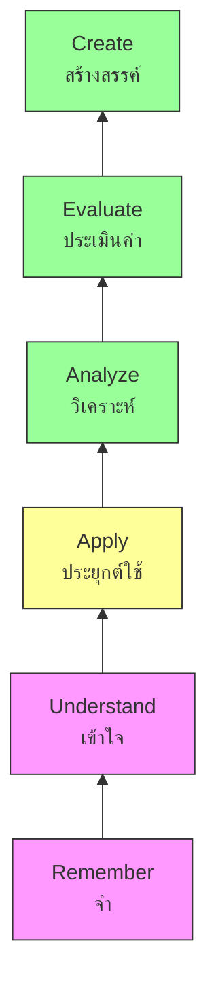

---
tags:
  - teaching
  - curriculum
  - instruction
  - lesson-planning
  - teaching-methods
source: "Thai Core Curriculum B.E. 2551 (revised 2560); Teachers' Council Standards"
created: 2026-07-27
domain: "Curriculum & Instruction"
prerequisites: ["[[01_Foundations_of_Education]]"]
---

# 02 — Curriculum & Instruction

> *"Curriculum is what to teach. Instruction is how to teach it. Master both, and you master the classroom."*

Curriculum and Instruction is the core of teacher training — where philosophy meets the classroom floor. Teachers learn to design lessons, choose methods, and deliver content in ways that reach every learner. This is the heart of **Years 2–3**.

---

## Part A: Curriculum (หลักสูตร)

### 1 | The Thai Basic Education Core Curriculum B.E. 2551

The **หลักสูตรแกนกลางการศึกษาขั้นพื้นฐาน พุทธศักราช 2551** (revised 2560/2017) is Thailand's national curriculum framework.

#### 1.1 Key Competencies

| Competency | Thai | Description |
|---|---|---|
| **Communication** | ความสามารถในการสื่อสาร | Speaking, listening, reading, writing |
| **Thinking** | ความสามารถในการคิด | Analytical, critical, creative thinking |
| **Problem-Solving** | ความสามารถในการแก้ปัญหา | Applying knowledge to real situations |
| **Life Skills** | ความสามารถในการใช้ทักษะชีวิต | Self-management, social skills |
| **Technology** | ความสามารถในการใช้เทคโนโลยี | Digital literacy, ICT skills |

#### 1.2 Desired Characteristics (คุณลักษณะอันพึงประสงค์)

| Characteristic | Thai |
|---|---|
| Love of nation, religion, monarchy | รักชาติ ศาสน์ กษัตริย์ |
| Honesty and integrity | ซื่อสัตย์สุจริต |
| Self-discipline | มีวินัย |
| Eagerness to learn | ใฝ่เรียนรู้ |
| Sufficiency living | อยู่อย่างพอเพียง |
| Dedication to work | มุ่งมั่นในการทำงาน |
| Thai-ness pride | รักความเป็นไทย |
| Public-mindedness | มีจิตสาธารณะ |

### 2 | Curriculum Design Models

| Model | Key Thinker | Approach |
|---|---|---|
| **Tyler's Rationale (1949)** | Ralph Tyler | 4 questions: (1) What objectives? (2) What experiences? (3) How organize? (4) How evaluate? |
| **Taba's Grassroots Model (1962)** | Hilda Taba | Teachers design curriculum from bottom up: diagnose needs → objectives → content → organize → select experiences → evaluate |
| **Backward Design (Wiggins & McTighe)** | Grant Wiggins, Jay McTighe | Start with desired results → Determine acceptable evidence → Plan learning experiences (NOT: "pick activities first") |
| **Spiral Curriculum (Bruner)** | Jerome Bruner | Revisit topics at increasing depth as students mature |

### 3 | Curriculum Components

| Component | Description |
|---|---|
| **Standards / Indicators** | มาตรฐานการเรียนรู้ / ตัวชี้วัด — what students must know/do |
| **Content** | สาระการเรียนรู้ — knowledge core and local content |
| **Learning Activities** | กิจกรรมการเรียนรู้ — how students learn |
| **Media / Resources** | สื่อการเรียนการสอน — materials and resources |
| **Assessment** | การวัดและประเมินผล — how learning is measured |

---

## Part B: Instruction (การสอน)

### 4 | Teaching Methods

#### 4.1 Teacher-Centered Methods

| Method | Description | Best For |
|---|---|---|
| **Direct Instruction** | Teacher explains, demonstrates, models; students practice with feedback | New skills, factual knowledge, procedures |
| **Lecture** | Teacher presents content; students listen and take notes | Large groups, content-heavy topics |
| **Explicit Teaching** | "I do → We do → You do" gradual release | Foundational skills (reading, math procedures) |

#### 4.2 Student-Centered / Active Learning Methods

| Method | Description | Best For |
|---|---|---|
| **Inquiry-Based Learning** | Students ask questions, investigate, discover | Science, social studies; deep understanding |
| **Project-Based Learning (PBL)** | Students work on extended, real-world projects | Integration across subjects; 21st century skills |
| **Problem-Based Learning** | Students solve authentic, ill-structured problems | Critical thinking, collaboration |
| **Cooperative Learning** | Structured group work — positive interdependence, individual accountability | Social skills, peer learning |
| **Discussion / Socratic Seminar** | Teacher facilitates; students discuss, question, debate | Higher-order thinking, perspective-taking |
| **Flipped Classroom** | Content at home (video), practice + application in class | Making class time interactive |
| **Game-Based Learning** | Learning through games — motivation, engagement | Practice, review, skill building |
| **Differentiated Instruction** | Varying content, process, product based on readiness, interest, learning profile | Diverse classrooms |

#### 4.3 Thai-Specific Methods

| Method | Description |
|---|---|
| **การสอนแบบโครงงาน** | Project approach — widely promoted in Thai schools |
| **การสอนแบบบูรณาการ (Integration)** | Connecting subjects — e.g., science + English + social studies |
| **การสอนโดยใช้ปัญหาเป็นฐาน** | Problem-based learning — adopted in many Thai schools |
| **การสอนแบบ Active Learning** | Active learning — MOE policy push since 2015 |
| **การสอนแบบสะเต็มศึกษา (STEM/STEAM)** | Interdisciplinary science, tech, engineering, arts, math |

### 5 | Lesson Planning (การเขียนแผนการสอน)

#### 5.1 Lesson Plan Structure

| Component | Purpose |
|---|---|
| **Learning Standards / Indicators** | มาตรฐาน/ตัวชี้วัด — aligned to national curriculum |
| **Learning Objectives** | จุดประสงค์การเรียนรู้ — SMART: Specific, Measurable, Achievable, Relevant, Time-bound |
| **Content** | สาระสำคัญ — key concepts and knowledge |
| **Learning Activities** | กิจกรรมการเรียนรู้ — Warm-up → Presentation → Practice → Production → Wrap-up |
| **Media & Materials** | สื่อ/แหล่งเรียนรู้ — what resources are needed |
| **Assessment** | การวัดผล — how will you know they learned? |
| **Reflection** | บันทึกหลังสอน — teacher's reflection after teaching |

#### 5.2 Bloom's Taxonomy (Revised)

| Level | Verbs for Objectives |
|---|---|
| **Remember** | List, define, identify, label, match |
| **Understand** | Explain, summarize, paraphrase, classify |
| **Apply** | Use, demonstrate, solve, implement |
| **Analyze** | Compare, contrast, differentiate, examine |
| **Evaluate** | Justify, critique, defend, judge |
| **Create** | Design, construct, produce, invent |

---

## Part C: Learning Theories (Brief Overview)

> *See [[03_Developmental_and_Learning_Psychology]] for depth*

| Theory | Classroom Application |
|---|---|
| **Behaviorism** (Skinner) | Reinforcement, feedback, practice drills |
| **Cognitivism** (Piaget, Bruner) | Build on prior knowledge; organize content logically |
| **Constructivism** (Vygotsky) | Inquiry, projects, social interaction; ZPD + scaffolding |
| **Social Learning** (Bandura) | Modeling, demonstrations, peer learning |
| **Connectivism** (Siemens) | Digital age — learning through networks and technology |

---

## 6 | Key Terminology

| Thai | English | Notes |
|---|---|---|
| หลักสูตร | Curriculum | What is taught and learned |
| การสอน | Instruction | How teaching is delivered |
| แผนการจัดการเรียนรู้ | Lesson Plan | Daily instructional blueprint |
| มาตรฐานการเรียนรู้ | Learning Standard | What students should know/do |
| ตัวชี้วัด | Indicator | Specific, measurable learning outcome |
| จุดประสงค์การเรียนรู้ | Learning Objective | SMART goal for the lesson |
| Active Learning | Active Learning | Student-centered, participatory |
| สะเต็มศึกษา | STEM Education | Science, Technology, Engineering, Math |
| การสอนแบบบูรณาการ | Integrated Instruction | Cross-subject teaching |
| Backward Design | Backward Design | Plan assessment before activities |

---

## Related Notes

- [[01_Foundations_of_Education]] — Philosophy and history behind curriculum choices
- [[03_Developmental_and_Learning_Psychology]] — Learning theories in depth
- [[04_Classroom_Management_and_Assessment]] — Assessment design and classroom implementation
- [[Teacher - Overview]] — Return to teaching overview
