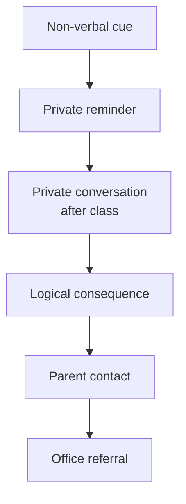

---
tags:
  - teaching
  - classroom-management
  - assessment
  - evaluation
  - measurement
source: "Teachers' Council Professional Standards"
created: 2026-07-27
domain: "Classroom Management & Assessment"
prerequisites: ["[[02_Curriculum_and_Instruction]]", "[[03_Developmental_and_Learning_Psychology]]"]
---

# 04 — Classroom Management & Assessment

> *"You can have the best lesson plan in the world. Without classroom management, you'll never teach it. Without assessment, you'll never know if it worked."*

These twin pillars of daily teaching — managing the learning environment and measuring what students learn — are where theory becomes practice. Taught across **Years 2–4** and honed during practicum.

---

## Part A: Classroom Management (การจัดการชั้นเรียน)

### 1 | Creating a Positive Learning Environment

#### 1.1 Physical Environment

| Element | Purpose |
|---|---|
| **Seating arrangement** | Rows (independent work), clusters (collaboration), U-shape (discussion), stations (centers) |
| **Traffic flow** | Clear paths; minimize bottlenecks at pencil sharpener, door, sink |
| **Visuals** | Anchor charts, word walls, student work display — not clutter |
| **Accessibility** | Materials accessible to ALL students; clear labeling |
| **Teacher visibility** | Can you see every student from your position? Can they see the board? |
| **Safety** | Clear exits, no trip hazards, emergency procedures visible |

#### 1.2 Psychological Environment

| Element | How to Build It |
|---|---|
| **Psychological safety** | Mistakes are OK; "no put-downs"; celebrate risk-taking |
| **Belonging** | Know every name; greet at door; show genuine interest in students' lives |
| **Predictability** | Consistent routines, clear expectations, fair consequences |
| **Autonomy support** | Choices in assignments, seating, partners (within boundaries) |
| **Growth culture** | Praise effort and improvement, not fixed ability |

### 2 | Classroom Management Models

| Model | Key Thinker | Core Approach |
|---|---|---|
| **Assertive Discipline** | Canter & Canter | Clear rules, consistent consequences, teacher authority — "I will not tolerate..." |
| **Positive Discipline** | Jane Nelsen | Firm AND kind; teach skills, not just punish; natural/logical consequences |
| **Choice Theory / Glasser** | William Glasser | Students choose behavior to meet 5 basic needs; help them make better choices |
| **Restorative Practices** | — | Repair harm, restore relationships; circles, conferences — not just punishment |
| **Responsive Classroom** | Northeast Foundation | Morning meeting, rule creation together, logical consequences, teacher language |
| **Love and Logic** | Fay & Funk | Empathy + consequences; "I love you too much to argue" |
| **Kounin's Model** | Jacob Kounin | "Withitness" — teacher awareness; smooth transitions; overlapping; momentum |

### 3 | Practical Strategies

#### 3.1 Rules & Routines (First 2 Weeks = Critical)

| Strategy | Example |
|---|---|
| **3–5 positively stated rules** | "Respect others" NOT "Don't be rude"; "Be prepared" NOT "Don't forget materials" |
| **Teach routines explicitly** | Enter room → unpack → bell work → attention signal — PRACTICE until automatic |
| **Attention signal** | Hand up ("Give me 5"), chime, countdown, call-and-response |
| **Transitions** | "You have 90 seconds to move to your groups... GO." Timer visible. |
| **Procedures for everything** | Bathroom, pencil sharpening, late work, asking for help, turning in work |

#### 3.2 Prevention > Intervention

| Preventative Strategy | Why It Works |
|---|---|
| **Engaging lessons** | Boredom = misbehavior. Active learning keeps students on task |
| **Proximity** | Stand near potential trouble — non-verbal redirection |
| **Withitness** (Kounin) | Let students know you see everything; nip issues early |
| **Positive reinforcement** | Catch them being good — 4:1 ratio (4 positives per correction) |
| **Non-verbal cues** | Eye contact, hand gesture, pause — address without disrupting lesson |
| **Planned ignoring** | For attention-seeking minor behavior — ignore the behavior, praise the desired behavior |

### 4 | Responding to Misbehavior

| Level | Behavior | Response |
|---|---|---|
| **Level 1 — Minor** | Talking, off-task, not prepared | Non-verbal cue, proximity, redirect, private conversation |
| **Level 2 — Moderate** | Disrespect, repeated disruption, refusal | Private conference, logical consequence, parent contact |
| **Level 3 — Serious** | Bullying, fighting, cheating, defiance | Office referral, behavior contract, parent conference, restorative circle |

#### The Hierarchy of Intervention:

> **Golden rule:** Preserve dignity. Correct privately when possible. "Praise publicly, correct privately."

---

## Part B: Assessment & Evaluation (การวัดและประเมินผล)

### 5 | Purposes of Assessment

| Purpose | Type | Question Answered |
|---|---|---|
| **Diagnostic** | Pre-assessment | "What do they already know?" |
| **Formative** | During learning | "How are they doing? What needs reteaching?" |
| **Summative** | End of unit/term | "Did they achieve the standards?" |
| **Evaluative** | Program level | "Is the curriculum/instruction working?" |

### 6 | Types of Assessment

#### 6.1 By Timing

| Type | When | Weight | Purpose |
|---|---|---|---|
| **Formative (ระหว่างเรียน)** | Ongoing, daily | Low/no stakes | Guide instruction; give feedback |
| **Summative (สิ้นสุด)** | End of unit/term | High stakes | Evaluate achievement; assign grades |

#### 6.2 By Method

| Method | Description | Example | Best For |
|---|---|---|---|
| **Selected Response** | Choose from given options | Multiple choice, true/false, matching | Knowledge recall, efficiency |
| **Constructed Response** | Generate own answer | Short answer, essay | Deeper understanding, analysis |
| **Performance Assessment** | Demonstrate skill | Lab, presentation, recital, speech | Practical skills |
| **Product Assessment** | Create artifact | Portfolio, project, artwork, report | Application, creativity |
| **Observation** | Watch and record | Checklist, anecdotal notes, rubric | Process skills, behavior |
| **Oral Assessment** | Verbal questioning | Interview, defense, Q&A | Communication, reasoning |

### 7 | Quality Criteria for Assessment

| Criterion | Meaning | Check |
|---|---|---|
| **Validity** (ความตรง) | Does it measure what it claims to measure? | Math test full of reading passages = invalid |
| **Reliability** (ความเที่ยง) | Consistent results across raters/occasions? | Two teachers grade same essay → same score? |
| **Fairness** (ความเป็นธรรม) | Free from bias? All students can demonstrate knowledge? | ELL student understands the questions? |
| **Practicality** (ความสะดวก) | Feasible in real classroom? Time, resources, scoring? | Can you grade 40 essays in a weekend? |

### 8 | Rubrics (เกณฑ์การประเมิน)

#### 8.1 Types of Rubrics

| Type | Structure | When to Use |
|---|---|---|
| **Holistic** | One overall score for the whole work | Quick overview; simple tasks |
| **Analytic** | Separate scores for each criterion | Detailed feedback; complex tasks |
| **Single-Point** | Only describes the proficiency level; space for notes above/below | Growth-focused; flexible |

#### 8.2 Analytic Rubric Example (Essay)

| Criterion | 4 — Excellent | 3 — Proficient | 2 — Developing | 1 — Beginning |
|---|---|---|---|---|
| **Thesis** | Clear, arguable, insightful | Clear and arguable | Vague or too broad | Missing |
| **Evidence** | Strong, varied, well-integrated | Adequate, mostly relevant | Limited or weakly connected | Insufficient |
| **Organization** | Logical flow, strong transitions | Clear structure, some transitions | Some organization, jumps | Disorganized |
| **Conventions** | Few/no errors | Minor errors, doesn't impede | Errors begin to impede | Pervasive errors |

### 9 | Thai Grading System (Basic Education)

| Score (%) | Grade | Meaning |
|---|---|---|
| 80–100 | 4 | ดีเยี่ยม (Excellent) |
| 75–79 | 3.5 | ดีมาก (Very Good) |
| 70–74 | 3 | ดี (Good) |
| 65–69 | 2.5 | ค่อนข้างดี (Fairly Good) |
| 60–64 | 2 | ปานกลาง (Satisfactory) |
| 55–59 | 1.5 | พอใช้ (Fair) |
| 50–54 | 1 | ผ่านเกณฑ์ขั้นต่ำ (Minimum Pass) |
| 0–49 | 0 | ต่ำกว่าเกณฑ์ (Below Standard) |

---

## 10 | Key Terminology

| Thai | English | Notes |
|---|---|---|
| การจัดการชั้นเรียน | Classroom Management | Environment + behavior |
| การวัดผล | Measurement | Quantifying learning |
| การประเมินผล | Evaluation | Judging quality of learning |
| การประเมินระหว่างเรียน | Formative Assessment | Ongoing, guides instruction |
| การประเมินปลายภาค | Summative Assessment | End-of-unit/term |
| เกณฑ์การประเมิน (Rubric) | Rubric | Scoring guide with criteria |
| ความตรง / ความเที่ยง | Validity / Reliability | Assessment quality |
| ระเบียบวินัย | Discipline | Self-control, not punishment |
| การเสริมแรงทางบวก | Positive Reinforcement | Reward desired behavior |
| จิตวิทยาเชิงบวกในชั้นเรียน | Positive Classroom Psychology | Growth culture |

---

## Related Notes

- [[02_Curriculum_and_Instruction]] — Lesson planning and assessment alignment
- [[03_Developmental_and_Learning_Psychology]] — Behavior and motivation
- [[06_Special_Education_and_Inclusive_Practices]] — Behavior support and modified assessment
- [[Teacher - Overview]] — Return to teaching overview
