---
tags:
  - teaching
  - educational-technology
  - edtech
  - digital-learning
  - innovation
source: "Teachers' Council Professional Standards; MOE Digital Learning Policy"
created: 2026-07-27
domain: "Educational Technology & Innovation"
prerequisites: ["[[02_Curriculum_and_Instruction]]"]
---

# 05 — Educational Technology & Innovation

> *"Technology won't replace teachers. But teachers who use technology will replace those who don't."* — adapted from George Couros

Educational technology is no longer optional. Thai teachers are expected to integrate digital tools, design media, and foster innovation. This domain covers everything from PowerPoint basics to AI in the classroom. Taught across **Years 2–4**.

---

## 1 | Technology Integration Frameworks

### 1.1 SAMR Model (Puentedura)

```mermaid
flowchart BT
    subgraph "Transformation"
        R["Redefinition<br/>Tech allows new tasks<br/>&#40;e.g., global collaboration&#41;"]
        M["Modification<br/>Tech allows redesign<br/>&#40;e.g., multimedia projects&#41;"]
    end
    subgraph "Enhancement"
        A["Augmentation<br/>Tech as direct substitute<br/>with improvement<br/>&#40;e.g., online quiz&#41;"]
        S["Substitution<br/>Tech as direct substitute<br/>no change<br/>&#40;e.g., PDF instead of paper&#41;"]
    end
```

| Level | Question | Example |
|---|---|---|
| **Substitution** | Does tech replace something without change? | Reading a PDF instead of a book |
| **Augmentation** | Does tech replace with some improvement? | Online quiz with instant feedback |
| **Modification** | Does tech allow significant redesign? | Collaborative Google Doc with peer comments |
| **Redefinition** | Does tech enable previously impossible tasks? | Video conference with students in another country |

> **Goal:** Move from Enhancement (S, A) to Transformation (M, R).

### 1.2 TPACK Framework (Mishra & Koehler)

| Knowledge Domain | What It Means |
|---|---|
| **CK** — Content Knowledge | What you're teaching (math, science, history) |
| **PK** — Pedagogical Knowledge | How to teach (methods, strategies, assessment) |
| **TK** — Technological Knowledge | How to use the tools (software, hardware, platforms) |
| **PCK** | Knowing how to teach YOUR content |
| **TCK** | Knowing tech tools specific to YOUR content |
| **TPK** | Knowing how tech changes teaching |
| **TPACK** ⭐ | The sweet spot — all three integrated |

---

## 2 | Digital Tools for Teaching

### 2.1 By Category

| Category | Tools | Use |
|---|---|---|
| **Learning Management Systems (LMS)** | Google Classroom, Microsoft Teams, Moodle, Canvas | Assign, collect, grade, communicate |
| **Presentation** | PowerPoint, Google Slides, Canva, Prezi, Nearpod | Deliver content interactively |
| **Interactive Quizzing** | Kahoot!, Quizizz, Mentimeter, Gimkit, Socrative | Formative assessment, engagement |
| **Video** | YouTube, Edpuzzle (embed questions), Screencastify, Loom | Content delivery, flipped classroom |
| **Collaboration** | Google Workspace (Docs, Sheets, Jamboard), Padlet, Miro | Group work, brainstorming |
| **Coding & STEM** | Scratch, Micro:bit, Tinkercad, Arduino, Minecraft Education | Computational thinking, STEM |
| **AI Tools** | ChatGPT, Claude, Perplexity, Canva AI, Magic School AI | Lesson planning, differentiation, tutoring |
| **Communication** | Line, ClassDojo, Remind, Seesaw | Parent communication, class updates |
| **Accessibility** | Immersive Reader, speech-to-text, text-to-speech, translation | Support diverse learners |

### 2.2 Thai Digital Learning Platforms

| Platform | Description |
|---|---|
| **DLTV (Distance Learning TV)** | TV-based distance learning — pandemic-era essential, still used in rural schools |
| **OBEC Learning** | OBEC's online learning platform |
| **Learn Education** | Private platform — adaptive learning for Thai students |
| **Kruclub** | Teacher community and resource sharing |
| **Starfish Labz** | Free online courses for Thai teachers |

---

## 3 | Media & Material Creation

### 3.1 Types of Instructional Media

| Type | Examples | Best For |
|---|---|---|
| **Print** | Worksheets, flashcards, posters, booklets | Reference, practice, display |
| **Visual** | Diagrams, infographics, photos, cartoons | Simplify complex info; engage visual learners |
| **Audio** | Podcasts, recordings, music, audio books | Language learning, storytelling, listening |
| **Audio-Visual** | Videos, animations, screencasts | Demonstrations, virtual field trips |
| **Interactive** | Simulations, games, AR/VR | Hands-on, inquiry, engagement |
| **Manipulative** | Models, real objects, lab equipment | Concrete → abstract understanding |

### 3.2 Principles of Media Design (Mayer's Multimedia Principles)

| Principle | Meaning |
|---|---|
| **Coherence** | Remove extraneous material — less is more |
| **Signaling** | Highlight essential information (arrows, color, bold) |
| **Redundancy** | Graphics + narration > graphics + narration + on-screen text |
| **Spatial Contiguity** | Put words near corresponding pictures |
| **Temporal Contiguity** | Present words and pictures simultaneously |
| **Segmenting** | Break into learner-paced segments |
| **Modality** | Graphics + spoken words > graphics + printed words |
| **Personalization** | Conversational style > formal style |

---

## 4 | Innovation in Education

### 4.1 Current Trends

| Trend | Description | Status in Thailand |
|---|---|---|
| **AI in Education** | AI tutors, automated grading, personalized learning paths, lesson plan generation | Early adoption; Ministry policies emerging |
| **Gamification** | Game elements (points, badges, leaderboards) in non-game contexts | Growing in EdTech startups |
| **Microlearning** | Bite-sized learning (3–10 min chunks) | Social media (TikTok/YouTube shorts) |
| **Personalized Learning** | Adaptive platforms adjust to student level | Some schools; Learn Education platform |
| **STEAM** (STEM + Arts) | Integrating arts into STEM | MOE policy promoting active learning |
| **Computational Thinking** | Problem-solving, coding, data literacy + coding | Added to Thai curriculum (2017 revision) |
| **21st Century Skills** | 4Cs: Critical thinking, Communication, Collaboration, Creativity | National curriculum emphasis |
| **Competency-Based Education** | Progress when you demonstrate mastery, not seat time | Emerging — CBE pilot programs |
| **Hybrid / Blended Learning** | Mix of in-person + online | Post-COVID norm in many schools |
| **VR / AR** | Immersive experiences (virtual labs, field trips) | Limited — mostly well-resourced schools |

### 4.2 Teacher as Innovator (ครูนักนวัตกร)

Being an innovative teacher means:

| Aspect | Action |
|---|---|
| **Research mindset** | วิจัยในชั้นเรียน (Classroom Action Research) — investigate and improve your own practice |
| **Professional Learning Community (PLC)** | ชุมชนแห่งการเรียนรู้ทางวิชาชีพ — collaborate with colleagues to solve problems |
| **Open to change** | Try new methods, fail forward, iterate |
| **Student voice** | Let students co-design learning; listen to feedback |
| **Sharing** | Present at conferences, publish, blog, build a PLN (Professional Learning Network) |

---

## 5 | Digital Citizenship & Safety

### 5.1 Teaching Digital Citizenship

| Topic | What to Teach |
|---|---|
| **Digital footprint** | Everything posted is permanent; think before posting |
| **Privacy** | Protect personal info; understand privacy settings |
| **Cyberbullying** | Recognize, report, refuse to participate; empathy online |
| **Information literacy** | Evaluate sources; distinguish fact from opinion/misinformation |
| **Screen time balance** | Healthy limits; sleep, exercise, face-to-face time |
| **Copyright & plagiarism** | Cite sources; respect intellectual property |

### 5.2 Teacher Digital Safety

| Practice | Why |
|---|---|
| **Professional boundaries online** | Separate personal and professional social media |
| **Secure passwords** | Use password manager; enable 2FA on school systems |
| **Data privacy** | Protect student data; know PDPA (Personal Data Protection Act) obligations |
| **Appropriate content** | Preview all videos/websites before showing students |

---

## 6 | Key Terminology

| Thai | English | Notes |
|---|---|---|
| เทคโนโลยีการศึกษา | Educational Technology | Tech tools for teaching |
| สื่อการเรียนการสอน | Instructional Media | Teaching materials |
| การเรียนรู้แบบผสมผสาน | Blended Learning | In-person + online |
| ห้องเรียนกลับด้าน | Flipped Classroom | Content at home, practice in class |
| สะเต็มศึกษา | STEAM Education | Science, Tech, Engineering, Arts, Math |
| ความเป็นพลเมืองดิจิทัล | Digital Citizenship | Responsible tech use |
| ระบบจัดการการเรียนรู้ (LMS) | Learning Management System | Google Classroom, Moodle, etc. |
| ชุมชนแห่งการเรียนรู้ทางวิชาชีพ (PLC) | Professional Learning Community | Teacher collaboration |
| วิจัยในชั้นเรียน | Classroom Action Research | Teacher as researcher |
| ปัญญาประดิษฐ์เพื่อการศึกษา | AI in Education | Emerging frontier |

---

## Related Notes

- [[02_Curriculum_and_Instruction]] — Technology integration in lesson design
- [[04_Classroom_Management_and_Assessment]] — Digital assessment tools
- [[07_University_Guide_and_Career_Paths]] — EdTech career paths
- [[Teacher - Overview]] — Return to teaching overview
