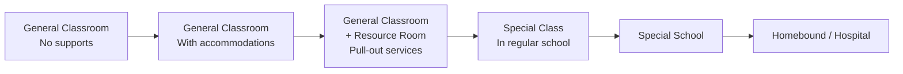
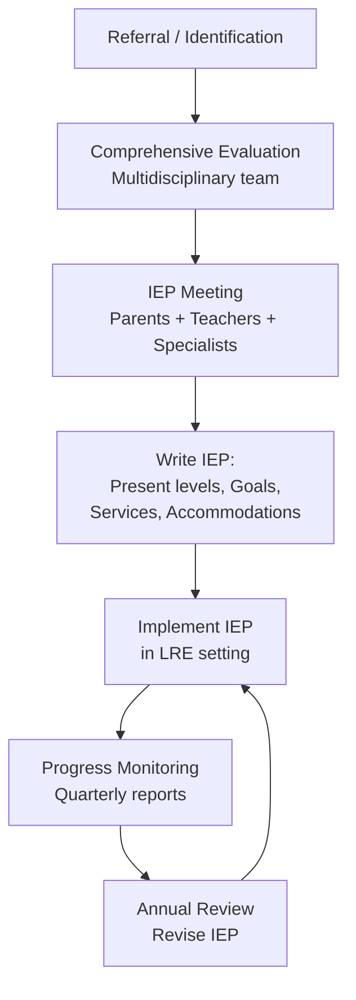

---
tags:
  - teaching
  - special-education
  - inclusive-education
  - learning-disabilities
  - IEP
source: "Teachers' Council Professional Standards; Thai Special Education Policy"
created: 2026-07-27
domain: "Special Education & Inclusive Practices"
prerequisites: ["[[03_Developmental_and_Learning_Psychology]]", "[[04_Classroom_Management_and_Assessment]]"]
---

# 06 — Special Education & Inclusive Practices

> *"Every student can learn. Just not on the same day or in the same way."* — George Evans

Special education and inclusive practices prepare teachers to work with **all learners** — those with disabilities, those who are gifted, and everyone in between. Thailand has committed to inclusive education since the National Education Act B.E. 2542. Most Thai teachers WILL have students with special needs in their regular classrooms. Taught in **Years 3–4**.

---

## 1 | Foundations of Special Education

### 1.1 Key Laws & Policies (Thailand)

| Law / Policy | Key Provision |
|---|---|
| **National Education Act B.E. 2542** | Right to 12 years free education for ALL, including those with disabilities |
| **Persons with Disabilities Education Act B.E. 2551** | Right to appropriate education, IEPs, assistive technology |
| **Ministerial Regulation on Special Education B.E. 2546** | Types of disabilities, IEP requirements, special education centers |
| **Convention on the Rights of Persons with Disabilities (CRPD)** | Thailand ratified in 2008 — inclusive education as a right |

### 1.2 Inclusion Models

| Model | Description |
|---|---|
| **Full Inclusion** | Student with disabilities in general classroom 100% of the time with supports |
| **Partial Inclusion / Mainstreaming** | Most time in general classroom; pull-out for specialized instruction |
| **Special Class** | Separate class within regular school |
| **Special School** | Separate school for specific disability category |
| **Inclusive School (โรงเรียนเรียนรวม)** | All students together; school-wide support systems |

### 1.3 The Continuum of Services

> **Least Restrictive Environment (LRE):** Students should be educated with non-disabled peers to the maximum extent possible. Move right on the continuum ONLY when necessary.

---

## 2 | Categories of Exceptionalities

### 2.1 Learning Disabilities (LD — ความบกพร่องทางการเรียนรู้)

| Type | Characteristics | Classroom Strategies |
|---|---|---|
| **Dyslexia** (Reading) | Difficulty with phonological processing, decoding, fluency | Multisensory reading (Orton-Gillingham), audiobooks, extra time, colored overlays |
| **Dyscalculia** (Math) | Difficulty with number sense, calculation, math reasoning | Manipulatives, graph paper, calculator, step-by-step guides |
| **Dysgraphia** (Writing) | Difficulty with handwriting, spelling, written expression | Typing instead of writing, speech-to-text, graphic organizers, reduce writing load |
| **Auditory Processing** | Normal hearing but difficulty processing what's heard | Visual supports, written instructions, preferential seating, FM system |
| **Visual Processing** | Normal vision but difficulty interpreting visual info | Verbal instructions, audio recordings, large print, high contrast |

### 2.2 Intellectual Disability (ID — ความบกพร่องทางสติปัญญา)

| Severity | IQ Range | Adaptive Functioning |
|---|---|---|
| **Mild** | 50–70 | Can learn academic skills to ~ป.6 level; can live independently with supports |
| **Moderate** | 35–50 | Can learn basic self-care and communication; supervised living/working |
| **Severe** | 20–35 | Limited communication; needs extensive daily support |
| **Profound** | < 20 | Full-time care; sensory and physical impairments |

> **Key:** Focus on ADAPTIVE SKILLS, not just IQ. What can they DO in daily life?

### 2.3 Autism Spectrum Disorder (ASD — กลุ่มอาการออทิสติก)

| Area | Characteristics | Classroom Strategies |
|---|---|---|
| **Social communication** | Difficulty with eye contact, conversation, reading social cues | Social stories, peer buddies, explicit social skills teaching |
| **Restricted/repetitive behaviors** | Routines, stimming (rocking, hand flapping), intense interests | Visual schedules, prepare for transitions, use interests to motivate |
| **Sensory sensitivities** | Over- or under-sensitive to sound, light, touch, texture | Quiet corner, noise-canceling headphones, flexible seating, sensory breaks |

### 2.4 Attention-Deficit/Hyperactivity Disorder (ADHD)

| Type | Classroom Strategies |
|---|---|
| **Inattentive** | Preferential seating, break tasks into chunks, visual timers, check for understanding privately |
| **Hyperactive-Impulsive** | Movement breaks, fidget tools, standing desk option, "jobs" that allow movement |
| **Combined** | Mix of above; structure + flexibility; clear consequences + positive reinforcement |

### 2.5 Physical & Health Disabilities

| Condition | Classroom Accommodation |
|---|---|
| **Cerebral Palsy** | Wheelchair accessibility, assistive technology, extra time, scribe |
| **Visual Impairment** | Braille/large print, audiobooks, screen reader, tactile materials, described videos |
| **Hearing Impairment** | Sign language interpreter, FM system, captions, visual cues, preferential seating |
| **Chronic illness** (cancer, diabetes, etc.) | Flexible attendance, homebound instruction, medical management plan |

### 2.6 Gifted & Talented (เด็กที่มีความสามารถพิเศษ)

| Area | Strategies |
|---|---|
| **Acceleration** | Skip grade, early entrance, subject acceleration |
| **Enrichment** | Deeper, not just faster — independent projects, mentorships, competitions |
| **Differentiation** | Compact curriculum, tiered assignments, choice menus |
| **Social-emotional** | Address perfectionism, underachievement, social isolation, asynchronous development |

---

## 3 | The IEP Process

### 3.1 Individualized Education Program (IEP — แผนการจัดการศึกษาเฉพาะบุคคล)

### 3.2 IEP Components

| Component | Description |
|---|---|
| **Present Levels of Performance (PLOP)** | What can the student currently do? Academic + functional |
| **Annual Goals** | SMART goals for the year — measurable |
| **Special Education Services** | Minutes per week, provider, location |
| **Accommodations** | Changes in HOW student learns (extra time, audio, large print) |
| **Modifications** | Changes in WHAT student learns (reduced content, alternate standards) |
| **Participation in State Assessments** | Standard, with accommodations, or alternate assessment |
| **Transition Plan** (age 14+) | Post-school goals: college, career, independent living |

### 3.3 Accommodations vs. Modifications

| | Accommodation | Modification |
|---|---|---|
| **Changes...** | HOW the student accesses content or demonstrates learning | WHAT the student is expected to learn |
| **Curriculum** | SAME | DIFFERENT / REDUCED |
| **Example** | Extra time, audiobook, preferential seating | Simplified reading level, fewer math problems, alternate test |
| **Grading** | Same standards | May be graded against different standards |

---

## 4 | Universal Design for Learning (UDL)

> **UDL:** Design lessons from the start to work for ALL learners, not retrofit after.

### 4.1 Three Principles of UDL

| Principle | What It Means | Examples |
|---|---|---|
| **Multiple Means of ENGAGEMENT** (Why) | Motivate and sustain interest | Choice, relevance, autonomy, collaboration, minimize threats |
| **Multiple Means of REPRESENTATION** (What) | Present content in different ways | Text + audio + video + graphics; activate background knowledge; clarify vocabulary |
| **Multiple Means of ACTION & EXPRESSION** (How) | Let students show what they know in different ways | Writing, speaking, drawing, building, performing; scaffolds for executive function |

### 4.2 UDL in a Thai Classroom

| Instead of... | Try... |
|---|---|
| Only lecture | Lecture + visuals + video + discussion |
| Only written test | Test + oral + project + portfolio — student choice |
| One-size-fits-all homework | Tiered homework (must-do, should-do, aspire-to-do) |
| Teacher always answers questions | Peer tutoring, reference materials, "ask 3 before me" |
| Fixed seating | Flexible seating options (standing desk, floor cushions, wobble stool) |

---

## 5 | Key Terminology

| Thai | English | Notes |
|---|---|---|
| การศึกษาแบบเรียนรวม | Inclusive Education | All students together |
| การศึกษาพิเศษ | Special Education | Specialized instruction |
| เด็กที่มีความต้องการพิเศษ | Students with Special Needs | Broad term |
| ความบกพร่องทางการเรียนรู้ (LD) | Learning Disability | Dyslexia, dyscalculia, dysgraphia |
| โรคสมาธิสั้น (ADHD) | ADHD | Attention-deficit/hyperactivity disorder |
| กลุ่มอาการออทิสติก (ASD) | Autism Spectrum Disorder | Social + communication differences |
| แผนการจัดการศึกษาเฉพาะบุคคล (IEP) | Individualized Education Program | Legal document for special services |
| สภาพแวดล้อมที่มีข้อจำกัดน้อยที่สุด (LRE) | Least Restrictive Environment | Inclusion principle |
| การออกแบบการเรียนรู้ที่เป็นสากล (UDL) | Universal Design for Learning | Design for all from the start |
| เด็กที่มีความสามารถพิเศษ | Gifted and Talented | High ability learners |

---

## Related Notes

- [[03_Developmental_and_Learning_Psychology]] — Understanding atypical development
- [[04_Classroom_Management_and_Assessment]] — Behavior support and modified assessment
- [[05_Educational_Technology_and_Innovation]] — Assistive technology
- [[Teacher - Overview]] — Return to teaching overview
