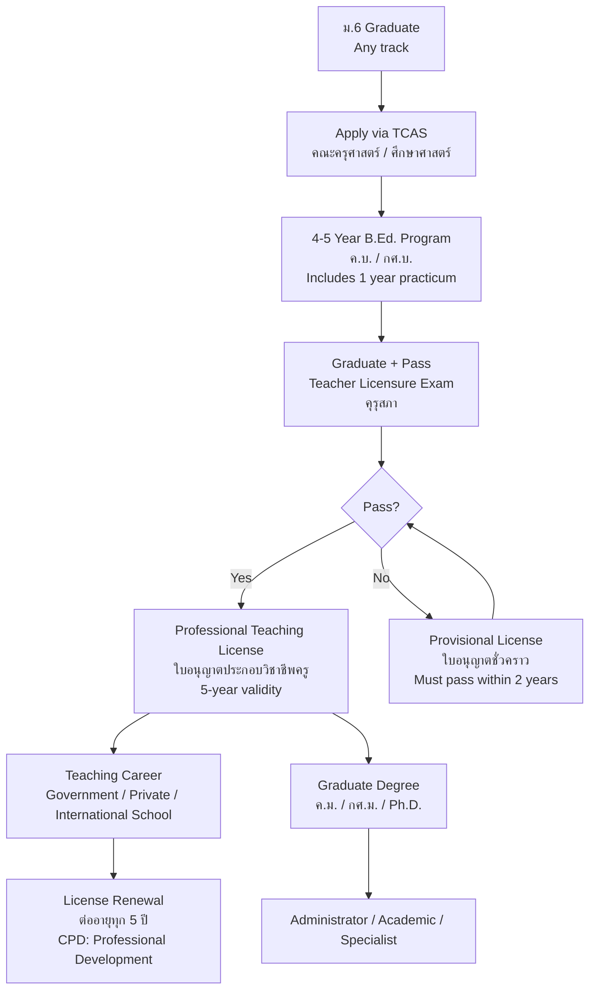

---
tags:
  - overview
  - teaching
  - education
  - career
  - thai-education
source: "Teachers' Council of Thailand Act B.E. 2546 (2003); Teachers and Educational Personnel Council Act; Ministry of Education Core Curriculum B.E. 2551"
created: 2026-07-27
profession: "ครู (Teacher)"
degree: "ค.บ. (ครุศาสตรบัณฑิต) / กศ.บ. (การศึกษาบัณฑิต) — Bachelor of Education (B.Ed.)"
duration: "4-5 ปี (4-5 years, including teaching practicum)"
---

# Teaching — วิชาชีพครู

> *"A teacher affects eternity; he can never tell where his influence stops."* — Henry Adams

> *"ครู คือ ผู้ที่อบรมสั่งสอน ถ่ายทอดความรู้ และเป็นแบบอย่างที่ดีแก่ศิษย์ วิชาชีพครูเป็นวิชาชีพชั้นสูงที่ต้องได้รับใบอนุญาตประกอบวิชาชีพจากคุรุสภา"* — พ.ร.บ. สภาครูและบุคลากรทางการศึกษา พ.ศ. 2546

## What Is This?

This is a **career guidance knowledge base** for Thai students considering teaching as a profession. It covers what teaching is, what you'll learn, how to get licensed, where you can study, and what career paths exist — whether in government schools, private schools, international schools, or alternative education.

Teaching in Thailand is a **regulated profession** under the **Teachers and Educational Personnel Council Act B.E. 2546 (2003)** — พระราชบัญญัติสภาครูและบุคลากรทางการศึกษา. All teachers in licensed schools must hold a **Professional Teaching License (ใบอนุญาตประกอบวิชาชีพครู)** issued by the **Teachers' Council of Thailand (คุรุสภา)**.

## Education Pathway

## The 6 Knowledge Domains

### 🏛️ Foundations
- [[01_Foundations_of_Education|01 Foundations of Education]] — Philosophy, sociology, history of education; Thai education system; educational psychology

### 📋 Curriculum & Instruction
- [[02_Curriculum_and_Instruction|02 Curriculum & Instruction]] — Thai core curriculum, lesson planning, teaching methods, learning theories, instructional design

### 🧠 Learner Development
- [[03_Developmental_and_Learning_Psychology|03 Developmental & Learning Psychology]] — Child/adolescent development, learning theories, motivation, individual differences

### 🎯 Classroom Practice
- [[04_Classroom_Management_and_Assessment|04 Classroom Management & Assessment]] — Classroom environment, discipline, formative/summative assessment, rubrics, grading

### 💻 Innovation
- [[05_Educational_Technology_and_Innovation|05 Educational Technology & Innovation]] — EdTech, digital learning, media creation, AI in education, STEM/STEAM

### 🌈 Inclusion
- [[06_Special_Education_and_Inclusive_Practices|06 Special Education & Inclusive Practices]] — Learning disabilities, gifted education, inclusive classrooms, IEPs

### 🎓 Career Pathways
- [[07_University_Guide_and_Career_Paths|07 University Guide & Career Paths]] — Top education faculties, TCAS, licensing, salaries, career advancement

## The Teaching Profession in Thailand

### Regulatory Body

| Organization | Thai Name | Role |
|---|---|---|
| **Teachers' Council of Thailand** | คุรุสภา | Professional licensing, standards, ethics, CPD |
| **Ministry of Education** | กระทรวงศึกษาธิการ | Policy, curriculum, government schools |
| **OBEC** (Office of the Basic Education Commission) | สพฐ. (สำนักงานคณะกรรมการการศึกษาขั้นพื้นฐาน) | Manages public basic education schools |
| **OHEC** (Office of the Higher Education Commission) | สกอ. | University-level education |
| **ONEC** (Office of National Education Commission) | สกศ. | Education policy and planning |

### Legal Framework

| Law | Key Points |
|---|---|
| **พ.ร.บ. การศึกษาแห่งชาติ พ.ศ. 2542 (National Education Act B.E. 2542)** | Foundation law — 12 years free education, learner-centered approach, education reform |
| **พ.ร.บ. สภาครูและบุคลากรทางการศึกษา พ.ศ. 2546 (Teachers Council Act B.E. 2546)** | Establishes คุรุสภา; licensing, professional standards |
| **พ.ร.บ. ระเบียบข้าราชการครูและบุคลากรทางการศึกษา พ.ศ. 2547** | Teacher civil service regulations |
| **Basic Education Core Curriculum B.E. 2551 (2008, revised 2560)** | หลักสูตรแกนกลางการศึกษาขั้นพื้นฐาน — the national curriculum |

### Types of Teaching Licenses

| License Type | Thai | Valid For |
|---|---|---|
| **Professional License (License A)** | ใบอนุญาตประกอบวิชาชีพครู | 5 years, renewable with CPD |
| **Provisional License (License B)** | ใบอนุญาตปฏิบัติการสอนชั่วคราว | 2 years, non-renewable — must pass exam |
| **Administrative License** | ใบอนุญาตผู้บริหารสถานศึกษา | School directors |
| **Educational Supervisor License** | ใบอนุญาตศึกษานิเทศก์ | Curriculum supervisors |

### Professional Standards (มาตรฐานวิชาชีพครู)

Issued by คุรุสภา, three domains:

| Domain | Standards |
|---|---|
| **มาตรฐานความรู้ (Knowledge)** | 11 areas: language, philosophy, curriculum, psychology, measurement, classroom management, research, innovation, teacher professionalism |
| **มาตรฐานประสบการณ์วิชาชีพ (Experience)** | Teaching practicum: ≥ 1 year supervised teaching |
| **มาตรฐานการปฏิบัติงาน (Performance)** | 12 practice standards covering planning, teaching, assessment, professional development |
| **มาตรฐานการปฏิบัติตน (Conduct)** | จรรยาบรรณวิชาชีพครู — 5 categories of professional ethics |

---

## Key Terminology

| Thai | English | Notes |
|---|---|---|
| ครู | Teacher | Licensed professional educator |
| คุรุสภา | Teachers' Council of Thailand | Licensing and regulatory body |
| ครุศาสตรบัณฑิต (ค.บ.) | Bachelor of Education (B.Ed.) | 4-5 year degree |
| ศึกษาศาสตรบัณฑิต (กศ.บ.) | Bachelor of Education (B.Ed.) | Alternative name |
| ใบอนุญาตประกอบวิชาชีพครู | Professional Teaching License | 5-year renewable license |
| การฝึกประสบการณ์วิชาชีพครู | Teaching Practicum | 1-year supervised student teaching |
| หลักสูตรแกนกลาง | Core Curriculum | National curriculum B.E. 2551 |
| จรรยาบรรณวิชาชีพครู | Teacher's Code of Ethics | Enforceable by คุรุสภา |
| การพัฒนาตนเองทางวิชาชีพ (CPD) | Continuing Professional Development | Required for license renewal |
| วิทยฐานะ | Academic Standing | Career advancement ranks |

---

## Reading Paths

- **High school student exploring:** Start here → [[07_University_Guide_and_Career_Paths|University Guide]] → [[01_Foundations_of_Education|What you'll study]]
- **Student teacher (นักศึกษาครู):** [[02_Curriculum_and_Instruction|Curriculum]] → [[04_Classroom_Management_and_Assessment|Classroom Practice]]
- **Practicing teacher advancing:** [[05_Educational_Technology_and_Innovation|Innovation]] → Graduate degrees
- **Parent/guidance counselor:** [[07_University_Guide_and_Career_Paths|University Guide]] → Return here

---

> **Related Careers:** [[../nurse/Nursing - Overview|Nursing]], [[../psychologist/Psychologist - Overview|Psychologist]], [[../lawyer/Law - Overview|Law]]
