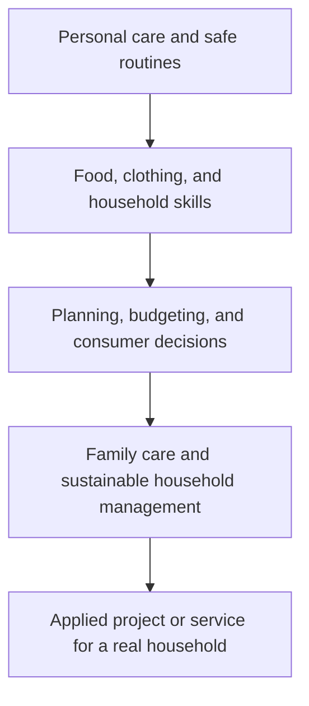

# Home Economics: การดำรงชีวิตและครอบครัว

> **Strand:** Home Economics (งานบ้าน and การดำรงชีวิตในครอบครัว) | **Concept Areas:** 4 | **Duration:** 12 years, ป.1–ม.6
> **Focus:** Food, clothing, household management, child and family development

## Overview

Home Economics develops the practical knowledge and habits needed for healthy, safe, economical, and responsible everyday living. Students begin with personal care and simple household tasks, then progress toward nutrition, clothing care, budgeting, family relationships, and evidence-informed care of children.

The strand is not limited to domestic labor. It combines applied science, health, design, consumer literacy, resource management, and social responsibility. Students should understand why a practice works, perform it safely, and improve it for a real household context.

## Concept Areas

| # | Concept Area | Thai | Main Focus |
|---|---|---|---|
| 01 | [[01_Cooking_and_Nutrition]] | อาหารและโภชนาการ | Food groups, meal planning, preparation, hygiene, food safety |
| 02 | [[02_Sewing_and_Clothing]] | งานผ้าและเครื่องแต่งกาย | Fibres, stitches, clothing care, repair, design |
| 03 | [[03_Household_Management]] | การจัดการบ้านเรือน | Cleaning, organization, budgeting, consumer decisions, sustainability |
| 04 | [[04_Child_Development]] | พัฒนาการเด็ก and ครอบครัว | Developmental domains, caregiving, safety, family roles |

## Grade Band Progression

| Grade Band | Progression |
|---|---|
| **ป.1–3** | Personal hygiene, simple tidying, safe food awareness, identifying clothing and helping with age-appropriate tasks |
| **ป.4–6** | Basic cooking, food groups, cleaning routines, simple budgeting, clothing repair, family cooperation |
| **ม.1–3** | Meal planning, nutrition labels, food safety, fabric selection, household finance, consumer rights, child-care foundations |
| **ม.4–6** | Advanced meal and resource management, textile construction, family economics, child development analysis, sustainable household systems |

## Learning Sequence

## Progress Tracker

| # | Concept Area | Status | Files Created | Notes |
|---|---|---|---|---|
| 01 | Cooking and Nutrition | ✅ Done | `01_Cooking_and_Nutrition.md` | |
| 02 | Sewing and Clothing | ✅ Done | `02_Sewing_and_Clothing.md` | |
| 03 | Household Management | ✅ Done | `03_Household_Management.md` | |
| 04 | Child Development | ✅ Done | `04_Child_Development.md` | |

**Completion: 4/4 (100%) ✅**

## Related

- [[02 Agriculture/00_overview|Agriculture]]: food production and household food systems
- [[04 Career Education/00_overview|Career Education]]: home economics as a career and enterprise pathway
- [[05 Technology/00_overview|Technology]]: digital tools for planning, budgeting, and research
- [[Social Studies/03 Economics/00_overview|Economics]]: consumption, budgeting, and sufficiency

## Sources

- [OBEC: Basic Education Core Curriculum B.E. 2551 PDF](https://www.academic.obec.go.th/images/document/1525235513_d_1.pdf)
- [OBEC Academic Office: Curriculum documents](https://academic.obec.go.th/web/news/view/75)
