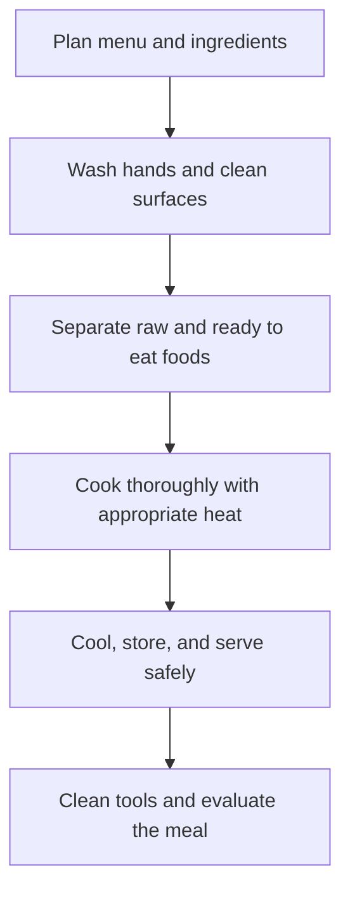

# Cooking and Nutrition: อาหารและโภชนาการ

Cooking and Nutrition connects food science, health, culture, budgeting, and safe practical work. Students learn to choose ingredients, plan balanced meals, prepare food hygienically, and evaluate whether a meal is nutritious, economical, culturally appropriate, and safe.

## 1 | Grade Band Breakdown

| Grade Band | Key Content |
|---|---|
| **ป.1–3** | Identify common foods and food groups, wash hands, keep utensils safe, distinguish everyday foods from foods to eat less often, and help with simple no-heat preparation |
| **ป.4–6** | Measure ingredients, prepare simple dishes, read basic nutrition information, use kitchen tools safely, and clean the work area |
| **ม.1–3** | Plan meals for age and activity, compare nutrients, read labels, control portion size, prevent cross-contamination, and calculate approximate cost |
| **ม.4–6** | Design menus for health and constraints, analyze food safety hazards, understand preservation and quality, manage food cost, and adapt recipes for dietary needs |

## 2 | Nutrition Foundations

| Food Component | Thai | Main Role | Common Sources |
|---|---|---|---|
| Carbohydrate | คาร์โบไฮเดรต | Main energy source | Rice, grains, potatoes, fruit |
| Protein | โปรตีน | Growth and tissue repair | Fish, eggs, meat, beans, tofu |
| Fat | ไขมัน | Energy, cell function, vitamin absorption | Oils, nuts, seeds, fish |
| Vitamins and minerals | วิตามินและแร่ธาตุ | Regulation and protection | Vegetables, fruit, dairy, varied foods |
| Water and fibre | น้ำและใยอาหาร | Hydration and digestive health | Water, vegetables, fruit, whole grains |

A balanced meal is not a single perfect plate. It is a pattern of varied foods over time. The practical decision is to combine adequacy, moderation, variety, and cultural fit.

## 3 | Safe Cooking Process

The WHO food-safety approach can be remembered as keeping clean, separating raw and cooked foods, cooking thoroughly, keeping food at safe temperatures, and using safe water and raw materials. In school projects, students should follow the teacher's rules for knives, heat, electricity, and allergies.

## 4 | Practical Skills

1. Read a recipe and convert it into a task sequence.
2. Measure mass and volume consistently.
3. Use a knife with a stable cutting board and safe hand position.
4. Observe changes caused by heating, mixing, dissolving, and fermentation.
5. Record ingredient cost, yield, waste, and feedback.
6. Modify a recipe while identifying what changed and why.

## 5 | Hands-On Project: Balanced Local Meal

### Project Brief

Design and prepare a low-cost meal using locally available ingredients. The meal should include a varied nutrient profile, a written workflow, a cost estimate, and a food-safety checklist.

### Steps

1. Define the eater, budget, dietary constraints, and serving number.
2. Select ingredients and explain the role of each major food component.
3. Write a process plan with preparation, cooking, serving, and cleaning stages.
4. Prepare the dish under supervision and record any changes.
5. Review taste, texture, cost, nutrition, waste, and safety.

### Expected Outcome

A recipe card, ingredient-cost table, safety checklist, and reflection showing how the meal could be improved.

## 6 | Thai Terminology

| Thai | English |
|---|---|
| โภชนาการ | Nutrition |
| สารอาหาร | Nutrient |
| อาหารครบ 5 หมู่ | Five food groups |
| สุขาภิบาลอาหาร | Food sanitation |
| การปนเปื้อนข้าม | Cross-contamination |
| คุณค่าทางโภชนาการ | Nutritional value |
| ฉลากโภชนาการ | Nutrition label |
| การถนอมอาหาร | Food preservation |

## 7 | Cross-Links

- [[02_Sewing_and_Clothing|Sewing and Clothing]]: materials, care, and household production
- [[03_Household_Management|Household Management]]: budgeting, shopping, and resource use
- [[05_Plant_Cultivation|Plant Cultivation]]: where ingredients come from
- [[08_Food_Processing|Food Processing]]: preservation and value addition
- [[Social Studies/03 Economics/06_Production_and_Consumption|Production and Consumption]]: food markets and consumer choices

## Sources

- [OBEC: Basic Education Core Curriculum B.E. 2551 PDF](https://www.academic.obec.go.th/images/document/1525235513_d_1.pdf)
- [WHO: Five keys to safer food](https://www.who.int/activities/promoting-safe-food-handling)
- [FAO: Food-based dietary guidelines](https://www.fao.org/nutrition/education/food-dietary-guidelines/en/)
