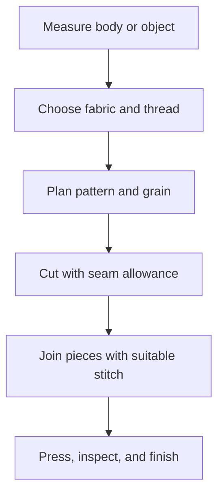

# Sewing and Clothing: งานผ้าและเครื่องแต่งกาย

Sewing and Clothing develops material awareness, hand skills, design judgment, repair habits, and responsible clothing consumption. Students learn that clothing is a system involving fibre choice, construction, fit, care, cost, identity, and environmental impact.

## 1 | Grade Band Breakdown

| Grade Band | Key Content |
|---|---|
| **ป.1–3** | Identify clothing, fold and store garments, thread large needles with supervision, practise simple paper or fabric crafts, and recognize sharp-tool hazards |
| **ป.4–6** | Sew buttons, hems, and simple seams; distinguish common fibres; measure safely; repair small defects; and care for clothing according to labels |
| **ม.1–3** | Compare natural and manufactured fibres, use patterns, apply hand stitches and basic machine procedures, plan a simple product, and calculate material cost |
| **ม.4–6** | Construct or modify garments, analyze fit and function, apply textile design principles, manage production quality, and evaluate repair, reuse, and waste reduction |

## 2 | Materials and Construction

| Concept | Thai | Explanation |
|---|---|---|
| Fibre | เส้นใย | Basic material that can be spun or formed into textile |
| Yarn | เส้นด้าย | Continuous strand made from fibres |
| Fabric | ผ้า | Material formed by weaving, knitting, felting, or other methods |
| Grain | แนวเส้นด้าย | Direction that affects fit, stretch, and cutting |
| Seam | ตะเข็บ | Joined edge between fabric pieces |
| Pattern | แบบตัด | Template used to cut a garment or product |

A good sewing process begins with purpose and measurement, then moves through material selection, pattern planning, cutting, joining, inspection, and finishing. The sequence reduces waste and makes errors easier to correct.

## 3 | Basic Stitching and Care

Students should learn running stitch (ด้นถอยหลัง or ด้นตะลุย depending on use), backstitch, whip stitch, hemming, button attachment, and simple repair. Clothing labels provide information about washing, bleaching, drying, ironing, and professional cleaning.

## 4 | Safety, Quality, and Sustainability

- Carry scissors closed with the point down.
- Keep needles in a pincushion and count them before and after work.
- Use a sewing machine only after learning threading, presser-foot control, and emergency stop procedures.
- Keep fingers away from the needle and unplug before cleaning or changing parts.
- Inspect seams for strength, neatness, comfort, and secure ends.
- Prefer repair, reuse, careful laundering, and durable design over unnecessary replacement.

## 5 | Hands-On Project: Reusable Fabric Item

### Project Brief

Create a small reusable item such as a pouch, produce bag, pencil case, or simple household cover from safe, clean fabric.

### Steps

1. Define the use and dimensions.
2. Make a paper pattern and calculate material use.
3. Select a fabric and explain its properties.
4. Cut, sew, finish, and inspect the item.
5. Record time, material cost, defects, and possible improvements.

### Expected Outcome

A functional fabric item with a labelled pattern, construction steps, care instructions, and a short sustainability reflection.

## 6 | Thai Terminology

| Thai | English |
|---|---|
| งานผ้า | Textile work |
| เส้นใย | Fibre |
| เส้นด้าย | Yarn |
| ผ้าทอ | Woven fabric |
| ผ้าถัก | Knitted fabric |
| ตะเข็บ | Seam |
| แบบตัด | Pattern |
| การซ่อมแซมเสื้อผ้า | Clothing repair |
| การใช้ซ้ำ | Reuse |

## 7 | Cross-Links

- [[01_Cooking_and_Nutrition|Cooking and Nutrition]]: household production and hygiene
- [[03_Household_Management|Household Management]]: care, storage, cost, and resource use
- [[13_Design_and_Fabrication|Design and Fabrication]]: design process and prototyping
- [[16_Work_Ethics|Work Ethics]]: care, precision, responsibility, and fair work

## Sources

- [OBEC: Basic Education Core Curriculum B.E. 2551 PDF](https://www.academic.obec.go.th/images/document/1525235513_d_1.pdf)
- [UN Environment Programme: Sustainable fashion](https://www.unep.org/news-and-stories/story/putting-brakes-fast-fashion)
- [International Labour Organization: Textiles, clothing, leather and footwear](https://www.ilo.org/global/industries-and-sectors/textiles-clothing-leather-footwear/lang--en/index.htm)
