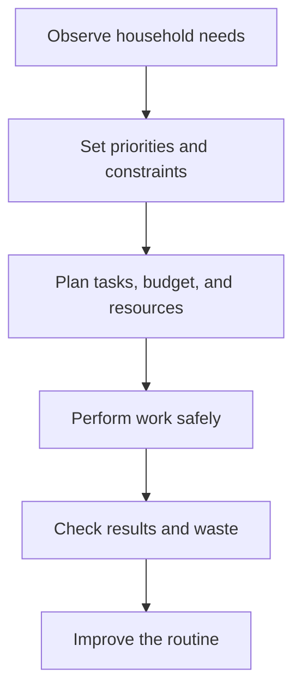

# Household Management: การจัดการบ้านเรือน

Household Management is the practical study of how people organize space, time, money, materials, and relationships so that daily life is safe, healthy, economical, and sustainable. Students learn to treat household work as planning and systems thinking rather than as invisible or gender-specific labor.

## 1 | Grade Band Breakdown

| Grade Band | Key Content |
|---|---|
| **ป.1–3** | Care for personal belongings, tidy a study area, follow simple routines, recognize hazards, and help fairly with age-appropriate tasks |
| **ป.4–6** | Plan cleaning routines, sort waste, use household products safely, record simple income and expenses, and cooperate in family work |
| **ม.1–3** | Build a household budget, compare products, understand consumer information, manage time and storage, and reduce energy, water, and material waste |
| **ม.4–6** | Analyze household systems, plan for emergencies, evaluate contracts and consumer choices, manage long-term resources, and connect household decisions with sustainability |

## 2 | Management Areas

| Area | Thai | Key Question |
|---|---|---|
| Space | การจัดพื้นที่ | Where should things go so work is safe and efficient? |
| Time | การบริหารเวลา | Which tasks must happen first and how often? |
| Money | การเงินครัวเรือน | What is needed, affordable, and worth the cost? |
| Materials | การใช้ทรัพยากร | How can items be maintained, reused, and disposed of responsibly? |
| Relationships | ความสัมพันธ์ในครอบครัว | How are responsibilities shared fairly and communicated? |

## 3 | Household Planning Cycle

A household plan should distinguish needs from preferences, fixed costs from flexible costs, urgent tasks from important tasks, and safe products from products that create unnecessary risk. Good management makes the system more resilient when income, time, health, or household membership changes.

## 4 | Practical Tools

- Cleaning schedule with task frequency, responsible person, tools, and safety notes.
- Simple budget: income, fixed expenses, variable expenses, savings, and contingency.
- Inventory list with quantity, expiry date, location, and replacement rule.
- Waste audit identifying avoidable purchases, reuse opportunities, recycling, and hazardous waste.
- Emergency plan with contacts, supplies, evacuation route, and responsibilities.

## 5 | Hands-On Project: Household Improvement Plan

### Project Brief

Choose one real household system such as a study area, pantry, cleaning routine, or monthly budget. Improve it without creating unrealistic work for the people who use it.

### Steps

1. Observe the current situation and interview users respectfully.
2. Identify one measurable problem and its likely causes.
3. Propose a low-cost change with a schedule and responsibility map.
4. Try the change for one week or simulate it with collected data.
5. Compare time, cost, safety, convenience, and waste before and after.

### Expected Outcome

A one-page household improvement plan with evidence, a revised routine, and a reflection on fairness and sustainability.

## 6 | Thai Terminology

| Thai | English |
|---|---|
| การจัดการบ้านเรือน | Household management |
| งานบ้าน | Household work |
| งบประมาณ | Budget |
| รายรับ | Income or receipts |
| รายจ่าย | Expenses |
| การบริโภคอย่างยั่งยืน | Sustainable consumption |
| การคัดแยกขยะ | Waste separation |
| ความปลอดภัยในบ้าน | Home safety |
| สิทธิผู้บริโภค | Consumer rights |

## 7 | Cross-Links

- [[01_Cooking_and_Nutrition|Cooking and Nutrition]]: meal planning and food safety
- [[02_Sewing_and_Clothing|Sewing and Clothing]]: care, repair, and reuse
- [[15_Entrepreneurship|Entrepreneurship]]: budgeting and value creation
- [[21_Digital_Citizenship|Digital Citizenship]]: online shopping and privacy
- [[Social Studies/03 Economics/02_Personal_Finance|Personal Finance]]: household money decisions

## Sources

- [OBEC: Basic Education Core Curriculum B.E. 2551 PDF](https://www.academic.obec.go.th/images/document/1525235513_d_1.pdf)
- [UN Sustainable Development Goal 12: Responsible consumption and production](https://sdgs.un.org/goals/goal12)
- [UNICEF: Family-friendly policies and care](https://www.unicef.org/early-childhood-development)
