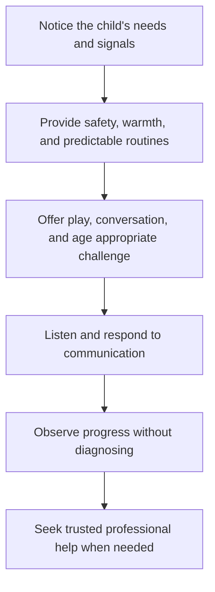

# Child Development: พัฒนาการเด็ก and การดูแลเด็ก

Child Development introduces the predictable but individual ways children grow, learn, communicate, move, and form relationships. Students learn how caregiving environments support development, how to respond safely to children's needs, and why developmental expectations must never be used to label or shame a child.

This topic is an introduction to informed family and care practice. It does not replace professional medical, psychological, or child-protection advice.

## 1 | Grade Band Breakdown

| Grade Band | Key Content |
|---|---|
| **ป.1–3** | Recognize that children have different needs, practise gentle interaction, identify trusted adults, and understand simple personal safety rules |
| **ป.4–6** | Observe basic physical, language, social, and emotional changes; help with safe play; and understand family cooperation |
| **ม.1–3** | Compare developmental domains, plan age-appropriate activities, identify protective factors, and communicate respectfully with younger children |
| **ม.4–6** | Analyze development through ecological and rights-based perspectives, plan inclusive caregiving environments, recognize safeguarding concerns, and distinguish observation from diagnosis |

## 2 | Developmental Domains

| Domain | Thai | What It Includes |
|---|---|---|
| Physical | ร่างกาย | Growth, movement, coordination, health, sleep, nutrition |
| Cognitive | สติปัญญา | Attention, memory, problem solving, language, learning |
| Social | สังคม | Relationships, cooperation, communication, social understanding |
| Emotional | อารมณ์ | Recognizing, expressing, and regulating feelings |
| Moral and self | คุณธรรมและความเข้าใจตนเอง | Empathy, responsibility, identity, values, agency |

Development is interactive. Nutrition, health, sleep, secure relationships, play, language, safety, culture, disability, poverty, and access to services can influence the opportunities available to a child.

## 3 | Supportive Care Process

## 4 | Safety and Rights

- Adults are responsible for creating safe environments; children are not responsible for abuse or neglect.
- Use age-appropriate supervision around water, heat, roads, electricity, tools, animals, and small objects.
- Ask permission before physical contact where appropriate and respect a child's communication.
- Avoid corporal punishment, humiliation, stereotyping, and public disclosure of private information.
- Treat disability and developmental difference through inclusion and support, not exclusion.
- If a child may be in danger, follow the local safeguarding process and contact an appropriate trusted adult or professional service.

## 5 | Hands-On Project: Age-Appropriate Activity Plan

### Project Brief

Design a short play or learning activity for a chosen age group. The activity should support one developmental domain and include safety, inclusion, materials, adult role, and observation criteria.

### Steps

1. Specify the age range and developmental goal.
2. Select an activity that is playful, culturally respectful, and achievable.
3. Identify risks, adaptations, and supervision needs.
4. Conduct or simulate the activity with consent and appropriate supervision.
5. Record observations using descriptive language, not diagnostic labels.

### Expected Outcome

An activity plan, safety checklist, inclusion adaptations, and a reflective observation note.

## 6 | Thai Terminology

| Thai | English |
|---|---|
| พัฒนาการเด็ก | Child development |
| การเจริญเติบโต | Growth |
| พัฒนาการด้านร่างกาย | Physical development |
| พัฒนาการด้านสติปัญญา | Cognitive development |
| พัฒนาการด้านอารมณ์ | Emotional development |
| พัฒนาการด้านสังคม | Social development |
| การดูแลเด็ก | Child caregiving |
| การคุ้มครองเด็ก | Child protection |
| การเล่นที่เหมาะสมตามวัย | Age-appropriate play |

## 7 | Cross-Links

- [[03_Household_Management|Household Management]]: routines, safety, and family responsibilities
- [[16_Work_Ethics|Work Ethics]]: care responsibility and professional boundaries
- [[14_Career_Exploration|Career Exploration]]: education, health, and social-care careers
- [[Social Studies/02 Civics/07_Social_Institutions|Social Institutions]]: family and education systems

## Sources

- [UNICEF: Early childhood development](https://www.unicef.org/early-childhood-development)
- [WHO: Nurturing care for early childhood development](https://www.who.int/teams/maternal-newborn-child-adolescent-health-and-ageing/child-health/nurturing-care)
- [OBEC: Basic Education Core Curriculum B.E. 2551 PDF](https://www.academic.obec.go.th/images/document/1525235513_d_1.pdf)
