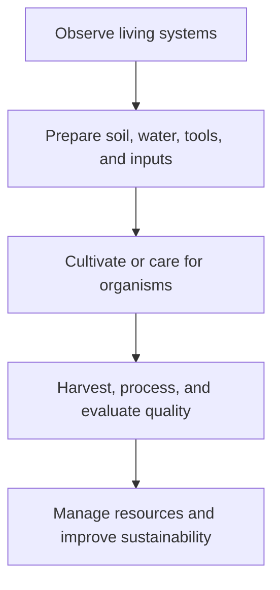

# Agriculture: งานเกษตร

> **Strand:** Agriculture (งานเกษตร) | **Concept Areas:** 5 | **Duration:** 12 years, ป.1–ม.6
> **Focus:** Plants, animals, soil, water, food processing, and sufficiency agriculture

## Overview

Agriculture connects biological knowledge with food, livelihoods, community resilience, and environmental stewardship. Students learn to observe living systems, plan production, use resources carefully, maintain safety, and evaluate the effects of agricultural choices.

Thai school agriculture commonly connects with the Sufficiency Economy Philosophy (ปรัชญาของเศรษฐกิจพอเพียง), local wisdom, community enterprise, and sustainable development. The aim is not simply to produce more, but to produce appropriately, safely, and responsibly.

## Concept Areas

| # | Concept Area | Thai | Main Focus |
|---|---|---|---|
| 05 | [[05_Plant_Cultivation]] | การปลูกพืช | Plant needs, propagation, crop planning, pest management |
| 06 | [[06_Animal_Husbandry]] | การเลี้ยงสัตว์ | Animal needs, welfare, hygiene, health, responsible production |
| 07 | [[07_Soil_and_Water_Management]] | การจัดการดินและน้ำ | Soil properties, compost, irrigation, conservation, water quality |
| 08 | [[08_Food_Processing]] | การแปรรูปอาหาร | Preservation, hygiene, packaging, quality, value addition |
| 09 | [[09_Sufficiency_Economy_Agriculture]] | เกษตรทฤษฎีใหม่ | Moderation, resilience, integrated farming, community systems |

## Grade Band Progression

| Grade Band | Progression |
|---|---|
| **ป.1–3** | Observe plants and animals, plant seeds, water safely, identify food sources, care for living things |
| **ป.4–6** | Garden planning, simple propagation, composting, basic animal care, drying and simple preservation |
| **ม.1–3** | Crop planning, soil improvement, irrigation, animal health, fermentation and pickling, resource records |
| **ม.4–6** | Organic and precision methods, integrated farming, food standards, enterprise planning, sustainability analysis |

## Learning Sequence

## Progress Tracker

| # | Concept Area | Status | Files Created | Notes |
|---|---|---|---|---|
| 05 | Plant Cultivation | ✅ Done | `05_Plant_Cultivation.md` | |
| 06 | Animal Husbandry | ✅ Done | `06_Animal_Husbandry.md` | |
| 07 | Soil and Water Management | ✅ Done | `07_Soil_and_Water_Management.md` | |
| 08 | Food Processing | ✅ Done | `08_Food_Processing.md` | |
| 09 | Sufficiency Economy Agriculture | ✅ Done | `09_Sufficiency_Economy_Agriculture.md` | |

**Completion: 5/5 (100%) ✅**

## Related

- [[01 Home Economics/00_overview|Home Economics]]: nutrition, food preparation, and household use
- [[03 Crafts and Industry/00_overview|Crafts and Industry]]: tools, structures, and farm equipment
- [[04 Career Education/00_overview|Career Education]]: agricultural careers and enterprise
- [[Science/Fundamental/22_Technology_and_Engineering|Science and Technology]]: systems, measurement, and design
- [[Social Studies/03 Economics/03_Sufficiency_Economy_Philosophy|Sufficiency Economy Philosophy]]: economic and social context

## Sources

- [OBEC: Basic Education Core Curriculum B.E. 2551 PDF](https://www.academic.obec.go.th/images/document/1525235513_d_1.pdf)
- [FAO: Sustainable food and agriculture](https://www.fao.org/sustainability/en/)
- [UN: Sustainable Development Goals](https://sdgs.un.org/goals)
