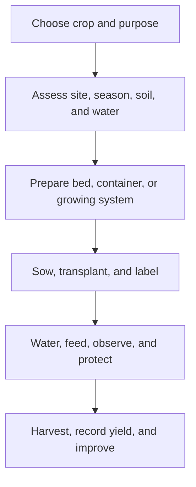

# Plant Cultivation: การปลูกพืช

Plant Cultivation applies observation, biology, soil and water management, planning, and care to the production of useful plants. Students learn that successful cultivation depends on matching plant needs with season, site, inputs, labour, risk, and intended use.

## 1 | Grade Band Breakdown

| Grade Band | Key Content |
|---|---|
| **ป.1–3** | Observe plant parts and needs, plant seeds, water gently, notice growth, and care for a small garden |
| **ป.4–6** | Prepare beds or containers, sow and transplant, identify common garden crops, use simple compost, and keep a growth record |
| **ม.1–3** | Plan crop cycles, compare propagation methods, diagnose basic pests, manage water and nutrients, and calculate yield and input use |
| **ม.4–6** | Evaluate organic, protected, hydroponic, or precision approaches, plan production for quality and market, and analyze sustainability and risk |

## 2 | Plant Growth System

| Need | Thai | Practical Question |
|---|---|---|
| Light | แสง | Does the site provide suitable light? |
| Water | น้ำ | How much and how often is water needed? |
| Air and space | อากาศและพื้นที่ | Is there enough room and airflow? |
| Nutrients | ธาตุอาหาร | What nutrients are available and what is missing? |
| Temperature | อุณหภูมิ | Is the crop suited to the season? |
| Protection | การป้องกัน | How can pests, disease, and physical damage be reduced? |

## 3 | Cultivation Cycle

Propagation may use seeds, cuttings, division, layering, or grafting. The correct method depends on the plant and the goal. Students should learn integrated pest management: observe first, prevent conditions that favour pests, use physical or biological methods where possible, and apply chemicals only under trained supervision and label directions.

## 4 | Safety and Sustainability

- Use clean water and safe tools.
- Wear suitable protection when handling compost, soil, or approved agricultural products.
- Do not taste unknown plants or use chemicals without supervision.
- Protect soil from erosion and avoid unnecessary disturbance.
- Record water, inputs, harvest, and waste so decisions can be improved.
- Prefer locally suitable crops, biodiversity, composting, and methods that protect pollinators.

## 5 | Hands-On Project: Small Food Garden

### Project Brief

Plan and grow one edible crop in a container, raised bed, or school plot. Use measurements and observations rather than memory alone.

### Steps

1. Select a crop appropriate for the local season and space.
2. Record site conditions and prepare a cultivation plan.
3. Plant, label, and keep a weekly growth record.
4. Observe pests, water use, plant health, and development.
5. Harvest or evaluate the crop and propose one improvement.

### Expected Outcome

A cultivation plan, labelled growing space, observation table, yield record, and sustainability reflection.

## 6 | Thai Terminology

| Thai | English |
|---|---|
| การปลูกพืช | Plant cultivation |
| การขยายพันธุ์พืช | Plant propagation |
| การเพาะเมล็ด | Seed sowing |
| การปักชำ | Cutting propagation |
| การย้ายกล้า | Transplanting |
| การกำจัดศัตรูพืชแบบผสมผสาน | Integrated pest management |
| ผลผลิต | Yield |
| เกษตรอินทรีย์ | Organic agriculture |

## 7 | Cross-Links

- [[07_Soil_and_Water_Management|Soil and Water Management]]: growing conditions and conservation
- [[08_Food_Processing|Food Processing]]: use and preservation of harvests
- [[09_Sufficiency_Economy_Agriculture|Sufficiency Economy Agriculture]]: integrated and resilient systems
- [[15_Entrepreneurship|Entrepreneurship]]: crop value and small enterprise

## Sources

- [FAO: Sustainable food and agriculture](https://www.fao.org/sustainability/en/)
- [FAO: Integrated pest management](https://www.fao.org/pest-and-pesticide-management/ipm/en/)
- [OBEC: Basic Education Core Curriculum B.E. 2551 PDF](https://www.academic.obec.go.th/images/document/1525235513_d_1.pdf)
