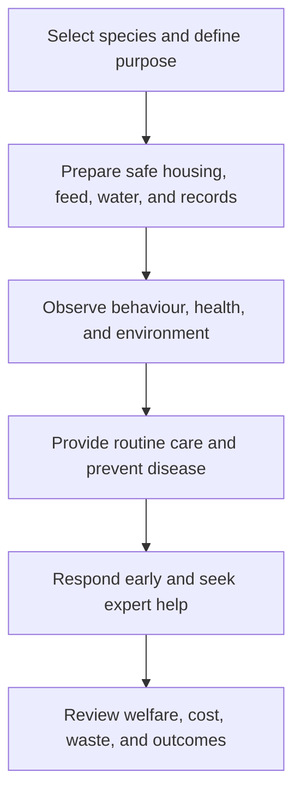

# Animal Husbandry: การเลี้ยงสัตว์

Animal Husbandry is the responsible care and management of domesticated animals for companionship, food, work, conservation, or livelihood. Students learn that production goals never remove the duty to protect animal welfare, public health, worker safety, and environmental quality.

## 1 | Grade Band Breakdown

| Grade Band | Key Content |
|---|---|
| **ป.1–3** | Observe animals, identify basic needs, behave gently, provide simple care under supervision, and understand that animals can feel stress and pain |
| **ป.4–6** | Learn housing, feed, water, hygiene, handling, and simple records for common small animals such as fish, chickens, or rabbits |
| **ม.1–3** | Study breeds and production purposes, animal health, biosecurity, breeding basics, waste management, and welfare indicators |
| **ม.4–6** | Plan a small livestock or aquaculture system, evaluate feed and disease risks, calculate costs, and balance welfare, productivity, public health, and sustainability |

## 2 | Five Welfare Needs

| Need | Thai | Example |
|---|---|---|
| Suitable environment | สภาพแวดล้อมที่เหมาะสม | Shelter, temperature, space, ventilation |
| Suitable diet | อาหารและน้ำที่เหมาะสม | Clean water and species-appropriate feed |
| Normal behaviour | พฤติกรรมตามธรรมชาติ | Space and opportunity to move and interact |
| Social needs | ความต้องการทางสังคม | Appropriate companionship or safe separation |
| Protection from pain and disease | การป้องกันความเจ็บปวดและโรค | Prevention, observation, treatment, humane care |

## 3 | Care Cycle

Biosecurity reduces the movement of disease between animals, people, equipment, and sites. Basic practices include quarantine where appropriate, clean equipment, controlled visitor access, safe waste handling, and prompt reporting of unusual illness or deaths.

## 4 | Safety and Ethics

- Do not handle unfamiliar or sick animals without trained supervision.
- Wash hands after contact with animals, feed, bedding, or waste.
- Protect animals from heat, cold, overcrowding, hunger, thirst, injury, and unnecessary fear.
- Use humane handling and never treat an animal as a disposable experiment.
- Keep animal waste away from food preparation and water sources.
- Follow local veterinary, public-health, and environmental rules.

## 5 | Hands-On Project: Welfare Observation Log

### Project Brief

Create a non-invasive observation project for a school, farm, or household animal. The purpose is to improve care, not to disturb the animal.

### Steps

1. Choose an appropriate animal and obtain permission.
2. Define welfare indicators such as appetite, movement, posture, cleanliness, and social behaviour.
3. Observe at consistent times without provoking the animal.
4. Compare observations with the animal's basic needs.
5. Recommend one safe improvement and explain when expert advice is needed.

### Expected Outcome

An observation log, welfare checklist, risk map, and evidence-based care recommendation.

## 6 | Thai Terminology

| Thai | English |
|---|---|
| การเลี้ยงสัตว์ | Animal husbandry |
| สวัสดิภาพสัตว์ | Animal welfare |
| อาหารสัตว์ | Animal feed |
| โรงเรือน | Housing or shelter |
| สุขาภิบาล | Sanitation |
| ความปลอดภัยทางชีวภาพ | Biosecurity |
| การกักกัน | Quarantine |
| โรคติดต่อจากสัตว์สู่คน | Zoonotic disease |

## 7 | Cross-Links

- [[05_Plant_Cultivation|Plant Cultivation]]: feed, crops, and integrated systems
- [[07_Soil_and_Water_Management|Soil and Water Management]]: waste and water quality
- [[08_Food_Processing|Food Processing]]: safe use of animal products
- [[09_Sufficiency_Economy_Agriculture|Sufficiency Economy Agriculture]]: balanced farm systems
- [[16_Work_Ethics|Work Ethics]]: responsibility and humane practice

## Sources

- [World Organisation for Animal Health: Animal welfare](https://www.woah.org/en/what-we-do/animal-health-and-welfare/animal-welfare/)
- [FAO: Livestock and sustainable food systems](https://www.fao.org/livestock-systems/en/)
- [OBEC: Basic Education Core Curriculum B.E. 2551 PDF](https://www.academic.obec.go.th/images/document/1525235513_d_1.pdf)
