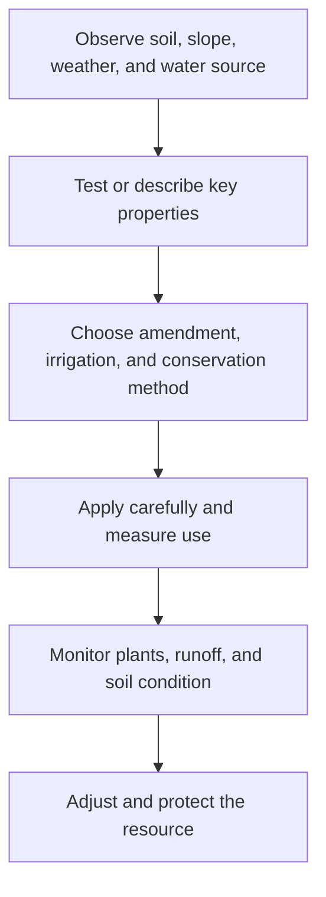

# Soil and Water Management: การจัดการดินและน้ำ

Soil and Water Management explains how growing systems depend on physical resources that must be observed, protected, and used efficiently. Students learn to identify soil properties, improve structure and fertility, plan irrigation, prevent erosion, and protect water from contamination.

## 1 | Grade Band Breakdown

| Grade Band | Key Content |
|---|---|
| **ป.1–3** | Observe soil colour and texture, understand that plants need water, water without waste, and keep litter and chemicals away from drains |
| **ป.4–6** | Compare soil types, add compost, protect soil from erosion, measure simple water use, and identify methods of watering |
| **ม.1–3** | Study pH, organic matter, drainage, water-holding capacity, irrigation efficiency, runoff, and basic soil conservation |
| **ม.4–6** | Analyze soil and water data, design conservation systems, evaluate salinity and contamination risk, and plan sustainable water allocation |

## 2 | Resource Properties

| Property | Thai | Why It Matters |
|---|---|---|
| Texture | เนื้อดิน | Affects drainage, air, and root movement |
| Structure | โครงสร้างดิน | Affects aggregation, erosion, and infiltration |
| Organic matter | อินทรียวัตถุ | Supports structure, nutrients, and biological activity |
| pH | ความเป็นกรดด่าง | Influences nutrient availability |
| Infiltration | การซึมลงดิน | Determines runoff and water storage |
| Water quality | คุณภาพน้ำ | Protects crops, animals, people, and ecosystems |

## 3 | Management Cycle

Useful practices include composting, mulching, contour planting, ground cover, rainwater capture, drip irrigation, appropriate watering time, buffer vegetation near waterways, and keeping hazardous substances out of soil and drains.

## 4 | Safety and Sustainability

- Do not taste soil, compost, irrigation water, or agricultural products.
- Wear gloves and wash hands after handling soil, manure, or amendments.
- Treat unknown water as unsafe for drinking and food preparation.
- Never mix chemicals or apply them without trained supervision.
- Protect waterways from sediment, fertilizer, oil, and waste.
- Match irrigation to plant need, soil condition, weather, and local water availability.

## 5 | Hands-On Project: Water-Smart Garden Plan

### Project Brief

Design a small garden irrigation and soil-protection plan for a chosen site.

### Steps

1. Map the site, slope, soil, crops, water source, and likely runoff path.
2. Test or describe soil texture, drainage, and organic matter.
3. Select a conservation method and an irrigation method.
4. Estimate water use and design a simple monitoring table.
5. Review the plan for safety, cost, maintenance, and resilience.

### Expected Outcome

A site map, soil and water observation record, design sketch, water-use estimate, and improvement rationale.

## 6 | Thai Terminology

| Thai | English |
|---|---|
| ดิน | Soil |
| การอนุรักษ์ดิน | Soil conservation |
| การอนุรักษ์น้ำ | Water conservation |
| ปุ๋ยหมัก | Compost |
| อินทรียวัตถุ | Organic matter |
| การชะล้างพังทลายของดิน | Soil erosion |
| การให้น้ำแบบหยด | Drip irrigation |
| น้ำไหลบ่า | Runoff |
| คุณภาพน้ำ | Water quality |

## 7 | Cross-Links

- [[05_Plant_Cultivation|Plant Cultivation]]: roots, nutrients, and crop health
- [[06_Animal_Husbandry|Animal Husbandry]]: waste and water risks
- [[09_Sufficiency_Economy_Agriculture|Sufficiency Economy Agriculture]]: resource resilience
- [[Science/Fundamental/22_Technology_and_Engineering|Science and Engineering]]: systems and measurement
- [[Social Studies/05 Geography/06_Natural_Resources|Natural Resources]]: environmental context

## Sources

- [FAO: Soils portal](https://www.fao.org/soils-portal/en/)
- [FAO: Water for sustainable food and agriculture](https://www.fao.org/land-water/water/water-efficiency/en/)
- [OBEC: Basic Education Core Curriculum B.E. 2551 PDF](https://www.academic.obec.go.th/images/document/1525235513_d_1.pdf)
