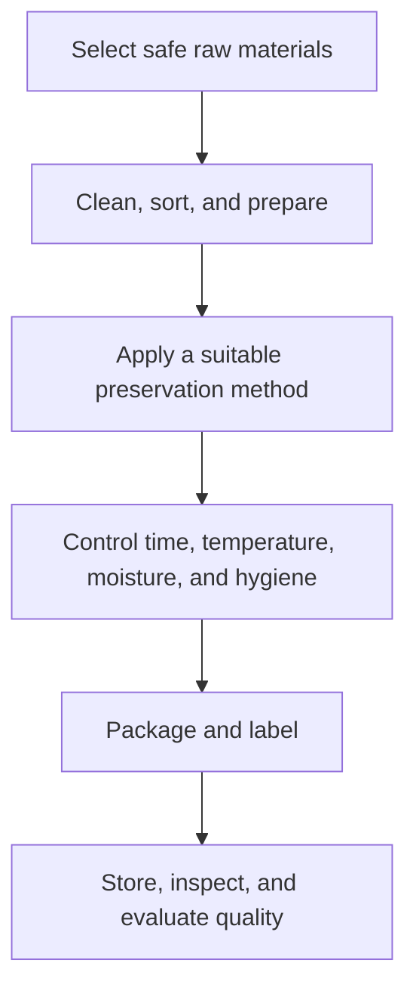

# Food Processing: การแปรรูปอาหาร

Food Processing changes raw agricultural products into food that is safer, more convenient, more stable, or more valuable. Students learn how methods such as drying, chilling, heating, fermentation, pickling, and packaging affect moisture, microorganisms, texture, flavour, shelf life, cost, and waste.

## 1 | Grade Band Breakdown

| Grade Band | Key Content |
|---|---|
| **ป.1–3** | Identify raw and prepared foods, practise clean handling, observe drying or chilling, and understand that food can spoil |
| **ป.4–6** | Prepare simple dried, chilled, or cooked products, use clean tools, label dates, and store food appropriately |
| **ม.1–3** | Compare preservation principles, control time and temperature, study fermentation and pickling, calculate yield, and design simple packaging |
| **ม.4–6** | Analyze hazards, quality control, standard operating procedures, shelf-life assumptions, cost, branding, waste, and small-scale food enterprise |

## 2 | Preservation Principles

| Method | Thai | Main Principle |
|---|---|---|
| Drying | การทำแห้ง | Reduce available water for microorganisms |
| Chilling or freezing | การแช่เย็น or การแช่แข็ง | Slow or stop many microbial and chemical changes |
| Heating | การใช้ความร้อน | Reduce microorganisms and alter texture |
| Pickling | การดอง | Use salt, acid, or both to create a less favourable environment |
| Fermentation | การหมัก | Use controlled microorganisms to transform food |
| Packaging | การบรรจุ | Protect from contamination, moisture, oxygen, light, and damage |

## 3 | Processing Cycle

A product is not safe merely because it looks or smells acceptable. Students should use reliable procedures, avoid unknown preservation claims, and identify when a process requires trained supervision or laboratory testing.

## 4 | Safety and Quality

- Use clean water, clean surfaces, clean containers, and hygienic hands.
- Separate raw materials from ready-to-eat products.
- Record dates, ingredients, process conditions, and storage conditions.
- Never taste a product that shows mould, unusual gas, swelling, leakage, or suspected contamination.
- Label allergens and storage instructions.
- Treat shelf life as a controlled claim, not a guess.

## 5 | Hands-On Project: Local Produce Product

### Project Brief

Transform one local crop into a safe, small-batch product such as dried fruit, a properly refrigerated preparation, or a supervised fermented product.

### Steps

1. Choose a raw material and research a safe method.
2. Write a process flow and hazard checklist.
3. Prepare a small batch with supervision and record conditions.
4. Package, label, and store appropriately.
5. Evaluate sensory quality, yield, cost, waste, and limits of the process.

### Expected Outcome

A process flowchart, batch record, label, cost table, and safety reflection.

## 6 | Thai Terminology

| Thai | English |
|---|---|
| การแปรรูปอาหาร | Food processing |
| การถนอมอาหาร | Food preservation |
| การทำแห้ง | Drying |
| การดอง | Pickling |
| การหมัก | Fermentation |
| อายุการเก็บรักษา | Shelf life |
| การปนเปื้อน | Contamination |
| บรรจุภัณฑ์ | Packaging |
| การควบคุมคุณภาพ | Quality control |

## 7 | Cross-Links

- [[01_Cooking_and_Nutrition|Cooking and Nutrition]]: hygiene and food properties
- [[05_Plant_Cultivation|Plant Cultivation]]: harvest quality and seasonal supply
- [[15_Entrepreneurship|Entrepreneurship]]: value addition and market testing
- [[Social Studies/03 Economics/06_Production_and_Consumption|Production and Consumption]]: product and consumer decisions

## Sources

- [FAO: Food processing and preservation resources](https://www.fao.org/food-loss-reduction/en/)
- [WHO: Five keys to safer food](https://www.who.int/activities/promoting-safe-food-handling)
- [OBEC: Basic Education Core Curriculum B.E. 2551 PDF](https://www.academic.obec.go.th/images/document/1525235513_d_1.pdf)
