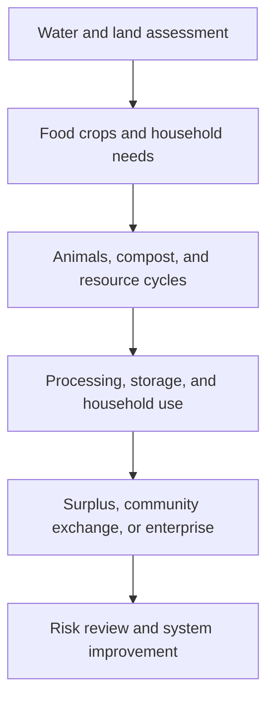

# Sufficiency Economy Agriculture: เกษตรทฤษฎีใหม่

Sufficiency Economy Agriculture applies the Sufficiency Economy Philosophy to agricultural planning and everyday resource decisions. Its purpose is balanced development: people use knowledge and morality to act with moderation, reasonableness, and preparedness for change.

This framework should not be reduced to a slogan or a single farm layout. It is a way to examine relationships among food, water, land, labour, income, risk, community, and the environment.

## 1 | Grade Band Breakdown

| Grade Band | Key Content |
|---|---|
| **ป.1–3** | Use resources carefully, share work, grow or care for simple living things, avoid waste, and recognize that families depend on natural systems |
| **ป.4–6** | Introduce moderation, saving, local food, simple integrated activities, composting, and careful use of water and materials |
| **ม.1–3** | Apply the three principles and two conditions to a small farm or household system, compare risks, and connect production with consumption |
| **ม.4–6** | Analyze integrated farming, resilience, community enterprise, market limits, ecological trade-offs, and development through evidence rather than idealized claims |

## 2 | Framework Components

| Component | Thai | Meaning in Practice |
|---|---|---|
| Moderation | ความพอประมาณ | Avoid overuse and match decisions to capacity |
| Reasonableness | ความมีเหตุผล | Use evidence, causes, consequences, and context |
| Self-immunity | ภูมิคุ้มกันในตัวที่ดี | Prepare for uncertainty, shocks, and changing conditions |
| Knowledge condition | เงื่อนไขความรู้ | Learn, plan, record, and apply appropriate knowledge |
| Morality condition | เงื่อนไขคุณธรรม | Act honestly, responsibly, patiently, and cooperatively |

New Theory Agriculture (เกษตรทฤษฎีใหม่) commonly emphasizes water storage, food production, productive land use, and residence or infrastructure in an integrated plan. The exact proportions should be adapted to local geography, household capacity, water, labour, and law.

## 3 | Integrated System

## 4 | Critical Thinking and Limits

- Sufficiency does not mean refusing markets, technology, or ambition.
- Self-reliance can coexist with cooperation, trade, public services, and specialist knowledge.
- A plan must account for land rights, climate, disability, labour, debt, market access, and unequal starting conditions.
- Sustainability requires measuring outcomes such as water use, soil condition, income stability, nutrition, and waste.
- Students should distinguish a philosophical principle from a guaranteed economic result.

## 5 | Hands-On Project: Resilient Household Food Plan

### Project Brief

Design a small integrated food and resource plan for a household, school, or community. The plan should address food, water, waste, income, risk, and participation.

### Steps

1. Map available land, water, skills, time, and constraints.
2. Identify essential needs and major risks.
3. Design a small integrated system with at least two resource cycles.
4. Estimate inputs, outputs, costs, benefits, and maintenance.
5. Review who benefits, who does the work, and how the plan adapts to shocks.

### Expected Outcome

A system map, resource budget, risk register, implementation sequence, and reflection on moderation, reasonableness, self-immunity, knowledge, and morality.

## 6 | Thai Terminology

| Thai | English |
|---|---|
| เศรษฐกิจพอเพียง | Sufficiency Economy Philosophy |
| ความพอประมาณ | Moderation |
| ความมีเหตุผล | Reasonableness |
| ภูมิคุ้มกันในตัวที่ดี | Self-immunity or resilience |
| เกษตรทฤษฎีใหม่ | New Theory Agriculture |
| เกษตรผสมผสาน | Integrated farming |
| การพึ่งตนเอง | Self-reliance |
| วิสาหกิจชุมชน | Community enterprise |
| การพัฒนาอย่างยั่งยืน | Sustainable development |

## 7 | Cross-Links

- [[05_Plant_Cultivation|Plant Cultivation]]: crops and biodiversity
- [[07_Soil_and_Water_Management|Soil and Water Management]]: resource protection
- [[08_Food_Processing|Food Processing]]: value and food security
- [[15_Entrepreneurship|Entrepreneurship]]: community enterprise and markets
- [[Social Studies/03 Economics/03_Sufficiency_Economy_Philosophy|Sufficiency Economy Philosophy]]: social and economic foundations

## Sources

- [Chaipattana Foundation: New Theory Agriculture](https://www.chaipat.or.th/eng/concepts-theories-and-development/new-theory.html)
- [UNDP Thailand: Sufficiency Economy](https://www.undp.org/thailand/publications/sufficiency-economy-philosophy)
- [OBEC: Basic Education Core Curriculum B.E. 2551 PDF](https://www.academic.obec.go.th/images/document/1525235513_d_1.pdf)
