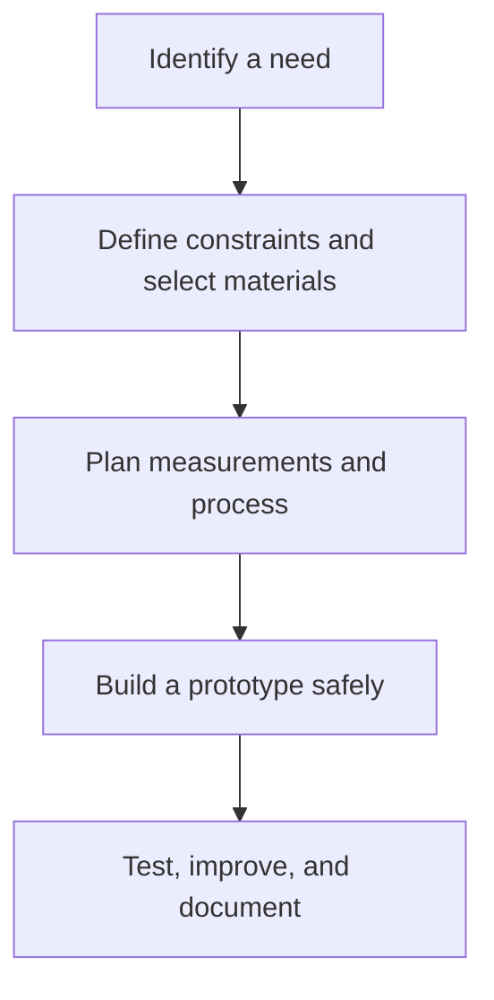

# Crafts and Industry: งานช่าง and การออกแบบ

> **Strand:** Crafts and Industry | **Concept Areas:** 4 | **Duration:** 12 years, ป.1–ม.6
> **Focus:** Materials, tools, repair, electronics, design, fabrication, and workshop safety

## Overview

Crafts and Industry develops the ability to transform materials into useful, safe, and well-designed products. Students learn to measure, select tools, follow processes, inspect quality, repair everyday objects, and communicate design decisions.

The strand is practical and project-based. A successful project balances function, safety, material efficiency, appearance, cost, and environmental impact. Students should learn that skilled making is a form of problem solving, not merely manual repetition.

## Concept Areas

| # | Concept Area | Thai | Main Focus |
|---|---|---|---|
| 10 | [[10_Woodwork]] | งานไม้ | Wood properties, measurement, joints, finishing, furniture safety |
| 11 | [[11_Metalwork]] | งานโลหะ | Metal properties, cutting, forming, joining, corrosion, workshop safety |
| 12 | [[12_Electronics]] | งานไฟฟ้าและอิเล็กทรอนิกส์ | Electrical safety, circuits, components, soldering, control systems |
| 13 | [[13_Design_and_Fabrication]] | การออกแบบและประดิษฐ์ | Design process, prototyping, testing, iteration, sustainable fabrication |

## Grade Band Progression

| Grade Band | Progression |
|---|---|
| **ป.1–3** | Safe handling of simple materials, paper and model construction, recognizing tools and hazards |
| **ป.4–6** | Measurement, simple cutting and joining, basic projects, tool care, elementary circuits |
| **ม.1–3** | Material properties, workshop processes, soldering foundations, prototyping, testing, documentation |
| **ม.4–6** | Product design, fabrication planning, microcontrollers, quality control, cost, sustainability, entrepreneurship |

## Learning Sequence

## Progress Tracker

| # | Concept Area | Status | Files Created | Notes |
|---|---|---|---|---|
| 10 | Woodwork | ✅ Done | `10_Woodwork.md` | |
| 11 | Metalwork | ✅ Done | `11_Metalwork.md` | |
| 12 | Electronics | ✅ Done | `12_Electronics.md` | |
| 13 | Design and Fabrication | ✅ Done | `13_Design_and_Fabrication.md` | |

**Completion: 4/4 (100%) ✅**

## Related

- [[02 Agriculture/00_overview|Agriculture]]: farm tools and resource systems
- [[04 Career Education/00_overview|Career Education]]: technical careers and product enterprise
- [[05 Technology/00_overview|Technology]]: digital design, programming, and documentation
- [[Science/Fundamental/22_Technology_and_Engineering|Science and Engineering]]: force, energy, materials, and systems

## Sources

- [OBEC: Basic Education Core Curriculum B.E. 2551 PDF](https://www.academic.obec.go.th/images/document/1525235513_d_1.pdf)
- [IPST: Curriculum for Science, Mathematics, and Technology](https://www.ipst.ac.th/curriculum)
