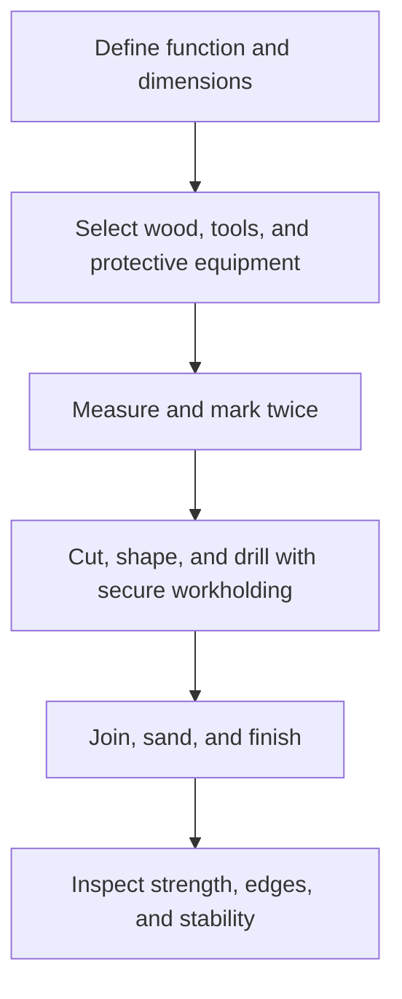

# Woodwork: งานไม้

Woodwork develops the ability to select, measure, cut, join, finish, and care for wood-based materials. It combines material science, geometry, hand skills, design, and workshop discipline. A good woodworker plans before cutting, protects people and tools, and checks whether the final object is useful and durable.

## 1 | Grade Band Breakdown

| Grade Band | Key Content |
|---|---|
| **ป.1–3** | Recognize wood and wood-like materials, assemble simple models, identify sharp edges and tool hazards, and keep a work area orderly |
| **ป.4–6** | Measure and mark, use simple hand tools under supervision, make basic joints or projects, sand safely, and care for materials |
| **ม.1–3** | Compare solid wood and manufactured boards, use saws, planes, chisels, drills, and clamps appropriately, practise basic joinery, and apply finish safely |
| **ม.4–6** | Plan a furniture or product project, calculate material use and cost, select joints for load and appearance, control quality, and consider sustainable sourcing |

## 2 | Materials and Processes

| Concept | Thai | Explanation |
|---|---|---|
| Grain | ลายไม้ | Direction and pattern of wood fibres |
| Moisture | ความชื้น | Affects movement, strength, and finishing |
| Measuring and marking | การวัดและการร่างแบบ | Transfer dimensions accurately before cutting |
| Joint | การต่อไม้ | Method for connecting parts |
| Sanding | การขัด | Smooths surfaces and prepares finish |
| Finish | การเคลือบผิว | Protects and changes the appearance of the surface |

Common joints include butt, lap, mitre, dowel, and mortise-and-tenon. The choice depends on load, tools, skill, appearance, and whether the joint must be removable.

## 3 | Safe Workshop Sequence

Safety depends on stable workholding, correct tool direction, sharp and maintained tools, eye protection, dust control, and supervision for power tools. Students should never remove guards, bypass switches, or use a tool for a purpose it was not designed to perform.

## 4 | Quality and Sustainability

- Check dimensions before each irreversible cut.
- Keep grain direction and edge orientation consistent with the design.
- Avoid hidden cracks, loose joints, protruding fasteners, and sharp edges.
- Use offcuts for small parts where practical.
- Prefer legally and responsibly sourced timber or suitable reclaimed material.
- Apply finishes with ventilation and follow product instructions.

## 5 | Hands-On Project: Small Utility Shelf

### Project Brief

Design and build a small shelf, phone stand, or book support for a real user and a defined load.

### Steps

1. Interview the user and define dimensions and load.
2. Draw a labelled plan and calculate material use.
3. Select joints and prepare a cut list.
4. Build under supervision, checking squareness after each stage.
5. Test stability and document defects and improvements.

### Expected Outcome

A functional wood product, dimensioned drawing, cut list, safety checklist, and testing record.

## 6 | Thai Terminology

| Thai | English |
|---|---|
| งานไม้ | Woodwork |
| ไม้เนื้อแข็ง | Hardwood |
| ไม้เนื้ออ่อน | Softwood |
| ไม้อัด | Plywood |
| การวัดและร่างแบบ | Measuring and marking |
| การต่อไม้ | Wood joinery |
| การขัด | Sanding |
| การเคลือบผิว | Finishing |
| อุปกรณ์ป้องกันส่วนบุคคล | Personal protective equipment |

## 7 | Cross-Links

- [[11_Metalwork|Metalwork]]: material properties and joining
- [[12_Electronics|Electronics]]: safe integration of circuits into products
- [[13_Design_and_Fabrication|Design and Fabrication]]: planning, prototyping, and testing
- [[15_Entrepreneurship|Entrepreneurship]]: pricing and product value
- [[Science/Fundamental/22_Technology_and_Engineering|Science and Engineering]]: forces, materials, and systems

## Sources

- [OBEC: Basic Education Core Curriculum B.E. 2551 PDF](https://www.academic.obec.go.th/images/document/1525235513_d_1.pdf)
- [OSHA: Woodworking safety](https://www.osha.gov/woodworking)
- [FAO: Sustainable forest management](https://www.fao.org/forestry/en/)
