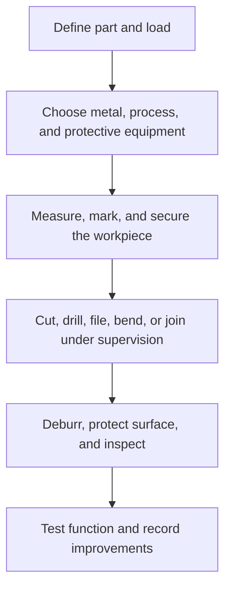

# Metalwork: งานโลหะ

Metalwork teaches how metallic materials can be measured, cut, shaped, joined, finished, and maintained. Students use practical projects to understand properties such as hardness, ductility, conductivity, corrosion resistance, and strength while developing disciplined workshop habits.

## 1 | Grade Band Breakdown

| Grade Band | Key Content |
|---|---|
| **ป.1–3** | Recognize metal objects, identify sharp and hot surfaces, use simple construction materials safely, and understand that tools need careful handling |
| **ป.4–6** | Measure and mark simple metal pieces, use hand tools with supervision, bend or fasten safe materials, and prevent rust through care |
| **ม.1–3** | Compare ferrous and non-ferrous metals, cut, drill, file, bend, and fasten metal, learn basic joining concepts, and manage sparks and swarf safely |
| **ม.4–6** | Plan fabrication, select processes, evaluate tolerances and surface treatment, understand welding risks under specialist supervision, and control quality and cost |

## 2 | Material and Process Choices

| Concept | Thai | Explanation |
|---|---|---|
| Ferrous metal | โลหะกลุ่มเหล็ก | Contains iron, often strong and magnetic depending on alloy |
| Non-ferrous metal | โลหะนอกกลุ่มเหล็ก | Metals such as aluminium, copper, and brass |
| Ductility | ความเหนียว | Ability to deform before breaking |
| Corrosion | การกัดกร่อน | Chemical or electrochemical deterioration |
| Fastening | การยึดประกอบ | Bolts, screws, rivets, or other removable methods |
| Joining | การเชื่อมต่อ | Process that connects parts, sometimes permanently |

Process selection depends on thickness, shape, strength, precision, available equipment, finish, cost, and safety. Filing and deburring are not cosmetic extras: they reduce cuts and make a product fit and function correctly.

## 3 | Safe Workshop Sequence

Safety requires eye protection, suitable clothing, secure workholding, control of sharp edges, safe handling of hot or sparking processes, ventilation, and correct storage. Welding, grinding, and powered cutting require trained supervision and equipment-specific procedures.

## 4 | Sustainability and Quality

- Select the least wasteful process that meets the design need.
- Separate and recycle metal offcuts where possible.
- Prevent oil, coatings, and metal dust from entering soil or drains.
- Inspect dimensions, hole alignment, joint strength, surface condition, and sharp edges.
- Protect suitable metals with paint, oil, plating, or design choices that reduce corrosion.

## 5 | Hands-On Project: Metal Utility Bracket

### Project Brief

Design a small bracket, hook, or stand from a safe metal strip or reclaimed component. The project must support a defined load and have no hazardous edges.

### Steps

1. Define the load and mounting conditions.
2. Draw dimensions and select a safe process.
3. Mark, cut, drill, bend, and deburr with supervision.
4. Assemble and apply a suitable surface protection.
5. Test load, alignment, and edge safety.

### Expected Outcome

A functional metal product, process plan, material-use record, safety checklist, and test report.

## 6 | Thai Terminology

| Thai | English |
|---|---|
| งานโลหะ | Metalwork |
| โลหะกลุ่มเหล็ก | Ferrous metal |
| โลหะนอกกลุ่มเหล็ก | Non-ferrous metal |
| การตัด | Cutting |
| การเจาะ | Drilling |
| การตะไบ | Filing |
| การดัด | Bending |
| การเชื่อม | Welding |
| การกัดกร่อน | Corrosion |

## 7 | Cross-Links

- [[10_Woodwork|Woodwork]]: material selection and joining
- [[12_Electronics|Electronics]]: conductivity and electrical safety
- [[13_Design_and_Fabrication|Design and Fabrication]]: process planning and testing
- [[16_Work_Ethics|Work Ethics]]: safety and professional responsibility

## Sources

- [OSHA: Machine guarding](https://www.osha.gov/machine-guarding)
- [OSHA: Welding, cutting, and brazing](https://www.osha.gov/welding-cutting-brazing)
- [OBEC: Basic Education Core Curriculum B.E. 2551 PDF](https://www.academic.obec.go.th/images/document/1525235513_d_1.pdf)
