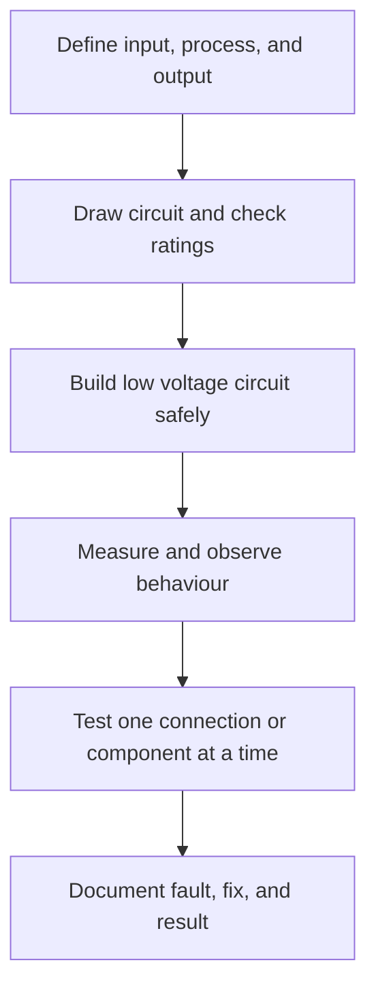

# Electronics: งานไฟฟ้าและอิเล็กทรอนิกส์

Electronics studies how electrical energy and signals are controlled by circuits and components. Students begin with safety and simple circuits, then progress toward measurement, sensors, control, microcontrollers, and responsible repair or design.

## 1 | Grade Band Breakdown

| Grade Band | Key Content |
|---|---|
| **ป.1–3** | Recognize common electrical devices, keep water away from electricity, identify plugs and batteries, and ask an adult before connecting equipment |
| **ป.4–6** | Build safe low-voltage circuits with batteries, switches, bulbs, or buzzers; identify conductors and insulators; and practise simple fault finding |
| **ม.1–3** | Study voltage, current, resistance, series and parallel circuits, common components, multimeter use, soldering foundations, and electrical safety |
| **ม.4–6** | Design sensor and control circuits, use microcontrollers, read schematics, test signals, manage power, document code and hardware, and evaluate reliability |

## 2 | Core Components

| Component | Thai | Function |
|---|---|---|
| Battery or supply | แหล่งจ่ายไฟ | Provides electrical energy |
| Switch | สวิตช์ | Opens or closes a circuit |
| Resistor | ตัวต้านทาน | Limits current or sets signal conditions |
| LED | ไดโอดเปล่งแสง | Emits light when correctly connected |
| Sensor | เซนเซอร์ | Converts a physical condition into a signal |
| Microcontroller | ไมโครคอนโทรลเลอร์ | Reads inputs and controls outputs through a program |

A circuit needs a complete path and compatible voltage and current. Students should use low-voltage educational kits where possible, calculate or check component limits, and never experiment with mains electricity without qualified instruction.

## 3 | Design and Troubleshooting Cycle

Troubleshooting should move from simple causes to complex causes: power, polarity, connection, component value, code, and expected behaviour. A schematic and a test record make reasoning visible.

## 4 | Safety and Responsible Practice

- Disconnect power before changing a circuit.
- Never short a battery or connect components beyond their ratings.
- Keep liquids, metal scraps, and loose wires away from powered circuits.
- Use eye protection and ventilation for soldering; wash hands after handling solder or flux.
- Dispose of batteries and electronic waste through appropriate collection channels.
- Respect intellectual property when copying circuit designs or code.

## 5 | Hands-On Project: Automatic Plant-Watering Indicator

### Project Brief

Build a low-voltage indicator that reads soil moisture or a simulated sensor and turns on an LED when a plant needs attention.

### Steps

1. Define the threshold and the output behaviour.
2. Draw a circuit and identify safe voltage limits.
3. Assemble the circuit or microcontroller system.
4. Test dry and wet conditions using repeatable observations.
5. Document the circuit, code, calibration, and limitations.

### Expected Outcome

A working low-voltage prototype, circuit diagram, test table, and explanation of false readings or improvement options.

## 6 | Thai Terminology

| Thai | English |
|---|---|
| ไฟฟ้า | Electricity |
| วงจรไฟฟ้า | Electrical circuit |
| แรงดันไฟฟ้า | Voltage |
| กระแสไฟฟ้า | Current |
| ความต้านทาน | Resistance |
| ตัวต้านทาน | Resistor |
| เซนเซอร์ | Sensor |
| แผงวงจร | Circuit board |
| การบัดกรี | Soldering |
| ขยะอิเล็กทรอนิกส์ | Electronic waste |

## 7 | Cross-Links

- [[10_Woodwork|Woodwork]]: enclosures and product construction
- [[11_Metalwork|Metalwork]]: conductors, cases, and fabrication
- [[13_Design_and_Fabrication|Design and Fabrication]]: prototyping and testing
- [[20_Programming|Programming]]: control logic and microcontrollers
- [[Science/Advance/Computer Science/00_overview|Computer Science]]: computational systems

## Sources

- [IPST: Computing Science](https://www.ipst.ac.th/cs)
- [IPST: Curriculum](https://www.ipst.ac.th/curriculum)
- [OSHA: Electrical safety](https://www.osha.gov/electrical)
- [OBEC: Basic Education Core Curriculum B.E. 2551 PDF](https://www.academic.obec.go.th/images/document/1525235513_d_1.pdf)
