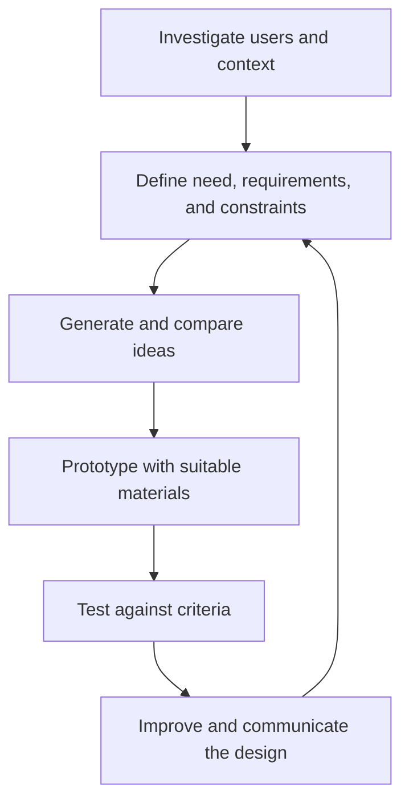

# Design and Fabrication: การออกแบบและประดิษฐ์

Design and Fabrication is the process of turning a human need into a tested product, system, or service. Students learn to investigate users, define constraints, generate ideas, prototype, test, communicate, and improve. The goal is not to produce the first idea quickly, but to make decisions visible and learn from evidence.

## 1 | Grade Band Breakdown

| Grade Band | Key Content |
|---|---|
| **ป.1–3** | Build and modify simple models, describe what a product is for, choose materials, and notice that designs can be improved |
| **ป.4–6** | Identify a problem, sketch ideas, make a model, use simple tools, test function, and explain changes |
| **ม.1–3** | Gather user requirements, define constraints, compare alternatives, prototype, measure performance, and document iteration |
| **ม.4–6** | Conduct structured design research, manage requirements and trade-offs, fabricate or code prototypes, assess sustainability and cost, and present evidence |

## 2 | Design Elements

| Element | Thai | Key Question |
|---|---|---|
| Need | ความต้องการ or ปัญหา | Who needs what improvement? |
| Requirement | ความต้องการของผู้ใช้ | What must the solution do? |
| Constraint | ข้อจำกัด | What limits cost, size, time, material, safety, or access? |
| Prototype | ต้นแบบ | What can be built and tested early? |
| Criterion | เกณฑ์ | How will success be judged? |
| Trade-off | การแลกเปลี่ยน | Which benefit is reduced when another improves? |

## 3 | Iterative Design Process

A prototype is a learning tool. It may be rough, incomplete, or made from inexpensive material as long as it answers an important question. Testing should produce evidence, not merely a statement that the designer likes the result.

## 4 | Quality, Ethics, and Sustainability

- Include the people affected by the design, especially users with different abilities or constraints.
- Avoid copying protected designs without permission or attribution.
- Consider repair, maintenance, energy use, material waste, accessibility, privacy, and end-of-life.
- Separate personal preference from measurable performance.
- Record failed ideas because they prevent repeated mistakes.

## 5 | Hands-On Project: Improve a School or Household Problem

### Project Brief

Identify a small problem such as disorganized charging cables, unsafe storage, wasted water, or difficult access. Design and test a low-cost improvement.

### Steps

1. Observe the context and interview users.
2. Write a problem statement, requirements, constraints, and success criteria.
3. Sketch at least three alternatives and compare trade-offs.
4. Build a prototype and conduct a simple test.
5. Revise the design and present evidence of improvement.

### Expected Outcome

A design brief, alternatives table, prototype, test data, revision record, and final explanation.

## 6 | Thai Terminology

| Thai | English |
|---|---|
| การออกแบบ | Design |
| การประดิษฐ์ | Making or invention |
| กระบวนการออกแบบเชิงวิศวกรรม | Engineering design process |
| ปัญหา | Problem |
| ข้อจำกัด | Constraint |
| ต้นแบบ | Prototype |
| การทดสอบ | Testing |
| การปรับปรุง | Iteration or improvement |
| เกณฑ์การประเมิน | Evaluation criteria |

## 7 | Cross-Links

- [[10_Woodwork|Woodwork]]: material and construction skills
- [[11_Metalwork|Metalwork]]: fabrication processes
- [[12_Electronics|Electronics]]: interactive products and systems
- [[20_Programming|Programming]]: computational prototypes
- [[15_Entrepreneurship|Entrepreneurship]]: value, users, and market fit

## Sources

- [IPST: Curriculum](https://www.ipst.ac.th/curriculum)
- [IPST: Project 14: Design and Technology](https://proj14.ipst.ac.th/m1/m1-dt/dt-m1b1-002/)
- [OBEC: Basic Education Core Curriculum B.E. 2551 PDF](https://www.academic.obec.go.th/images/document/1525235513_d_1.pdf)
