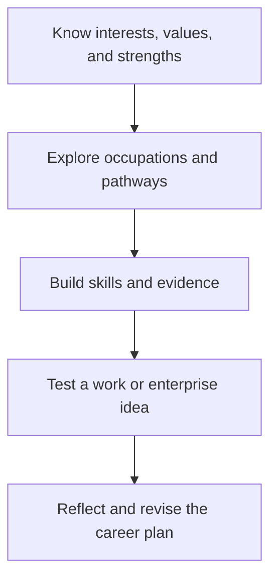

# Career Education: การอาชีพ

> **Strand:** Career Education (งานอาชีพ) | **Concept Areas:** 4 | **Duration:** 12 years, ป.1–ม.6
> **Focus:** Career awareness, enterprise, ethics, employability, and lifelong learning

## Overview

Career Education helps students connect their interests, capabilities, values, and community needs with future study and work. It develops a realistic understanding of occupations, the changing labor market, entrepreneurship, workplace behavior, and the evidence needed to make career decisions.

Career learning is not a one-time choice of job. It is an iterative process: explore, compare, try, reflect, build skills, and revise plans. Students should understand both personal agency and structural factors such as opportunity, technology, education, location, and labor rights.

## Concept Areas

| # | Concept Area | Thai | Main Focus |
|---|---|---|---|
| 14 | [[14_Career_Exploration]] | การสำรวจอาชีพ | Interests, skills, occupations, pathways, labor-market awareness |
| 15 | [[15_Entrepreneurship]] | การเป็นผู้ประกอบการ | Value creation, customers, business models, finance, risk |
| 16 | [[16_Work_Ethics]] | จรรยาบรรณในการทำงาน | Responsibility, integrity, teamwork, inclusion, workplace rights |
| 17 | [[17_Job_Application_Skills]] | ทักษะการสมัครงาน | Evidence, resumes, portfolios, interviews, professional communication |

## Grade Band Progression

| Grade Band | Progression |
|---|---|
| **ป.1–3** | Recognize community jobs, responsibility, helping others, and what people do at work |
| **ป.4–6** | Compare occupations, identify personal interests, cooperate on small projects, and understand simple selling |
| **ม.1–3** | Explore career clusters, map skills, examine education routes, plan a small enterprise, and practice teamwork |
| **ม.4–6** | Build a career plan, evaluate labor-market information, prepare application evidence, understand workplace rights, and test an enterprise idea |

## Learning Sequence

## Progress Tracker

| # | Concept Area | Status | Files Created | Notes |
|---|---|---|---|---|
| 14 | Career Exploration | ✅ Done | `14_Career_Exploration.md` | |
| 15 | Entrepreneurship | ✅ Done | `15_Entrepreneurship.md` | |
| 16 | Work Ethics | ✅ Done | `16_Work_Ethics.md` | |
| 17 | Job Application Skills | ✅ Done | `17_Job_Application_Skills.md` | |

**Completion: 4/4 (100%) ✅**

## Related

- [[01 Home Economics/00_overview|Home Economics]]: domestic skills and service careers
- [[02 Agriculture/00_overview|Agriculture]]: agricultural careers and community enterprise
- [[03 Crafts and Industry/00_overview|Crafts and Industry]]: technical and maker careers
- [[05 Technology/00_overview|Technology]]: digital work, information, and future skills
- [[Social Studies/03 Economics/01_Economics_Fundamentals|Economics Fundamentals]]: markets, production, and finance

## Sources

- [OBEC: Basic Education Core Curriculum B.E. 2551 PDF](https://www.academic.obec.go.th/images/document/1525235513_d_1.pdf)
- [ILO: Youth employment and decent work](https://www.ilo.org/global/topics/youth-employment/lang--en/index.htm)
- [OECD: Career guidance](https://www.oecd.org/education/career-guidance/)
