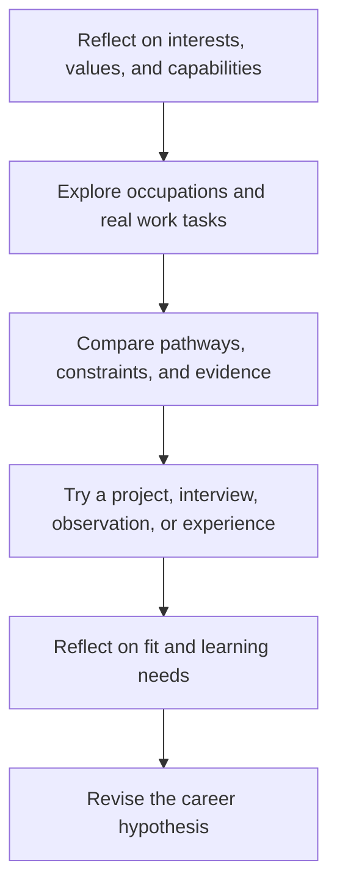

# Career Exploration: การสำรวจอาชีพ

Career Exploration helps students understand themselves, occupations, education pathways, work environments, and changing opportunities. It is a process of informed experimentation rather than a test that assigns one permanent career.

A useful career decision connects four questions: What matters to me? What can I learn to do? What problems or needs exist? Which pathway lets me test and develop a realistic contribution?

## 1 | Grade Band Breakdown

| Grade Band | Key Content |
|---|---|
| **ป.1–3** | Recognize jobs in family and community, describe what workers do, appreciate different contributions, and notice personal interests |
| **ป.4–6** | Group occupations by type of work, identify skills and tools, interview a worker, and connect school learning with real tasks |
| **ม.1–3** | Explore career clusters, reflect on interests and strengths, compare education routes, research labour-market change, and plan a small experience |
| **ม.4–6** | Build a career hypothesis, compare pathways and costs, collect evidence through projects or work exposure, identify transferable skills, and revise a plan |

## 2 | Career Decision Evidence

| Evidence Area | Thai | Examples |
|---|---|---|
| Interests | ความสนใจ | Activities that sustain attention or curiosity |
| Values | ค่านิยม | Meaning, autonomy, security, service, creativity, income |
| Capabilities | ความสามารถ | Current skills and skills that can be learned |
| Context | บริบท | Location, access, family, health, technology, opportunity |
| Information | ข้อมูลอาชีพ | Tasks, conditions, qualifications, pay, demand, risks |
| Experience | ประสบการณ์ | Projects, volunteering, interviews, practice, portfolios |

A career title is less informative than the actual work. Students should investigate daily tasks, tools, decisions, collaboration, stressors, ethical responsibilities, entry routes, progression, and how technology may change the occupation.

## 3 | Exploration Cycle

## 4 | Ethical Use of Career Information

- Treat salary and job-demand figures as time- and location-dependent.
- Check official or primary sources rather than relying on stereotypes or social-media success stories.
- Do not assume one educational route is suitable for everyone.
- Separate a person's worth from their occupation, income, or academic status.
- Consider decent work, accessibility, discrimination, safety, and work-life conditions.

## 5 | Hands-On Project: Career Evidence Portfolio

### Project Brief

Choose one occupation or career cluster and investigate it through at least three kinds of evidence.

### Steps

1. Write a career hypothesis and the reasons behind it.
2. Find an authoritative occupational source and one real worker or organization to learn from.
3. Map tasks, skills, pathway, working conditions, opportunities, and risks.
4. Complete a small related project or interview.
5. Compare evidence with assumptions and revise the hypothesis.

### Expected Outcome

A career profile, evidence table, pathway map, interview questions or project artefact, and a revised next-step plan.

## 6 | Thai Terminology

| Thai | English |
|---|---|
| การสำรวจอาชีพ | Career exploration |
| อาชีพ | Occupation or career |
| ความถนัด | Aptitude |
| ความสนใจ | Interest |
| ค่านิยม | Values |
| เส้นทางการศึกษา | Education pathway |
| ตลาดแรงงาน | Labour market |
| ทักษะที่ถ่ายโอนได้ | Transferable skills |
| แฟ้มสะสมผลงาน | Portfolio |

## 7 | Cross-Links

- [[15_Entrepreneurship|Entrepreneurship]]: creating work and value
- [[16_Work_Ethics|Work Ethics]]: responsible professional behaviour
- [[17_Job_Application_Skills|Job Application Skills]]: communicating evidence
- [[20_Programming|Programming]]: technology skills and computational work
- [[Social Studies/03 Economics/10_Economic_Indicators|Economic Indicators]]: labour-market context

## Sources

- [OECD: Career guidance](https://www.oecd.org/education/career-guidance/)
- [ILO: Youth employment](https://www.ilo.org/global/topics/youth-employment/lang--en/index.htm)
- [U.S. Bureau of Labor Statistics: Occupational Outlook Handbook](https://www.bls.gov/ooh/)
- [OBEC: Basic Education Core Curriculum B.E. 2551 PDF](https://www.academic.obec.go.th/images/document/1525235513_d_1.pdf)
