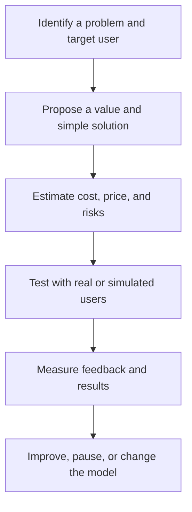

# Entrepreneurship: การเป็นผู้ประกอบการ

Entrepreneurship is the practice of identifying a problem or opportunity, creating value for a customer or community, organizing resources, managing uncertainty, and learning from results. It includes commercial businesses, social enterprises, cooperatives, community enterprises, and independent professional work.

The school version should emphasize ethical value creation and learning, not reckless risk-taking or the idea that every student must start a company.

## 1 | Grade Band Breakdown

| Grade Band | Key Content |
|---|---|
| **ป.1–3** | Recognize goods and services, identify needs, practise sharing work, make simple products, and understand exchange and saving |
| **ป.4–6** | Observe customers, compare cost and price, plan a small school sale, cooperate in roles, and keep simple records |
| **ม.1–3** | Define a problem, identify customer segments, create a value proposition, estimate cost, test a prototype, and reflect on feedback |
| **ม.4–6** | Build a lean business model, study market evidence, manage cash flow and risk, consider legal and ethical duties, and plan growth or sustainability |

## 2 | Enterprise Model

| Component | Thai | Question |
|---|---|---|
| Problem or need | ปัญหาหรือความต้องการ | What should be improved? |
| Customer or beneficiary | ลูกค้าหรือผู้ได้รับประโยชน์ | Who receives value? |
| Value proposition | คุณค่าที่เสนอ | Why would they choose this? |
| Resources and activities | ทรัพยากรและกิจกรรม | What must be done and with what? |
| Cost and revenue | ต้นทุนและรายรับ | Is the model financially plausible? |
| Risk and ethics | ความเสี่ยงและจริยธรรม | Who may be harmed and how is risk managed? |

Revenue is not the same as profit. A simple model is:

$$\text{Profit} = \text{Revenue} - \text{Total Cost}$$

Students should also consider unpaid labour, equipment, waste, taxes, platform fees, safety, data privacy, and environmental costs.

## 3 | Validation Cycle

## 4 | Ethical Entrepreneurship

- Do not mislead customers with false claims, hidden costs, or manipulated reviews.
- Respect intellectual property and cultural knowledge.
- Protect customer data and obtain consent for collection or communication.
- Design for accessibility and avoid discriminatory exclusion.
- Pay attention to product safety, labour conditions, and environmental impact.
- Treat failure as information, while limiting financial and personal harm.

## 5 | Hands-On Project: Micro-Enterprise Experiment

### Project Brief

Design a small, low-risk product or service experiment for a real user group. The goal is to learn whether the problem and value proposition are real.

### Steps

1. Interview or observe potential users.
2. Define the problem, customer, value proposition, and constraints.
3. Build a minimum viable prototype or service script.
4. Calculate cost and run a controlled test.
5. Analyze feedback, sales or usage, waste, and ethical issues.

### Expected Outcome

A one-page business model, prototype, cost table, feedback record, and decision to improve, continue, or stop.

## 6 | Thai Terminology

| Thai | English |
|---|---|
| ผู้ประกอบการ | Entrepreneur |
| การเป็นผู้ประกอบการ | Entrepreneurship |
| ธุรกิจ | Business |
| วิสาหกิจชุมชน | Community enterprise |
| คุณค่าที่เสนอ | Value proposition |
| ลูกค้าเป้าหมาย | Target customer |
| ต้นทุน | Cost |
| รายได้ | Revenue |
| กำไร | Profit |
| แบบจำลองธุรกิจ | Business model |

## 7 | Cross-Links

- [[14_Career_Exploration|Career Exploration]]: enterprise as one career pathway
- [[16_Work_Ethics|Work Ethics]]: trust and responsibility
- [[17_Job_Application_Skills|Job Application Skills]]: evidence and communication
- [[13_Design_and_Fabrication|Design and Fabrication]]: prototypes and user needs
- [[Social Studies/03 Economics/01_Economics_Fundamentals|Economics Fundamentals]]: production, markets, and choice

## Sources

- [ILO: Start and improve your business](https://www.ilo.org/empent/areas/start-and-improve-your-business/lang--en/index.htm)
- [OECD: Entrepreneurship education](https://www.oecd.org/cfe/smes/entrepreneurship-education.htm)
- [OBEC: Basic Education Core Curriculum B.E. 2551 PDF](https://www.academic.obec.go.th/images/document/1525235513_d_1.pdf)
