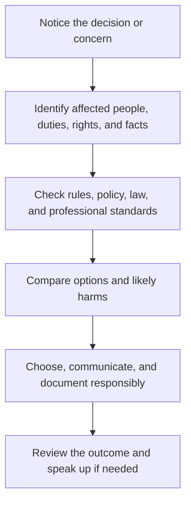

# Work Ethics: จรรยาบรรณในการทำงาน

Work Ethics concerns the principles and habits that make work trustworthy, safe, fair, and useful. It includes honesty, responsibility, respect, competence, confidentiality, accountability, teamwork, and the courage to report unsafe or unethical conduct.

Ethics is more than personal obedience. Workplaces contain power differences, conflicting incentives, unclear rules, and effects on people who are not in the room. Students should learn to reason about consequences, duties, rights, fairness, and professional standards.

## 1 | Grade Band Breakdown

| Grade Band | Key Content |
|---|---|
| **ป.1–3** | Keep promises, take care of shared materials, tell the truth about work, help others, and follow safety rules |
| **ป.4–6** | Be punctual, complete assigned tasks, share roles fairly, respect different abilities, and admit mistakes |
| **ม.1–3** | Practise reliability, teamwork, communication, digital responsibility, conflict resolution, and responsible use of information |
| **ม.4–6** | Analyze conflicts of interest, confidentiality, discrimination, corruption, safety reporting, labour rights, professional codes, and accountability |

## 2 | Ethical Principles

| Principle | Thai | Workplace Behaviour |
|---|---|---|
| Integrity | ความซื่อสัตย์สุจริต | Accurate claims, records, and communication |
| Responsibility | ความรับผิดชอบ | Own tasks, consequences, and follow-up |
| Respect | ความเคารพ | Treat people and property with dignity |
| Fairness | ความเป็นธรรม | Avoid exploitation, exclusion, and favoritism |
| Competence | ความสามารถในการปฏิบัติงาน | Know limits and seek help when necessary |
| Confidentiality | การรักษาความลับ | Protect private or sensitive information |
| Safety | ความปลอดภัย | Prevent harm and report hazards |

## 3 | Ethical Decision Process

A person can be technically skilled but professionally unsafe if they hide errors, misuse data, ignore hazards, or shift harm to less powerful people. Ethical work includes knowing when not to proceed.

## 4 | Common Workplace Situations

- A deadline conflicts with a safety requirement.
- A supervisor asks for inaccurate reporting.
- A team member receives credit for another person's work.
- Customer data is visible to people who do not need access.
- A worker experiences harassment or discriminatory treatment.
- A mistake could affect health, money, privacy, or public safety.

A good response gathers facts, avoids retaliation, uses appropriate reporting channels, protects evidence and people, and seeks trusted guidance.

## 5 | Hands-On Project: Ethical Case Analysis

### Project Brief

Analyze a realistic workplace dilemma and create a response plan that protects people, quality, and integrity.

### Steps

1. Describe the situation without exaggeration or personal attack.
2. Identify stakeholders, facts, uncertainties, duties, rights, and risks.
3. Compare at least three possible actions.
4. Select a response and identify a safe escalation path.
5. Reflect on what policy, training, or system change could prevent recurrence.

### Expected Outcome

A case analysis, stakeholder map, option comparison, decision record, and prevention recommendation.

## 6 | Thai Terminology

| Thai | English |
|---|---|
| จรรยาบรรณ | Ethics or code of conduct |
| คุณธรรมในการทำงาน | Work morality |
| ความซื่อสัตย์สุจริต | Integrity |
| ความรับผิดชอบ | Responsibility |
| วินัย | Discipline |
| การทำงานเป็นทีม | Teamwork |
| ผลประโยชน์ทับซ้อน | Conflict of interest |
| การรักษาความลับ | Confidentiality |
| สิทธิแรงงาน | Labour rights |

## 7 | Cross-Links

- [[14_Career_Exploration|Career Exploration]]: evaluating working conditions
- [[15_Entrepreneurship|Entrepreneurship]]: ethical value creation
- [[17_Job_Application_Skills|Job Application Skills]]: honest professional evidence
- [[21_Digital_Citizenship|Digital Citizenship]]: online ethics and privacy
- [[Social Studies/02 Civics/04_Rights_Duties_and_Laws|Rights, Duties, and Laws]]: civic and legal context

## Sources

- [ILO: Decent work](https://www.ilo.org/global/topics/decent-work/lang--en/index.htm)
- [OECD: Responsible business conduct](https://mneguidelines.oecd.org/)
- [OBEC: Basic Education Core Curriculum B.E. 2551 PDF](https://www.academic.obec.go.th/images/document/1525235513_d_1.pdf)
