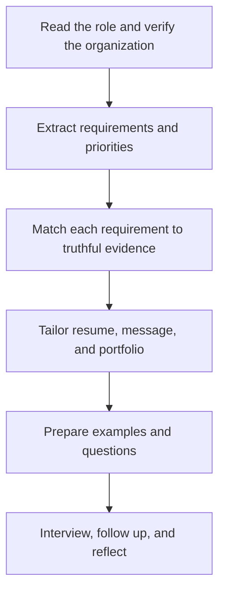

# Job Application Skills: ทักษะการสมัครงาน

Job Application Skills help students communicate relevant, truthful evidence of capability and fit. The process includes finding opportunities, reading requirements, preparing a resume or curriculum vitae, creating a portfolio, writing professional messages, interviewing, and reflecting after the result.

An application is not a performance of perfection. It is a structured argument: this is what the organization needs, this is evidence that I can contribute, and this is what I am ready to learn.

## 1 | Grade Band Breakdown

| Grade Band | Key Content |
|---|---|
| **ป.1–3** | Introduce oneself politely, describe responsibilities, listen, cooperate, and recognize that different people have different strengths |
| **ป.4–6** | Describe skills and interests, write simple personal information safely, practise introductions, and present a small project |
| **ม.1–3** | Read an opportunity, map requirements to evidence, write a basic resume, assemble a portfolio, and practise interview responses |
| **ม.4–6** | Tailor applications, write cover letters, communicate professionally, verify employers, negotiate boundaries, prepare for interviews, and reflect on feedback |

## 2 | Application Evidence

| Element | Thai | Purpose |
|---|---|---|
| Resume or CV | ประวัติย่อ or ประวัติส่วนตัว | Summarize relevant education, skills, experience, and evidence |
| Cover letter | จดหมายสมัครงาน | Explain fit, motivation, and contribution for a specific role |
| Portfolio | แฟ้มสะสมผลงาน | Show artefacts, process, results, and reflection |
| Interview | การสัมภาษณ์งาน | Exchange information and assess mutual fit |
| Reference | บุคคลอ้างอิง | Confirm relevant work or learning behaviour with permission |
| Follow-up | การติดตามผล | Communicate courteously and record next steps |

## 3 | Evidence-Based Application Process

The STAR structure helps organize examples: Situation, Task, Action, Result. It is useful when describing teamwork, problem solving, conflict, responsibility, or learning from failure. Quantification helps when meaningful, but students should never invent numbers or claim work they did not do.

## 4 | Safety and Professional Boundaries

- Verify employers, websites, locations, and requests for money or identity documents.
- Share only information necessary for the application.
- Use professional contact details and protect passwords.
- Be cautious of unpaid work, unsafe conditions, discriminatory questions, or pressure to misrepresent qualifications.
- Ask about role, pay, hours, supervision, safety, data use, and next steps.
- Keep a record of applications and respect confidentiality.

## 5 | Hands-On Project: Portfolio and Mock Application

### Project Brief

Create an application package for a real or simulated entry-level opportunity related to a skill the student has practised.

### Steps

1. Select a role and extract five requirements.
2. Choose two or three projects as evidence.
3. Write a one-page resume and a tailored message or cover letter.
4. Prepare three STAR examples and two questions for the interviewer.
5. Conduct a mock interview and revise from feedback.

### Expected Outcome

A truthful resume, tailored application message, small portfolio, STAR evidence bank, and interview reflection.

## 6 | Thai Terminology

| Thai | English |
|---|---|
| การสมัครงาน | Job application |
| ประวัติย่อ | Resume |
| จดหมายสมัครงาน | Cover letter |
| แฟ้มสะสมผลงาน | Portfolio |
| การสัมภาษณ์งาน | Job interview |
| คุณสมบัติ | Qualification |
| ประสบการณ์ทำงาน | Work experience |
| บุคคลอ้างอิง | Reference |
| การทำงานชั่วคราว | Temporary work |

## 7 | Cross-Links

- [[14_Career_Exploration|Career Exploration]]: choosing and researching opportunities
- [[16_Work_Ethics|Work Ethics]]: truthful and responsible communication
- [[18_Computer_Basics|Computer Basics]]: files, accounts, and digital safety
- [[19_Office_Software|Office Software]]: document and presentation production
- [[21_Digital_Citizenship|Digital Citizenship]]: privacy and professional online presence

## Sources

- [ILO: Skills and employability](https://www.ilo.org/skills/pubs/lang--en/index.htm)
- [OECD: Career guidance](https://www.oecd.org/education/career-guidance/)
- [U.S. Department of Labor: CareerOneStop](https://www.careeronestop.org/)
- [OBEC: Basic Education Core Curriculum B.E. 2551 PDF](https://www.academic.obec.go.th/images/document/1525235513_d_1.pdf)
