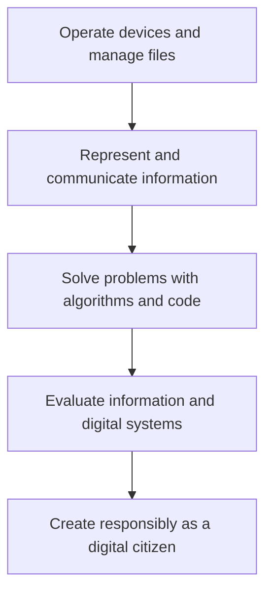

# Technology: เทคโนโลยี and วิทยาการคำนวณ

> **Strand:** Technology | **Concept Areas:** 5 | **Duration:** 12 years, ป.1–ม.6
> **Focus:** Computing, productivity tools, programming, digital citizenship, and information literacy

## Overview

Technology education develops the ability to use, understand, create, and evaluate digital systems. It includes practical computer use, computational thinking, programming, information evaluation, online safety, privacy, and responsible participation in digital society.

IPST describes Computing Science (วิทยาการคำนวณ) as developing computational thinking, analytical thinking, and systematic problem solving. The subject therefore goes beyond learning software buttons: students should explain processes, represent information, create artefacts, test solutions, and reason about consequences.

## Concept Areas

| # | Concept Area | Thai | Main Focus |
|---|---|---|---|
| 18 | [[18_Computer_Basics]] | พื้นฐานคอมพิวเตอร์ | Hardware, software, files, operating systems, troubleshooting |
| 19 | [[19_Office_Software]] | โปรแกรมสำนักงาน | Documents, spreadsheets, presentations, collaboration, data hygiene |
| 20 | [[20_Programming]] | การเขียนโปรแกรม | Algorithms, variables, control flow, decomposition, testing |
| 21 | [[21_Digital_Citizenship]] | พลเมืองดิจิทัล | Identity, privacy, safety, ethics, wellbeing, participation |
| 22 | [[22_Information_Literacy]] | การรู้สารสนเทศ | Search, source evaluation, evidence, citation, misinformation |

## Grade Band Progression

| Grade Band | Progression |
|---|---|
| **ป.1–3** | Identify devices, use keyboard and mouse, follow simple safety rules, recognize private information |
| **ป.4–6** | Organize files, create simple documents and presentations, search safely, use block-based sequences |
| **ม.1–3** | Troubleshoot systems, use spreadsheets and collaborative tools, write basic programs, evaluate sources, understand digital footprints |
| **ม.4–6** | Build software or data projects, use advanced productivity workflows, reason about algorithms, privacy, AI, bias, security, and research evidence |

## Learning Sequence

## Progress Tracker

| # | Concept Area | Status | Files Created | Notes |
|---|---|---|---|---|
| 18 | Computer Basics | ✅ Done | `18_Computer_Basics.md` | |
| 19 | Office Software | ✅ Done | `19_Office_Software.md` | |
| 20 | Programming | ✅ Done | `20_Programming.md` | |
| 21 | Digital Citizenship | ✅ Done | `21_Digital_Citizenship.md` | |
| 22 | Information Literacy | ✅ Done | `22_Information_Literacy.md` | |

**Completion: 5/5 (100%) ✅**

## Related

- [[03 Crafts and Industry/13_Design_and_Fabrication|Design and Fabrication]]: digital design and prototyping
- [[04 Career Education/14_Career_Exploration|Career Exploration]]: technology careers and changing work
- [[Science/Advance/Computer Science/00_overview|Computer Science]]: advanced computing topics
- [[Social Studies/02 Civics/12_Media_Literacy|Media Literacy]]: civic information and online communication
- [[Social Studies/03 Economics/10_Economic_Indicators|Economic Indicators]]: data and interpretation

## Sources

- [IPST: Computing Science](https://www.ipst.ac.th/cs)
- [IPST: Curriculum](https://www.ipst.ac.th/curriculum)
- [UNESCO: Media and Information Literacy](https://www.unesco.org/en/media-information-literacy)
- [OBEC: Basic Education Core Curriculum B.E. 2551 PDF](https://www.academic.obec.go.th/images/document/1525235513_d_1.pdf)
