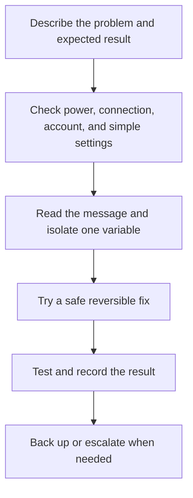

# Computer Basics: พื้นฐานคอมพิวเตอร์

Computer Basics develops the ability to operate, understand, maintain, and troubleshoot everyday computing systems. Students learn the relationship between hardware, software, data, users, networks, and procedures rather than memorizing device names alone.

## 1 | Grade Band Breakdown

| Grade Band | Key Content |
|---|---|
| **ป.1–3** | Identify common devices and parts, use keyboard and mouse, open and close applications safely, and follow simple screen and posture routines |
| **ป.4–6** | Create folders, save and retrieve files, use basic settings, connect peripherals, understand simple networks, and protect account information |
| **ม.1–3** | Explain operating systems, storage, memory, input and output, file types, troubleshooting steps, network basics, and malware awareness |
| **ม.4–6** | Compare system architectures, backups, access control, virtualization or cloud concepts, system administration basics, reliability, and responsible maintenance |

## 2 | Computer System Components

| Component | Thai | Function |
|---|---|---|
| Hardware | ฮาร์ดแวร์ | Physical parts of a computing system |
| Software | ซอฟต์แวร์ | Programs and instructions |
| Operating system | ระบบปฏิบัติการ | Manages hardware, files, users, and applications |
| Input | อุปกรณ์นำเข้า | Sends data to the system |
| Output | อุปกรณ์ส่งออก | Presents results to a user or another system |
| Storage | อุปกรณ์จัดเก็บข้อมูล | Keeps data for later use |
| Network | เครือข่าย | Connects devices to share data or services |

## 3 | File and Troubleshooting Workflow

A useful file system habit uses meaningful names, consistent folders, version awareness, and backups. Students should distinguish local files, removable storage, synchronized folders, and cloud copies. Deleting a file is not always the same as securely removing every copy.

## 4 | Safety and Maintenance

- Use strong unique passwords and multi-factor authentication when available.
- Keep systems and applications updated through trusted sources.
- Back up important work and test whether the backup can be restored.
- Protect devices from heat, liquids, blocked ventilation, impact, and unsafe chargers.
- Do not open suspicious attachments or install untrusted software.
- Dispose of batteries and electronic waste responsibly.
- Respect accessibility needs, privacy, and shared-device boundaries.

## 5 | Hands-On Project: Personal File and Backup System

### Project Brief

Design a folder structure and backup routine for school or personal project files.

### Steps

1. Inventory file types, importance, owners, and privacy needs.
2. Create meaningful folders and file names.
3. Set a versioning or date convention.
4. Copy selected files to a separate backup location using safe procedures.
5. Test retrieval and write a recovery checklist.

### Expected Outcome

A documented folder tree, naming convention, backup plan, and successful restoration test.

## 6 | Thai Terminology

| Thai | English |
|---|---|
| คอมพิวเตอร์ | Computer |
| ฮาร์ดแวร์ | Hardware |
| ซอฟต์แวร์ | Software |
| ระบบปฏิบัติการ | Operating system |
| แฟ้มข้อมูล | File |
| โฟลเดอร์ | Folder |
| เครือข่าย | Network |
| การสำรองข้อมูล | Backup |
| การแก้ไขปัญหา | Troubleshooting |
| ความปลอดภัยไซเบอร์ | Cybersecurity |

## 7 | Cross-Links

- [[19_Office_Software|Office Software]]: creating and managing digital documents
- [[20_Programming|Programming]]: software and computational processes
- [[21_Digital_Citizenship|Digital Citizenship]]: safe and responsible use
- [[22_Information_Literacy|Information Literacy]]: finding and evaluating information
- [[17_Job_Application_Skills|Job Application Skills]]: digital application evidence

## Sources

- [IPST: Computing Science](https://www.ipst.ac.th/cs)
- [CISA: Cybersecurity basics](https://www.cisa.gov/topics/cyber-threats-and-advisories)
- [OBEC: Basic Education Core Curriculum B.E. 2551 PDF](https://www.academic.obec.go.th/images/document/1525235513_d_1.pdf)
