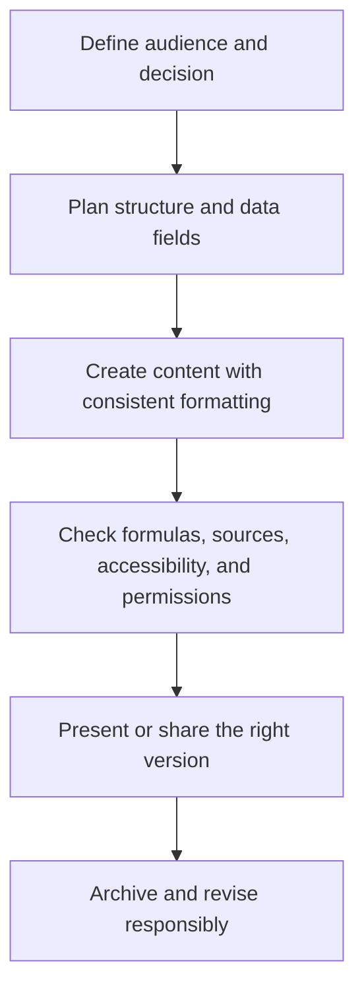

# Office Software: โปรแกรมสำนักงาน

Office Software includes tools for producing, analyzing, presenting, and collaborating on information. Students learn documents, spreadsheets, presentations, forms, and shared workspaces as communication systems. The important skill is choosing a suitable tool and structuring information clearly, not collecting software features.

## 1 | Grade Band Breakdown

| Grade Band | Key Content |
|---|---|
| **ป.1–3** | Type or enter short text, format simple work, insert images with permission, and save work with help |
| **ป.4–6** | Create structured documents and presentations, use tables, organize folders, enter simple spreadsheet data, and cite borrowed images or information |
| **ม.1–3** | Use styles and headings, formulas and charts, data sorting, slide design, collaboration comments, version control, and basic source citation |
| **ม.4–6** | Build reusable templates, analyze data, validate spreadsheets, automate routine tasks where appropriate, manage permissions, and communicate evidence to different audiences |

## 2 | Tool Selection

| Tool | Thai | Best Used For |
|---|---|---|
| Word processor | โปรแกรมประมวลผลคำ | Structured writing and reports |
| Spreadsheet | โปรแกรมตารางคำนวณ | Calculations, records, analysis, and charts |
| Presentation | โปรแกรมนำเสนอ | Guided visual communication |
| Database or form | ฐานข้อมูล or แบบฟอร์ม | Structured collection and retrieval |
| Collaboration platform | เครื่องมือทำงานร่วมกัน | Shared editing, comments, and workflow |

A polished document has a purpose, audience, structure, readable visual hierarchy, accessible formatting, accurate data, and traceable sources. A spreadsheet is a model: formulas, units, assumptions, missing values, and error checks must be visible.

## 3 | Production Workflow

## 4 | Common Quality Checks

- Use headings, styles, captions, and meaningful file names.
- Check formulas with a small known example before trusting a result.
- Keep raw data separate from calculated or edited data.
- Label units, dates, currencies, assumptions, and missing values.
- Use charts that match the question and do not distort the scale.
- Compress images only when readability remains adequate.
- Share the minimum permission needed and remove unnecessary personal data.
- Cite sources and distinguish original analysis from copied material.

## 5 | Hands-On Project: Household or School Data Report

### Project Brief

Collect a small, ethical dataset such as weekly water use, study time, crop growth, or household expenses, then communicate one useful finding.

### Steps

1. Define the question, variables, units, and privacy limits.
2. Record data in a clean table.
3. Calculate summaries with formulas and check the results.
4. Create one or two appropriate charts.
5. Write a short report explaining evidence, limits, and next action.

### Expected Outcome

A spreadsheet with validated formulas, a clear chart, and an accessible report or presentation.

## 6 | Thai Terminology

| Thai | English |
|---|---|
| โปรแกรมสำนักงาน | Office software |
| โปรแกรมประมวลผลคำ | Word processor |
| ตารางคำนวณ | Spreadsheet |
| โปรแกรมนำเสนอ | Presentation software |
| สูตรคำนวณ | Formula |
| แผนภูมิ | Chart |
| ฐานข้อมูล | Database |
| การทำงานร่วมกัน | Collaboration |
| การอ้างอิงแหล่งข้อมูล | Source citation |

## 7 | Cross-Links

- [[18_Computer_Basics|Computer Basics]]: files, systems, and maintenance
- [[20_Programming|Programming]]: automation and computational thinking
- [[22_Information_Literacy|Information Literacy]]: evidence and source quality
- [[17_Job_Application_Skills|Job Application Skills]]: resumes and portfolios
- [[07_Soil_and_Water_Management|Soil and Water Management]]: data collection in agriculture

## Sources

- [UNESCO: Digital literacy](https://www.unesco.org/en/digital-literacy)
- [Microsoft: Digital literacy resources](https://www.microsoft.com/en-us/digital-literacy)
- [OBEC: Basic Education Core Curriculum B.E. 2551 PDF](https://www.academic.obec.go.th/images/document/1525235513_d_1.pdf)
