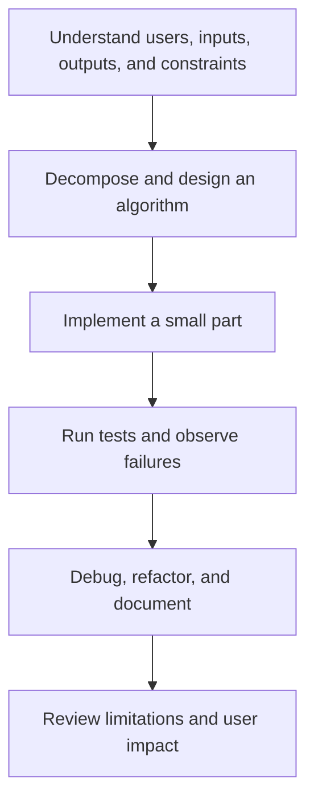

# Programming: การเขียนโปรแกรม

Programming is the practice of expressing a solution as precise instructions that a computer can execute. Students learn computational thinking: decomposition, pattern recognition, abstraction, algorithms, data, testing, debugging, and communication. Code is a tool for reasoning and creation, not an end in itself.

## 1 | Grade Band Breakdown

| Grade Band | Key Content |
|---|---|
| **ป.1–3** | Give and follow sequences, recognize patterns, describe algorithms in everyday tasks, and use block-based activities with guidance |
| **ป.4–6** | Use block programming with sequences, events, loops, conditions, variables, and simple debugging |
| **ม.1–3** | Write basic text programs, use input and output, variables, operators, control flow, functions, lists, algorithms, and test cases |
| **ม.4–6** | Design modular programs, choose data structures, analyze efficiency at an introductory level, use APIs or files, collaborate with version control, and address security and ethics |

## 2 | Core Concepts

| Concept | Thai | Explanation |
|---|---|---|
| Algorithm | ขั้นตอนวิธี | A finite, clear procedure for solving a problem |
| Decomposition | การแยกย่อยปัญหา | Break a complex problem into manageable parts |
| Variable | ตัวแปร | Named storage for a changing value |
| Condition | เงื่อนไข | A decision based on whether something is true |
| Loop | วนซ้ำ | Repeats instructions |
| Function | ฟังก์ชัน | Reusable named behaviour |
| Debugging | การแก้จุดบกพร่อง | Finding and correcting a defect |

## 3 | Problem-to-Program Cycle

A program is not correct merely because it works for one example. Test normal cases, boundary cases, invalid inputs, empty data, and cases that reveal assumptions. Students should explain expected behaviour before running code.

## 4 | Responsible Programming

- Do not collect data that the program does not need.
- Protect passwords, personal data, and access tokens.
- Attribute libraries, code, images, and datasets according to their licences.
- Consider accessibility, bias, misuse, and failure consequences.
- Use meaningful names, comments, formatting, and version history.
- Ask whether automation could harm people or make an unfair decision.

## 5 | Hands-On Project: Practical Decision Tool

### Project Brief

Create a small program that solves a real, bounded problem such as a budget calculator, crop-watering reminder, unit converter, or study planner.

### Steps

1. Write the problem, user, inputs, outputs, and constraints.
2. Draw the algorithm or flowchart.
3. Implement a minimal version.
4. Create a test table including invalid or boundary inputs.
5. Debug, improve readability, and document limitations.

### Expected Outcome

A working program, algorithm diagram, test table, source code, and short explanation of design decisions.

## 6 | Thai Terminology

| Thai | English |
|---|---|
| การเขียนโปรแกรม | Programming |
| วิทยาการคำนวณ | Computing Science |
| การคิดเชิงคำนวณ | Computational thinking |
| ขั้นตอนวิธี | Algorithm |
| ตัวแปร | Variable |
| คำสั่งเงื่อนไข | Conditional statement |
| การวนซ้ำ | Loop |
| ฟังก์ชัน | Function |
| การแก้จุดบกพร่อง | Debugging |

## 7 | Cross-Links

- [[18_Computer_Basics|Computer Basics]]: systems and software
- [[19_Office_Software|Office Software]]: data and automation
- [[20_Programming|Programming]]: this note connects to projects and tools
- [[21_Digital_Citizenship|Digital Citizenship]]: ethics, privacy, and online behaviour
- [[12_Electronics|Electronics]]: programming physical systems
- [[13_Design_and_Fabrication|Design and Fabrication]]: computational prototypes

## Sources

- [IPST: Computing Science](https://www.ipst.ac.th/cs)
- [IPST: Computing Science teaching resources](https://oho.ipst.ac.th/tag/%E0%B8%A7%E0%B8%B4%E0%B8%97%E0%B8%A2%E0%B8%B2%E0%B8%81%E0%B8%B2%E0%B8%A3%E0%B8%84%E0%B8%B3%E0%B8%99%E0%B8%A7%E0%B8%93/)
- [UNESCO: AI and digital learning](https://www.unesco.org/en/digital-education)
- [OBEC: Basic Education Core Curriculum B.E. 2551 PDF](https://www.academic.obec.go.th/images/document/1525235513_d_1.pdf)
