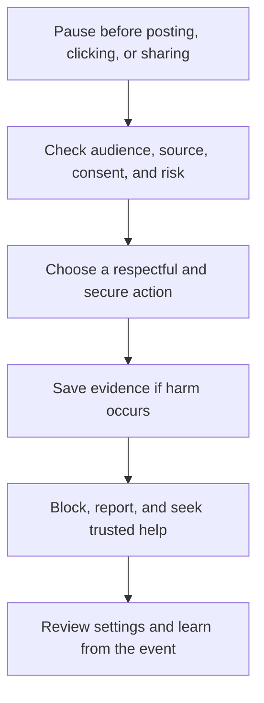

# Digital Citizenship: พลเมืองดิจิทัล

Digital Citizenship is the practice of participating in digital environments safely, ethically, critically, inclusively, and constructively. It includes identity, privacy, security, communication, information, wellbeing, rights, responsibilities, and the ability to create rather than merely consume.

A digital citizen has both individual responsibilities and rights. Students should learn how platforms shape behaviour, how data can persist, how power and access differ, and how to seek help when online harm occurs.

## 1 | Grade Band Breakdown

| Grade Band | Key Content |
|---|---|
| **ป.1–3** | Keep passwords private, ask before sharing photos, use kind language, recognize trusted adults, and stop when content feels unsafe |
| **ป.4–6** | Understand personal information, privacy settings, online manners, scams, cyberbullying, screen balance, and reporting tools |
| **ม.1–3** | Analyze digital footprints, consent, misinformation, account security, intellectual property, online conflict, and platform incentives |
| **ม.4–6** | Evaluate algorithmic influence, data rights, AI-generated content, surveillance, cybersecurity risk, digital labour, accessibility, and civic participation |

## 2 | Digital Citizenship Areas

| Area | Thai | Practical Question |
|---|---|---|
| Identity | อัตลักษณ์ดิจิทัล | How do I present myself and protect my boundaries? |
| Privacy | ความเป็นส่วนตัว | Who can collect, see, use, or infer my data? |
| Security | ความมั่นคงปลอดภัย | How do I reduce account and device risk? |
| Communication | การสื่อสารดิจิทัล | How do I communicate with respect and context? |
| Wellbeing | สุขภาวะดิจิทัล | How does technology affect attention, sleep, and relationships? |
| Participation | การมีส่วนร่วม | How can I create, collaborate, and contribute responsibly? |

## 3 | Responsible Response Flow

## 4 | Safety and Ethics

- Use unique passwords, multi-factor authentication, updates, and secure connections.
- Share the minimum personal information necessary.
- Obtain consent before posting another person's image, work, voice, or story.
- Distinguish disagreement from harassment and report threats or exploitation.
- Do not forward harmful content simply to criticize it.
- Check whether an image, text, or audio is synthetic, edited, or taken out of context.
- Protect wellbeing through intentional notification, screen, and platform habits.

## 5 | Hands-On Project: Digital Safety Guide

### Project Brief

Create a short digital safety guide for a chosen audience such as younger students, family members, or a community group.

### Steps

1. Identify the audience's likely risks and current habits.
2. Select five practical actions and explain why each matters.
3. Include privacy, security, communication, misinformation, and help-seeking.
4. Test the guide with one reader for clarity and accessibility.
5. Revise without using real private data or exposing a victim's identity.

### Expected Outcome

An audience-appropriate guide, reporting/help pathway, and revision reflection.

## 6 | Thai Terminology

| Thai | English |
|---|---|
| พลเมืองดิจิทัล | Digital citizen |
| รอยเท้าดิจิทัล | Digital footprint |
| ข้อมูลส่วนบุคคล | Personal data |
| ความเป็นส่วนตัว | Privacy |
| ความปลอดภัยไซเบอร์ | Cybersecurity |
| การกลั่นแกล้งทางไซเบอร์ | Cyberbullying |
| การยินยอม | Consent |
| ข่าวปลอม | Fake news or misinformation |
| สุขภาวะดิจิทัล | Digital wellbeing |

## 7 | Cross-Links

- [[18_Computer_Basics|Computer Basics]]: device and account safety
- [[20_Programming|Programming]]: software responsibility and data minimization
- [[22_Information_Literacy|Information Literacy]]: source evaluation and misinformation
- [[17_Job_Application_Skills|Job Application Skills]]: professional digital presence
- [[Social Studies/02 Civics/12_Media_Literacy|Media Literacy]]: civic communication and public information

## Sources

- [UNICEF: Child online protection](https://www.unicef.org/child-online-protection)
- [UNESCO: Media and Information Literacy](https://www.unesco.org/en/media-information-literacy)
- [CISA: Secure our world](https://www.cisa.gov/secure-our-world)
- [OBEC: Basic Education Core Curriculum B.E. 2551 PDF](https://www.academic.obec.go.th/images/document/1525235513_d_1.pdf)
