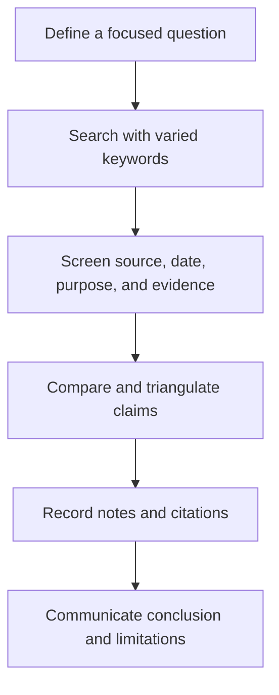

# Information Literacy: การรู้สารสนเทศ

Information Literacy is the ability to recognize an information need, search strategically, evaluate sources and evidence, use information ethically, and communicate a supported conclusion. It applies to school research, health decisions, consumer choices, work, citizenship, and everyday problem solving.

Search ranking is not the same as truth. A useful source must be judged in relation to the claim, context, date, evidence, expertise, purpose, and possible conflicts of interest.

## 1 | Grade Band Breakdown

| Grade Band | Key Content |
|---|---|
| **ป.1–3** | Ask questions, use trusted adults and child-safe resources, distinguish a fact from a guess, and identify the source of a picture or story |
| **ป.4–6** | Use keywords, compare two sources, identify author and date, recognize advertisements, take simple notes, and acknowledge borrowed work |
| **ม.1–3** | Refine research questions, search with operators, evaluate authority and evidence, distinguish primary and secondary sources, paraphrase, and cite |
| **ม.4–6** | Conduct a reproducible search, evaluate methods and uncertainty, identify bias and incentives, triangulate evidence, manage references, and communicate limitations |

## 2 | Source Evaluation Questions

| Question | Thai | What to Check |
|---|---|---|
| Who? | ใคร | Author, organization, expertise, accountability |
| When? | เมื่อใด | Publication, update, event, and evidence dates |
| Why? | เพราะเหตุใด | Purpose, audience, funding, persuasion, or sale |
| Evidence? | หลักฐานอะไร | Data, methods, citations, primary material, and reasoning |
| Compared with what? | เปรียบเทียบกับอะไร | Agreement, disagreement, independent confirmation |
| So what? | แล้วมีความหมายอย่างไร | Relevance, limitations, consequences, and uncertainty |

## 3 | Research Workflow

A primary source is close to the event, data, or original statement. A secondary source interprets or analyzes primary material. Neither category is automatically reliable; the research question determines what evidence is appropriate.

## 4 | Misinformation and Ethical Use

- Separate a claim, evidence, inference, opinion, advertisement, satire, and speculation.
- Read beyond the headline and inspect the original context.
- Check whether a statistic has a denominator, time frame, comparison, and definition.
- Reverse-search or trace media when authenticity matters.
- Do not cite a source that you have not read or represent another person's work as your own.
- Keep a search log so another person can understand how the conclusion was formed.
- State uncertainty rather than filling gaps with confident language.

## 5 | Hands-On Project: Mini Evidence Brief

### Project Brief

Investigate a practical question such as whether a household product is worth buying, which crop suits a site, or how screen habits affect study time.

### Steps

1. Write the question, scope, and decision it should support.
2. Find at least three sources with different roles.
3. Build a claim-evidence table and record citations.
4. Compare contradictions, incentives, methods, and limitations.
5. Write a brief conclusion with a confidence statement and next step.

### Expected Outcome

A research question, search log, source-evaluation table, cited evidence brief, and limitations section.

## 6 | Thai Terminology

| Thai | English |
|---|---|
| การรู้สารสนเทศ | Information literacy |
| การรู้เท่าทันสื่อ | Media literacy |
| แหล่งสารสนเทศ | Information source |
| หลักฐาน | Evidence |
| การอ้างอิง | Citation |
| บรรณานุกรม | Bibliography |
| อคติ | Bias |
| ข่าวลวงหรือข้อมูลบิดเบือน | Misinformation or disinformation |
| การตรวจสอบข้อเท็จจริง | Fact-checking |

## 7 | Cross-Links

- [[18_Computer_Basics|Computer Basics]]: files, search tools, and secure accounts
- [[19_Office_Software|Office Software]]: organizing and communicating evidence
- [[21_Digital_Citizenship|Digital Citizenship]]: responsible sharing and privacy
- [[14_Career_Exploration|Career Exploration]]: researching occupations and pathways
- [[Social Studies/02 Civics/12_Media_Literacy|Media Literacy]]: public claims and civic life
- [[Social Studies/04 History/03_Historical_Method|Historical Method]]: source criticism and evidence

## Sources

- [UNESCO: Media and Information Literacy](https://www.unesco.org/en/media-information-literacy)
- [Association of College and Research Libraries: Framework for Information Literacy](https://www.ala.org/acrl/standards/ilframework)
- [Stanford History Education Group: Civic Online Reasoning](https://cor.stanford.edu/)
- [OBEC: Basic Education Core Curriculum B.E. 2551 PDF](https://www.academic.obec.go.th/images/document/1525235513_d_1.pdf)
