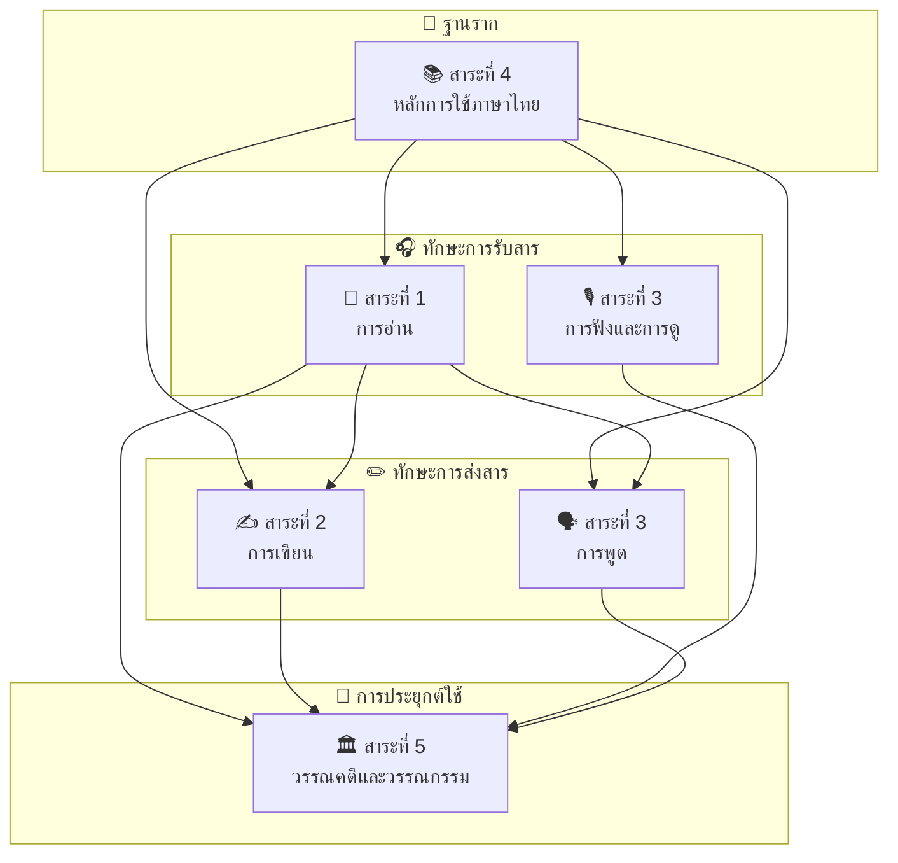
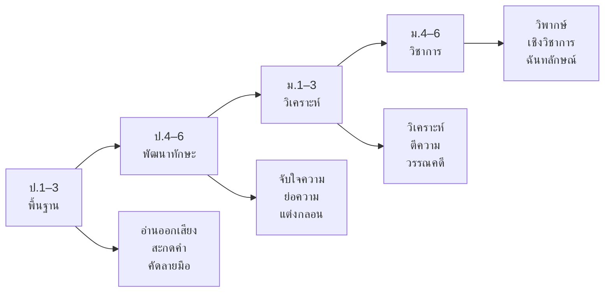

# ภาษาไทย — ภาพรวม

> *"ภาษาไทยเป็นสมบัติล้ำค่าของชาติ เป็นเครื่องมือสื่อสารและเป็นคลังปัญญาที่สืบทอดมาแต่โบราณกาล"*

**ภาษาไทย** เป็นวิชาบังคับสำหรับนักเรียนไทยทุกระดับชั้นตั้งแต่ ป.1 ถึง ม.6 ครอบคลุมระยะเวลา 12 ปี มุ่งพัฒนาทักษะทางภาษาครบทุกด้าน ตั้งแต่การอ่านออกเสียงเบื้องต้นไปจนถึงการวิเคราะห์วรรณคดีขั้นสูง

---

## โครงสร้างหลักสูตร

หลักสูตรภาษาไทยแบ่งเป็น **5 สาระ** ที่เชื่อมโยงกัน โดยแต่ละสาระจะวนเรียนซ้ำในแต่ละช่วงชั้นด้วยความลึกซึ้งที่เพิ่มขึ้น (spiral curriculum)

---

## สาระการเรียนรู้ทั้ง 5

| สาระ | ชื่อ | จำนวนหัวข้อ | ทักษะหลัก |
|---|---|---|---|
| **สาระที่ 1** | [[การอ่าน/00_ภาพรวม\|📖 การอ่าน]] | ~15 | อ่านออกเสียง → จับใจความ → วิเคราะห์ → วิจารณ์ |
| **สาระที่ 2** | การเขียน | ~15 | คัดลายมือ → แต่งประโยค → เรียงความ → เขียนวิชาการ |
| **สาระที่ 3** | การฟัง การดู และการพูด | ~10 | ฟังจับใจความ → วิเคราะห์สื่อ → พูดแสดงความคิดเห็น → สุนทรพจน์ |
| **สาระที่ 4** | หลักการใช้ภาษาไทย | ~23 | สะกดคำ → ชนิดคำ → ประโยค → ระดับภาษา → ฉันทลักษณ์ |
| **สาระที่ 5** | วรรณคดีและวรรณกรรม | ~15 | นิทาน → วรรณคดีมรดก → วรรณกรรมปัจจุบัน → วรรณคดีวิจักษณ์ |

---

## รหัสวิชา

| ระดับชั้น | รหัสวิชา | ชื่อวิชา |
|---|---|---|
| ป.1 | ท11101 | ภาษาไทย 1 |
| ป.2 | ท12101 | ภาษาไทย 2 |
| ป.3 | ท13101 | ภาษาไทย 3 |
| ป.4 | ท14101 | ภาษาไทย 4 |
| ป.5 | ท15101 | ภาษาไทย 5 |
| ป.6 | ท16101 | ภาษาไทย 6 |
| ม.1 | ท21101–ท21102 | ภาษาไทย 1–2 |
| ม.2 | ท22101–ท22102 | ภาษาไทย 3–4 |
| ม.3 | ท23101–ท23102 | ภาษาไทย 5–6 |
| ม.4 | ท31101–ท31102 | ภาษาไทย 1–2 |
| ม.5 | ท32101–ท32102 | ภาษาไทย 3–4 |
| ม.6 | ท33101–ท33102 | ภาษาไทย 5–6 |

---

## การแบ่งช่วงชั้น

| ช่วงชั้น | ระดับ | ลักษณะการเรียนรู้ |
|---|---|---|
| **ช่วงชั้นที่ 1** | ป.1–3 | สร้างพื้นฐาน: อ่านออกเขียนได้ สะกดคำ เรียนพยัญชนะ สระ วรรณยุกต์ |
| **ช่วงชั้นที่ 2** | ป.4–6 | พัฒนาทักษะ: จับใจความ วิเคราะห์เบื้องต้น เขียนเรียงความ ย่อความ |
| **ช่วงชั้นที่ 3** | ม.1–3 | เชิงวิเคราะห์: วิเคราะห์ ตีความ วิจารณ์ อ่านวรรณคดี แต่งบทร้อยกรอง |
| **ช่วงชั้นที่ 4** | ม.4–6 | เชิงวิชาการ: วิพากษ์ เขียนเชิงวิชาการ วิเคราะห์วรรณคดี ฉันทลักษณ์ขั้นสูง |

---

## การสอบสำคัญ

| การสอบ | ระดับชั้น | เนื้อหาหลัก |
|---|---|---|
| **NT** | ป.3 | อ่าน เขียน คิดเลข |
| **O-NET** | ป.6 | อ่านจับใจความ สรุปความ หลักภาษาเบื้องต้น |
| **O-NET** | ม.3 | วิเคราะห์ ตีความ หลักภาษา วรรณคดี |
| **O-NET** | ม.6 | วิพากษ์ วิจารณ์ วรรณคดี ฉันทลักษณ์ |
| **A-Level ภาษาไทย** | ม.6 | สอบเข้ามหาวิทยาลัย |

---

## ลำดับการเรียนรู้

---

## ดูเพิ่มเติม

- [[../body-of-knowledge/Thai/Thai Language - Overview|BOK ภาพรวมภาษาอังกฤษ]]
- [[../body-of-knowledge/Thai/การอ่าน/การอ่าน - ภาพรวม|BOK สาระที่ 1: การอ่าน]]
- [[../body-of-knowledge/Thai/การเขียน/การเขียน - ภาพรวม|BOK สาระที่ 2: การเขียน]]
- [[../body-of-knowledge/Thai/การฟัง การดู และการพูด/การฟัง การดู และการพูด - ภาพรวม|BOK สาระที่ 3: การฟัง การดู และการพูด]]
- [[../body-of-knowledge/Thai/หลักการใช้ภาษาไทย/หลักการใช้ภาษาไทย - ภาพรวม|BOK สาระที่ 4: หลักการใช้ภาษาไทย]]
- [[../body-of-knowledge/Thai/วรรณคดีและวรรณกรรม/วรรณคดีและวรรณกรรม - ภาพรวม|BOK สาระที่ 5: วรรณคดีและวรรณกรรม]]
