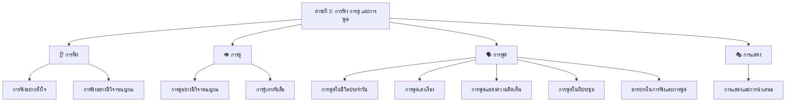

# สาระที่ 3: การฟัง การดู และการพูด

> ทักษะการรับสารและการส่งสารด้วยวาจา — ทักษะที่ใช้มากที่สุดในชีวิตประจำวัน หลักสูตรมุ่งเน้นการฝึกให้ผู้ฟังมีวิจารณญาณ และผู้พูดมีมารยาท กล้าแสดงออกอย่างสร้างสรรค์

---

## โครงสร้างของสาระ

---

## การแบ่งตามระดับชั้น

| หัวข้อ | ป.1–3 | ป.4–6 | ม.1–3 | ม.4–6 |
|---|---|---|---|---|
| การฟังอย่างตั้งใจ | ฟังนิทาน ฟังคำสั่ง | ฟังจับใจความ | ฟังสารคดี อภิปราย | ฟังการบรรยาย |
| การฟังอย่างมีวิจารณญาณ | — | ฟังแยกข้อเท็จจริง | วิเคราะห์ความน่าเชื่อถือ | ประเมินค่า |
| การดูอย่างมีวิจารณญาณ | — | ดูการ์ตูน สารคดี | ดูภาพยนตร์ ละคร | วิเคราะห์สื่อ |
| การรู้เท่าทันสื่อ | — | — | พื้นฐาน | สื่อออนไลน์ ข่าวปลอม |
| การพูดในชีวิตประจำวัน | ทักทาย แนะนำตัว | สนทนา โทรศัพท์ | — | — |
| การพูดเล่าเรื่อง | เล่านิทานสั้นๆ | เล่าประสบการณ์ | เล่าตามลำดับ | — |
| การพูดแสดงความคิดเห็น | — | แสดงความรู้สึก | โต้วาที | วิพากษ์สร้างสรรค์ |
| การพูดในที่ประชุม | — | รายงานกลุ่ม | นำเสนอ | สุนทรพจน์ |
| มารยาทในการฟังและพูด | พื้นฐาน | ตามกาลเทศะ | ใช้ภาษาเหมาะสม | มารยาทสากล |
| การแสดงและนำเสนอ | แสดงบทบาทสมมติ | ละครสั้น | นำเสนอกลุ่ม | การแสดง |

---

## รายชื่อบทเรียน

| ลำดับ | ชื่อบทเรียน | หมวด |
|---|---|---|
| 01 | [[01_การฟังอย่างตั้งใจ]] | การฟัง |
| 02 | [[02_การฟังอย่างมีวิจารณญาณ]] | การฟัง |
| 03 | [[03_การดูอย่างมีวิจารณญาณ]] | การดู |
| 04 | [[04_การรู้เท่าทันสื่อ]] | การดู |
| 05 | [[05_การพูดในชีวิตประจำวัน]] | การพูด |
| 06 | [[06_การพูดเล่าเรื่อง]] | การพูด |
| 07 | [[07_การพูดแสดงความคิดเห็น]] | การพูด |
| 08 | [[08_การพูดในที่ประชุม]] | การพูด |
| 09 | [[09_มารยาทในการฟังและการพูด]] | การพูด |
| 10 | [[10_การแสดงและการนำเสนอ]] | การแสดง |

---

## ดูเพิ่มเติม

- [[00_ภาพรวม|← กลับไปภาพรวมภาษาไทย]]
- [[การอ่าน/00_ภาพรวมการอ่าน|สาระที่ 1: การอ่าน]]
- [[การเขียน/00_ภาพรวมการเขียน|สาระที่ 2: การเขียน]]
- [[หลักการใช้ภาษาไทย/00_ภาพรวมหลักการใช้ภาษาไทย|สาระที่ 4: หลักการใช้ภาษาไทย]]
- [[00_ภาพรวม|สาระที่ 5: วรรณคดีและวรรณกรรม]]
