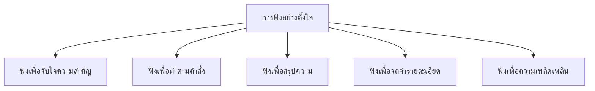

# การฟังอย่างตั้งใจ

> ฟังเพื่อจับใจความ ฟังคำสั่ง ฟังเรื่องเล่า — พื้นฐานของการเรียนรู้ทุกวิชา

**การฟังอย่างตั้งใจ** คือ การฟังโดยสมาธิ มุ่งเน้นการเข้าใจเนื้อหา จับใจความสำคัญ และจดจำรายละเอียด การฟังที่ดีไม่ใช่แค่ได้ยินเสียง แต่ต้องเข้าใจความหมายและสามารถนำไปใช้ได้

---

## เนื้อหาตามช่วงชั้น

| ช่วงชั้น | เนื้อหา |
|---|---|
| **ป.1–3** | ฟังนิทาน ฟังคำสั่ง ฟังเรื่องเล่าสั้นๆ |
| **ป.4–6** | ฟังจับใจความสำคัญ ฟังสรุปความ |
| **ม.1–3** | ฟังสารคดี ฟังการอภิปราย ฟังบทบรรยาย |
| **ม.4–6** | ฟังการบรรยาย ฟังสุนทรพจน์ ฟังการอภิปรายเชิงวิชาการ |

---

## ทักษะย่อยของการฟัง

---

## หลักการฟังที่มีประสิทธิภาพ

### 1. เตรียมตัวก่อนฟัง
- ทราบหัวข้อหรือวัตถุประสงค์ของการฟัง
- มีสมาธิ ไม่ฟุ้งซ่าน
- เตรียมสมุดบันทึก (ถ้าจำเป็น)

### 2. ขณะฟัง
- **สบตา** กับผู้พูด (ถ้าฟังด้วยตัวต่อตัว)
- **ทำท่าสนใจ** พยักหน้า ยิ้ม
- **ไม่ interrupt** รอให้ผู้พูดพูดจบก่อนถาม
- **จดประเด็นสำคัญ** ไม่จดทุกคำ

### 3. หลังฟัง
- ทบทวนสิ่งที่ได้ฟัง
- สรุปใจความสำคัญ
- ถามคำถามถ้ามีข้อสงสัย

---

## การฟังเพื่อจับใจความสำคัญ

**ใจความสำคัญ** คือ แก่นของเรื่องที่ผู้พูดต้องการสื่อ มักอยู่ใน:
- ประโยคแรกหรือประโยคสุดท้าย
- คำที่เน้นเสียง
- คำสำคัญที่พูดซ้ำๆ

| สัญญาณช่วยจับใจความ | ตัวอย่าง |
|---|---|
| คำนำ | "วันนี้จะพูดเรื่อง..." |
| คำสรุป | "สรุปแล้ว..." "ดังนั้น..." |
| คำเน้นย้ำ | "สำคัญที่สุดคือ..." |
| การเรียงลำดับ | "ประการแรก... ประการที่สอง..." |

---

## การฟังเพื่อทำตามคำสั่ง

**เทคนิค:**
1. ฟังให้จบทั้งคำสั่ง
2. จำใจความสำคัญ: อะไร ที่ไหน เมื่อไร อย่างไร
3. ทำซ้ำในใจ (rehearsal)
4. ถ้าไม่เข้าใจ ให้ถามทันที

**ตัวอย่าง:**
> ครูสั่ง: "นักเรียนหยิบหนังสือคณิตศาสตร์หน้า 45 ทำแบบฝึกหัดข้อ 1 ถึง 5 แล้วส่งก่อนเลิกเรียน"

สิ่งที่ต้องจำ:
- หนังสือ: คณิตศาสตร์ หน้า 45
- แบบฝึกหัด: ข้อ 1–5
- กำหนดส่ง: ก่อนเลิกเรียน

---

## การฟังเพื่อสรุปความ

**ขั้นตอน:**
1. ฟังเรื่องทั้งหมด
2. แยกแยะใจความหลักและใจความรอง
3. จดประเด็นสำคัญ
4. เรียบเรียงเป็นสรุป

---

## สิ่งรบกวนการฟัง

| ปัจจัยภายนอก | ปัจจัยภายใน |
|---|---|
| เสียงดังรอบข้าง | ความเหนื่อยล้า |
| สภาพแสง อุณหภูมิ | ความเครียด ความกังวล |
| อุปกรณ์เสียงไม่ดี | ความสนใจในเรื่องอื่น |
| การเคลื่อนไหวรบกวน | อคติต่อผู้พูดหรือเรื่อง |

---

## เคล็ดลับการฟังอย่างตั้งใจ

1. **มีสมาธิ**: ตั้งใจฟัง ไม่ฟุ้งซ่าน
2. **สบตา**: แสดงความเคารพและสนใจ
3. **ไม่ตัดสินเร็ว**: ฟังให้จบก่อน
4. **จดประเด็น**: ช่วยจำและทบทวน
5. **ถามถ้าไม่เข้าใจ**: อายรักษาทิ่มแต่ทะลุยาก
6. **ทบทวนหลังฟัง**: ช่วยเก็บข้อมูลในความจำระยะยาว

---

## ดูเพิ่มเติม

- [[02_การฟังอย่างมีวิจารณญาณ|การฟังอย่างมีวิจารณญาณ]]
- [[09_มารยาทในการฟังและการพูด|มารยาทในการฟังและการพูด]]
