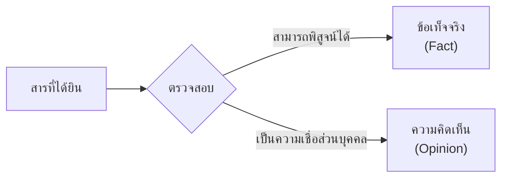

# การฟังอย่างมีวิจารณญาณ

> ฟังเพื่อแยกข้อเท็จจริงและความคิดเห็น วิเคราะห์ความน่าเชื่อถือ ประเมินคุณค่าของสาร

**การฟังอย่างมีวิจารณญาณ** คือ การฟังโดยใช้ความคิดวิเคราะห์ ไม่รับข้อมูลโดยไม่คิดตาม ผู้ฟังที่ดีต้องแยกแยะระหว่างข้อเท็จจริง (fact) และความคิดเห็น (opinion) ตลอดจนประเมินความน่าเชื่อถือของผู้พูดและเนื้อหา

---

## เนื้อหาตามช่วงชั้น

| ช่วงชั้น | เนื้อหา |
|---|---|
| **ป.4–6** | เริ่มแยกข้อเท็จจริงและความคิดเห็น |
| **ม.1–3** | วิเคราะห์ความน่าเชื่อถือของผู้พูดและเนื้อหา |
| **ม.4–6** | ประเมินคุณค่าของสาร วิเคราะห์เชิงลึก |

---

## การแยกข้อเท็จจริงและความคิดเห็น

| ประเภท | ลักษณะ | ตัวอย่าง |
|---|---|---|
| **ข้อเท็จจริง** | สามารถพิสูจน์ได้ มีหลักฐาน | "พระบาทสมเด็จพระจุลจอมเกล้าเจ้าอยู่หัวเสด็จสวรรคตในปี พ.ศ. 2453" |
| **ความคิดเห็น** | เป็นความรู้สึกส่วนบุคคล | "พระองค์ทรงเป็นกษัตริย์ที่ยิ่งใหญ่ที่สุด" |

**คำบ่งบอกความคิดเห็น:**
- "ฉันคิดว่า..." "หากถามฉัน..."
- "น่าจะ..." "อาจจะ..."
- "ดีที่สุด" "แย่ที่สุด"
- "ควรจะ..." "น่าจะ..."

---

## การประเมินความน่าเชื่อถือ

### ตรวจสอบผู้พูด
| ประเด็น | คำถามที่ควรถาม |
|---|---|
| **ความเชี่ยวชาญ** | ผู้พูดเป็นผู้เชี่ยวชาญในเรื่องนี้หรือไม่ |
| **ความเป็นกลาง** | ผู้พูดมีอคติหรือไม่ |
| **ความน่าเชื่อถือ** | ผู้พูดเคยให้ข้อมูลที่ถูกต้องหรือไม่ |
| **แรงจูงใจ** | ผู้พูดมีผลประโยชน์ในเรื่องนี้หรือไม่ |

### ตรวจสอบเนื้อหา
| ประเด็น | คำถามที่ควรถาม |
|---|---|
| **หลักฐาน** | มีข้อมูลหรือตัวอย่างสนับสนุนหรือไม่ |
| **ตรรกะ** | การให้เหตุผลสมเหตุสมผลหรือไม่ |
| **ความสม่ำเสมอ** | เนื้อหาสอดคล้องกันหรือไม่ |
| **แหล่งอ้างอิง** | อ้างอิงแหล่งข้อมูลที่น่าเชื่อถือหรือไม่ |

---

## การตรวจจับข้อความหลอกลวง

### เทคนิคโน้มน้าวที่ต้องระวัง

| เทคนิค | คำอธิบาย | ตัวอย่าง |
|---|---|---|
| **อุปมาเท็จ** | เปรียบเทียบสิ่งที่ไม่เกี่ยวข้องกัน | "ถ้าไม่ซื้อปืนเลเซอร์นี้ ก็เหมือนไม่รักลูก" |
| **ความกลัว** | สร้างความกลัวเพื่อโน้มน้าว | "ถ้าไม่ทำตาม จะเกิดภัยพิบัติ" |
| **กลุ่มอ้างอิง** | อ้างคนดัง ผู้เชี่ยวชาญ | "ดาราคนนี้ก็ใช้..." |
| **สมาชิกส่วนใหญ่** | อ้างว่าคนส่วนใหญ่ทำตาม | "ทุกคนก็ซื้อของแบรนด์นี้" |
| **ข้อมูลเท็จ** | ให้ข้อมูลที่ไม่จริง | "ผลิตภัณฑ์นี้รักษาโรคร้ายได้ 100%" |

---

## เคล็ดลับการฟังอย่างมีวิจารณญาณ

1. **อย่าเชื่อทันที**: คิดวิเคราะห์ก่อน
2. **แยกข้อเท็จจริงและความคิดเห็น**: ไม่ปะปนกัน
3. **ตรวจสอบแหล่งที่มา**: ใครพูด ทำไมพูด
4. **หาข้อมูลเพิ่ม**: ไม่อ้างอิงแหล่งเดียว
5. **รักษาใจเป็นกลาง**: ไม่มีอคติ
6. **ถามคำถาม**: ทำไม? ทำไมถึงเป็นเช่นนั้น?

---

## ดูเพิ่มเติม

- [[01_การฟังอย่างตั้งใจ|การฟังอย่างตั้งใจ]]
- [[04_การรู้เท่าทันสื่อ|การรู้เท่าทันสื่อ]]
