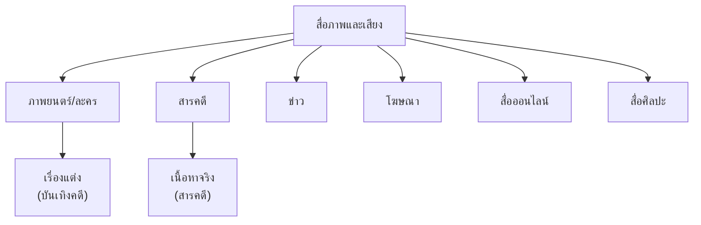
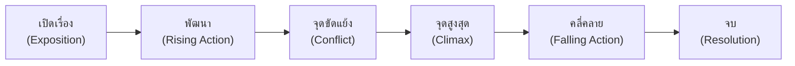

# การดูอย่างมีวิจารณญาณ

> ดูภาพยนตร์ ละคร สารคดี ด้วยความเข้าใจ — วิเคราะห์สื่อภาพและเสียง

**การดูอย่างมีวิจารณญาณ** คือ การรับชมสื่อภาพและเสียงด้วยสติและความคิดวิเคราะห์ ไม่ใช่แค่รับชมเพื่อความบันเทิง แต่ต้องเข้าใจเนื้อหา วิเคราะห์เทคนิคการนำเสนอ และประเมินคุณค่า

---

## เนื้อหาตามช่วงชั้น

| ช่วงชั้น | เนื้อหา |
|---|---|
| **ป.4–6** | ดูการ์ตูน สารคดีเบื้องต้น วิเคราะห์ตัวละคร |
| **ม.1–3** | ดูภาพยนตร์ ละคร วิเคราะห์โครงเรื่อง ตัวละคร |
| **ม.4–6** | วิเคราะห์สื่อเชิงลึก เทคนิคการนำเสนอ อคติของสื่อ |

---

## ประเภทของสื่อที่ต้องดู

---

## องค์ประกอบของสื่อภาพและเสียง

| องค์ประกอบ | รายละเอียด | สิ่งที่วิเคราะห์ |
|---|---|---|
| **ภาพ** | สี แสง องค์ประกอบภาพ | บรรยากาศ อารมณ์ |
| **เสียง** | ดนตรี เอฟเฟกต์ การพากย์ | ความรู้สึก จังหวะ |
| **ตัวละคร** | บุคลิก การแต่งกาย การกระทำ | ลักษณะนิสัย บทบาท |
| **โครงเรื่อง** | เรื่องย่อย การดำเนินเรื่อง | แก่นเรื่อง สาระ |
| **การตัดต่อ** | ลำดับภาพ ความเร็ว | จังหวะเรื่อง |
| **ข้อความ** | คำพูด คำบรรยาย | ความหมาย ความคิด |

---

## ขั้นตอนการดูอย่างมีวิจารณญาณ

### 1. ก่อนดู
- ทราบชื่อเรื่อง ผู้กำกับ ประเภทของสื่อ
- ตั้งคำถาม: "ฉันจะดูเพื่ออะไร"

### 2. ขณะดู
- **สังเกตตัวละคร**: บุคลิก การกระทำ ความสัมพันธ์
- **สังเกตโครงเรื่อง**: จุดเริ่มต้น พัฒนา จุดสูงสุด จบ
- **สังเกตเทคนิค**: มุมกล้อง ดนตรี การตัดต่อ
- **สังเกตข้อความ**: แก่นเรื่อง สาระที่ต้องการสื่อ

### 3. หลังดู
- สรุปเนื้อหาที่ดู
- วิเคราะห์ตัวละครและโครงเรื่อง
- ประเมินคุณค่าและข้อคิด
- เชื่อมโยงกับชีวิตจริง

---

## การวิเคราะห์ตัวละคร

| ประเด็น | คำถามวิเคราะห์ |
|---|---|
| **บุคลิก** | ตัวละครเป็นคนแบบไหน |
| **แรงจูงใจ** | ทำไมตัวละครถึงทำเช่นนั้น |
| **การพัฒนา** | ตัวละครเปลี่ยนแปลงอย่างไร |
| **ความสัมพันธ์** | ตัวละครสัมพันธ์กับผู้อื่นอย่างไร |
| **สัญลักษณ์** | ตัวละครเป็นตัวแทนของอะไร |

---

## การวิเคราะห์โคลงเรื่อง

---

## การแยกความจริงและเรื่องแต่ง

| สื่อ | ลักษณะ | ตัวอย่าง |
|---|---|---|
| **สารคดี** | เนื้อหาจริง มีข้อมูล | สารคดีธรรมชาติ |
| **บันเทิงคดี** | เรื่องแต่ง แต่อาจอิงความจริง | ภาพยนตร์อิงประวัติศาสตร์ |
| **เรื่องแต่งล้วน** | จินตนาการทั้งหมด | หนังผี หนังแอคชั่น |
| **ข่าว** | เหตุการณ์จริง | ข่าวร้อน |
| **โฆษณา** | มีเจตนาโน้มน้าว | โฆษณาสินค้า |

---

## เคล็ดลับการดูอย่างมีวิจารณญาณ

1. **ดูอย่างมีสติ**: ไม่ดูตามๆ กัน
2. **ตั้งคำถาม**: ทำไมผู้สร้างถึงทำแบบนี้
3. **วิเคราะห์เทคนิค**: ภาพ เสียง การตัดต่อ
4. **ประเมินคุณค่า**: ได้อะไรจากการดู
5. **เชื่อมโยงชีวิต**: นำข้อคิดมาใช้
6. **ไม่เชื่อทุกอย่าง**: มีวิจารณญาณ

---

## ดูเพิ่มเติม

- [[04_การรู้เท่าทันสื่อ|การรู้เท่าทันสื่อ]]
- [[02_การฟังอย่างมีวิจารณญาณ|การฟังอย่างมีวิจารณญาณ]]
