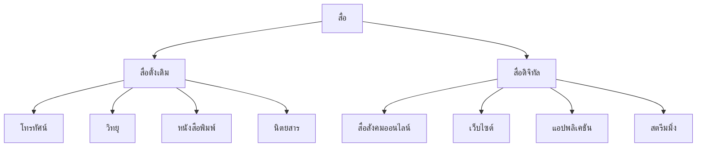
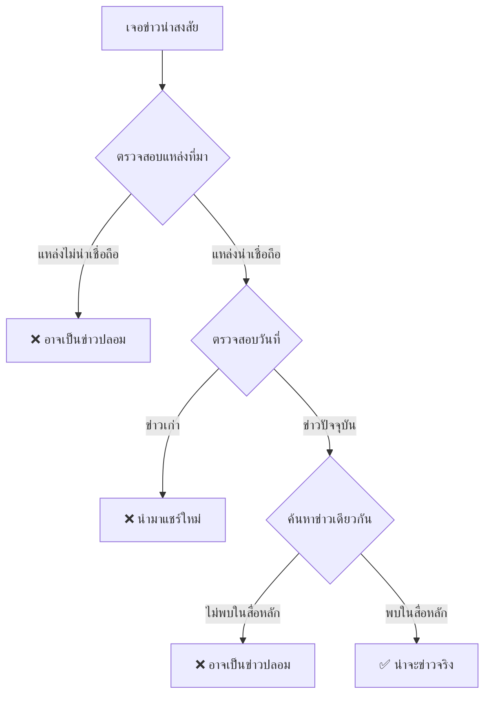

# การรู้เท่าทันสื่อ

> วิเคราะห์สื่อโฆษณา สื่อสังคมออนไลน์ ข่าวปลอม (Fake News) — สร้างภูมิคุ้มกันทางความคิด

**การรู้เท่าทันสื่อ** (Media Literacy) คือ ความสามารถในการเข้าถึง วิเคราะห์ ประเมิน และสร้างสื่อได้อย่างมีวิจารณญาณ ในยุคดิจิทัลที่ข้อมูลล้นทะลัก การรู้เท่าทันสื่อเป็นทักษะที่จำเป็นต่อการดำรงชีวิต

---

## เนื้อหาตามช่วงชั้น

| ช่วงชั้น | เนื้อหา |
|---|---|
| **ม.1–3** | พื้นฐานการวิเคราะห์สื่อ โฆษณา ข่าว |
| **ม.4–6** | สื่อสังคมออนไลน์ ข่าวปลอม อัลกอริทึม |

---

## ประเภทของสื่อในยุคดิจิทัล

---

## การวิเคราะห์โฆษณา

### เทคนิคที่โฆษณาใช้

| เทคนิค | คำอธิบาย | ตัวอย่าง |
|---|---|---|
| **ความน่าเชื่อถือ** | อ้างผู้เชี่ยวชาญ หรือคนดัง | "หมอฟันแนะนำยี่ห้อนี้" |
| **ความกลัว** | สร้างความกลัวเพื่อขายทางออก | "ถ้าไม่ซื้อประกัน ครอบครัวจะ..." |
| **ความสุข** | เชื่อมโยงสินค้ากับความสุข | "ดื่มแล้วมีความสุข" |
| **การเปรียบเทียบ** | เปรียบเทียบกับคู่แข่ง | "เหนือกว่ายี่ห้ออื่น" |
| **ความเร่งด่วน** | สร้างความรู้สึกเร่งด่วน | "เหลือเพียง 24 ชั่วโมง!" |
| **ไลฟ์สไตล์** | เชื่อมโยงสินค้ากับไลฟ์สไตล์ที่พึงประสงค์ | "คนที่ทันสมัยเลือก..." |

### คำถามที่ควรถามเมื่อดูโฆษณา

1. **ใครเป็นผู้สร้างโฆษณานี้**
2. **โฆษณาต้องการให้ฉันทำอะไร**
3. **เทคนิคอะไรที่ใช้ดึงดูดฉัน**
4. **ข้อมูลในโฆษณาเป็นจริงหรือไม่**
5. **สินค้าจำเป็นจริงๆ หรือไม่**

---

## ข่าวปลอม (Fake News)

### ประเภทของข่าวปลอม

| ประเภท | ลักษณะ | ตัวอย่าง |
|---|---|---|
| **เนื้อหาหลอกลว้ง** | แต่งเรื่องเพื่อหลอก | ข่าวทำเงินง่าย |
| **บิดเบือนบริบท** | นำภาพจริงมาแต่งเรื่อง | ภาพน้ำท่วมปีก่อน แต่บอกว่าปีนี้ |
| **พาดหัวเซนเซชัน** | พาดหัวเด่นแต่เนื้อหาไม่ตรง | "ช็อก! ดารา..." แต่เนื้อหาธรรมดา |
| **หลอกคลิก (Clickbait)** | พาดหัวน่าสงสัย ให้คลิก | "คุณจะไม่เชื่อสิ่งที่..." |
| **ข่าวลวงโดยสมบูรณ์** | ไม่มีมูลความจริงเลย | ข่าวต่างด้าวบุก |

### วิธีตรวจสอบข่าวปลอม

### ขั้นตอนการตรวจสอบ (Fact-Check)

1. **อ่านให้จบ**: อย่าอ่านแค่พาดหัว
2. **ตรวจสอบแหล่งที่มา**: ใครเป็นผู้รายงาน
3. **ตรวจสอบวันที่**: ข่าวเก่าหรือไม่
4. **ค้นหาข่าวเดียวกัน**: สื่ออื่นรายงานหรือไม่
5. **ตรวจสอบภาพ**: ภาพจริงหรือแต่ง
6. **ใช้เว็บไซต์ตรวจสอบ**: เช่น Anti-Fake News Center

---

## สื่อสังคมออนไลน์

### อันตรายของสื่อสังคมออนไลน์

| อันตราย | รายละเอียด |
|---|---|
| **ข้อมูลเท็จ** | ใครก็โพสต์ได้ ไม่ต้องตรวจสอบ |
| **การบูลลี่** | การรังแกกันทางไซเบอร์ (Cyberbullying) |
| **การหลอกลวง** | มิจฉาชีพหลอกเบอร์โทร บัญชีธนาคาร |
| **การเปรียบเทียบ** | เปรียบเทียบตัวเองกับคนอื่น |
| **การเสพติด** | ใช้เวลามากเกินไป |

### การใช้สื่อสังคมออนไลน์อย่างมีสติ

1. **ตรวจสอบก่อนเชื่อ**: ข่าวน่าเชื่อถือหรือไม่
2. **ตรวจสอบก่อนแชร์**: จะเป็นการแพร่ข่าวปลอมหรือไม่
3. **ปกป้องความเป็นส่วนตัว**: อย่าโพสต์ข้อมูลสำคัญ
4. **มีมารยาท**: ไม่พิมพ์สิ่งที่ทำร้ายผู้อื่น
5. **จำกัดเวลา**: ไม่ใช้จนเสียการทำสิ่งอื่น

---

## อัลกอริทึมกับการสร้างฟองสบู่ (Filter Bubble)

**อัลกอริทึม** คือ กฎเกณฑ์ที่แพลตฟอร์มใช้จัดเรียงเนื้อหาที่จะแสดงแก่ผู้ใช้

| ปรากฏการณ์ | คำอธิบาย |
|---|---|
| **ฟองสบู่ตัวกรอง (Filter Bubble)** | อัลกอริทึมแสดงเฉพาะเนื้อหาที่ผู้ใช้ชอบ ทำให้เห็นมุมมองเดียว |
| **ห้องสะท้อน (Echo Chamber)** | ผู้ใช้ถูกล้อมรอบด้วยคนที่คิดเหมือนกัน ทำให้ควดคิดแคบ |
| **การยืนยันยืนยัน (Confirmation Bias)** | เชื่อเฉพาะข้อมูลที่สนับสนุนความคิดเดิม |

**วิธีหลุดพ้นจากฟองสบู่:**
1. ติดตามแหล่งข้อมูลหลากหลาย
2. อ่านความคิดเห็นที่ไม่เหมือนเรา
3. ตรวจสอบสมมติฐานของตนเอง

---

## เคล็ดลับการรู้เท่าทันสื่อ

1. **ตั้งคำถามเสมอ**: ใคร ทำไม เพื่ออะไร
2. **ตรวจสอบแหล่งที่มา**: ข้อมูลมาจากไหน
3. **อย่าเชื่อทันที**: คิดก่อนเชื่อ คิดก่อนแชร์
4. **หาข้อมูลหลายแหล่ง**: อย่าอ้างอิงแหล่งเดียว
5. **รักษาใจเป็นกลาง**: ไม่มีอคติ
6. **อัปเดตความรู้**: เทคโนโลยีเปลี่ยนเร็ว

---

## ดูเพิ่มเติม

- [[03_การดูอย่างมีวิจารณญาณ|การดูอย่างมีวิจารณญาณ]]
- [[02_การฟังอย่างมีวิจารณญาณ|การฟังอย่างมีวิจารณญาณ]]
