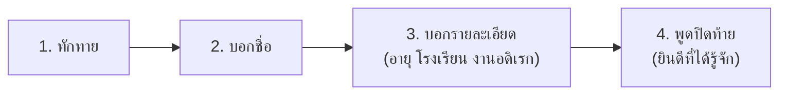
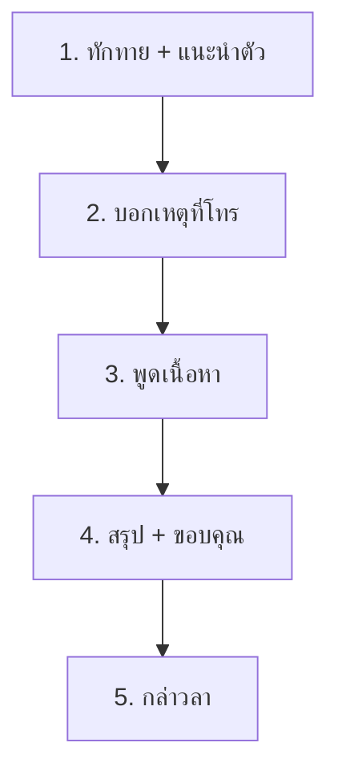

# การพูดในชีวิตประจำวัน

> ทักทาย แนะนำตัว สนทนา โทรศัพท์ — ทักษะพื้นฐานที่ใช้ทุกวัน

**การพูดในชีวิตประจำวัน** คือ การใช้ภาษาพูดเพื่อสื่อสารในสถานการณ์ต่างๆ ของชีวิตประจำวัน เป็นทักษะที่จำเป็นตั้งแต่การทักทาย การแนะนำตัว การสนทนา ไปจนถึงการโทรศัพท์

---

## เนื้อหาตามช่วงชั้น

| ช่วงชั้น | เนื้อหา |
|---|---|
| **ป.1–3** | ทักทาย แนะนำตัว สนทนาง่ายๆ |
| **ป.4–6** | สนทนาในสถานการณ์ต่างๆ โทรศัพท์ |

---

## การทักทาย

### คำทักทายตามเวลา

| เวลา | คำทักทาย |
|---|---|
| เช้า | "สวัสดีตอนเช้าครับ/ค่ะ" |
| กลางวัน | "สวัสดีครับ/ค่ะ" |
| เย็น | "สวัสดีตอนเย็นครับ/ค่ะ" |
| ก่อนนอน | "ราตรีสวัสดิ์ครับ/ค่ะ" |

### คำทักทายตามกาลเทศะ

| โอกาส | คำทักทาย |
|---|---|
| วันขึ้นปีใหม่ | "สวัสดีปีใหม่ครับ/ค่ะ" |
| วันเกิด | "สุขสันต์วันเกิดครับ/ค่ะ" |
| เทศกาลสงกรานต์ | "สวัสดีปีใหม่ไทยครับ/ค่ะ" |
| พบกันใหม่ | "ไม่ได้เจอกันนานเลยครับ/ค่ะ" |

---

## การแนะนำตัว

### โครงสร้างการแนะนำตัว

### ตัวอย่างการแนะนำตัว

**เด็กประถม:**
> "สวัสดีครับ ผมชื่อน้องบอล อายุ 8 ขวบ เรียนอยู่ชั้น ป.2 โรงเรียนสีลม ยินดีที่ได้รู้จักครับ"

**นักเรียนมัธยม:**
> "สวัสดีครับ ผมชื่อก้อง เรียนอยู่ชั้น ม.4 โรงเรียนสาธิตจุฬา งานอดิเรกชอบอ่านหนังสือและเล่นกีฬา ยินดีที่ได้รู้จักครับ"

### การแนะนับผู้อื่น

**รูปแบบ:**
> "ขอแนะนำครับ นี่คือ [ชื่อ] เป็น [ความสัมพันธ์/ตำแหน่ง] ครับ"

**ตัวอย่าง:**
> "ขอแนะนำครับ นี่คือคุณแม่ของผมครับ"
> "นี่คือเพื่อนสนิทของฉัน ชื่อน้ำค่ะ"

---

## การสนทนา

### หลักการสนทนาที่ดี

| หลักการ | รายละเอียด |
|---|---|
| **ฟังให้จบ** | อย่าตัดบทผู้พูด |
| **ตอบสั้นกระชับ** | พูดพอเหมาะ |
| **ใช้คำสุภาพ** | "ครับ" "ค่ะ" "นะครับ" |
| **สบตา** | แสดงความสนใจ |
| **หลีกเลี่ยงหัวข้ออ่อนไหว** | การเมือง ศาสนา ส่วนตัว |

### หัวข้อสนทนาที่เหมาะสม

| หัวข้อที่เหมาะสม | หัวข้อที่ควรหลีกเลี่ยง |
|---|---|
| สภาพอากาศ | รายได้ เงินเดือน |
| งานอดิเรก | การเมือง |
| หนังสือ ภาพยนตร์ | ศาสนา |
| อาหาร | ความลับของผู้อื่น |
| การเดินทาง | รูปร่างหน้าตา |

---

## การโทรศัพท์

### โครงสร้างการโทรศัพท์

### ตัวอย่างการโทรศัพท์

**โทรหาเพื่อน:**
> สวัสดีครับ ผมบอลเองครับ โทรมาถามเรื่องการบ้านคณิตศาสตร์หน่อยครับ ... ขอบคุณมากนะครับ งั้นวันจันทร์เจอกันที่โรงเรียนครับ สวัสดีครับ

**รับโทรศัพท์ที่บ้าน:**
> สวัสดีครับ บ้านหมายเลข [เบอร์] ขอรับใช้ครับ ... ครับ เดี๋ยวจะไปบอกคุณพ่อให้ครับ ขอบคุณครับ สวัสดีครับ

### มารยาทการใช้โทรศัพท์

1. **เวลาเหมาะสม**: ไม่โทรเช้ามากหรือดึกเกินไป
2. **สถานที่เหมาะสม**: ไม่โทรในที่เงียบ เช่น ห้องสมุด
3. **พูดเสียงปกติ**: ไม่ดังเกินไป
4. **กระชับ**: พูดเรื่องสำคัญก่อน
5. **กล่าวลา**: ก่อนวางสายเสมอ

---

## การใช้คำสุภาพ

| สถานการณ์ | คำสุภาพ |
|---|---|
| ผู้ชายพูด | ลงท้ายด้วย "ครับ" |
| ผู้หญิงพูด | ลงท้ายด้วย "ค่ะ" |
| ขอรบกวน | "รบกวน...หน่อยครับ/ค่ะ" |
| ขอโทษ | "ขอโทษครับ/ค่ะ" |
| ขอบคุณ | "ขอบคุณครับ/ค่ะ" |
| สิ่งของ | รับ-ให้ด้วยมือ 2 ข้าง |

---

## เคล็ดลับการพูดในชีวิตประจำวัน

1. **ยิ้มแย้มแจ่มใส**: สร้างความประทับใจแรก
2. **ใช้คำสุภาพ**: "ครับ" "ค่ะ" เสมอ
3. **สบตา**: แสดงความจริงใจ
4. **เสียงปกติ**: ไม่ดังหรือเบาเกินไป
5. **เนื้อหาเหมาะสม**: พูดตามกาลเทศะ
6. **ฟังให้ดี**: การสนทนาต้องมีการพูดและการฟัง

---

## ดูเพิ่มเติม

- [[06_การพูดเล่าเรื่อง|การพูดเล่าเรื่อง]]
- [[09_มารยาทในการฟังและการพูด|มารยาทในการฟังและการพูด]]
